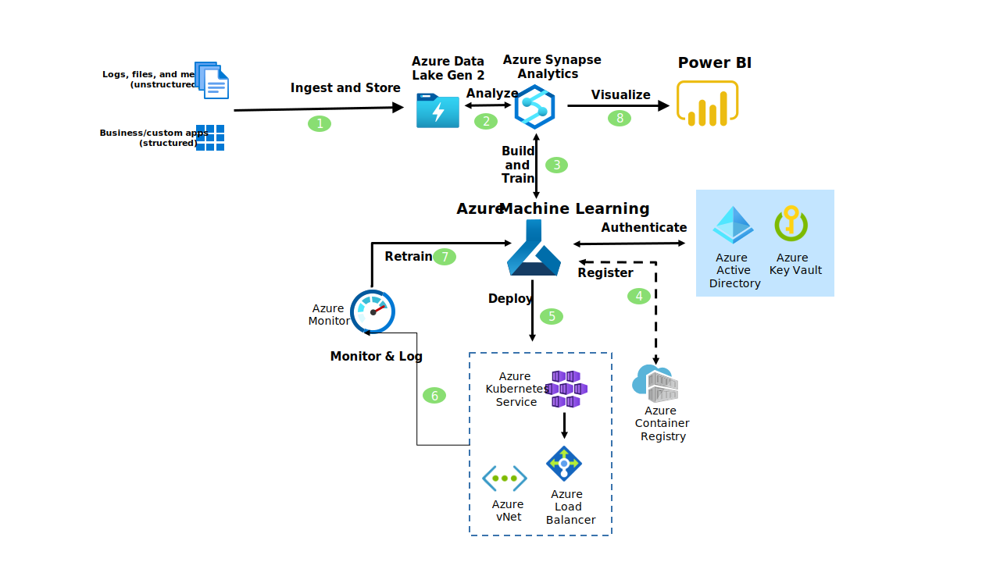

[!INCLUDE [header_file](../../../includes/sol-idea-header.md)]

This architecture shows you the components used to build, deploy, and manage high-quality models with Azure Machine Learning, a service for the end-to-end ML lifecycle.

## Architecture

*Download a [Visio file](https://arch-center.azureedge.net/azure-machine-learning-solution-architecture.vsdx) of this architecture.*

> [!NOTE]
> The architecture described in this article is based on Azure Machine Learning's CLI and Python SDK v1. For more information on the new v2 SDK and CLI, see [What is CLI and SDK v2](/azure/machine-learning/concept-v2).

### Dataflow

1. Bring together all your structured, unstructured, and semi-structured data (logs, files, and media) into Azure Data Lake Storage Gen2.
1. Use Apache Spark in Azure Synapse Analytics to clean, transform, and analyze datasets.
1. Build and train machine learning models in Azure Machine Learning.  
1. Control access and authentication for data and the ML workspace with Azure Active Directory and Azure Key Vault. Manage containers with Azure Container Registry.
1. Deploy the machine learning model to a container using Azure Kubernetes Services, securing and managing the deployment with Azure VNets and Azure Load Balancer.
1. Using log metrics and monitoring from Azure Monitor, evaluate model performance.
1. Retrain models as necessary in Azure Machine Learning.
1. Visualize data outputs with Power BI.

### Components

* [Azure Machine Learning](https://azure.microsoft.com/services/machine-learning) is an enterprise-grade machine learning (ML) service for the end-to-end ML lifecycle.
* [Azure Synapse Analytics](https://azure.microsoft.com/services/synapse-analytics) is a unified service where you can ingest, explore, prepare, transform, manage, and serve data for immediate BI and machine learning needs.
* [Azure Data Lake Storage Gen2](https://azure.microsoft.com/services/storage/data-lake-storage) is a massively scalable and secure data lake for your high-performance analytics workloads.
* [Azure Container Registry](https://azure.microsoft.com/services/container-registry) is a registry of Docker and Open Container Initiative (OCI) images, with support for all OCI artifacts. Build, store, secure, scan, replicate, and manage container images and artifacts with a fully managed, geo-replicated instance of OCI distribution.
* [Azure Kubernetes Service](https://azure.microsoft.com/services/kubernetes-service) Azure Kubernetes Service (AKS) offers serverless Kubernetes, an integrated continuous integration and continuous delivery (CI/CD) experience, and enterprise-grade security and governance. Deploy and manage containerized applications more easily with a fully managed Kubernetes service.
* [Azure Monitor](https://azure.microsoft.com/services/monitor) lets you collect, analyze, and act on telemetry data from your Azure and on-premises environments. Azure Monitor helps you maximize performance and availability of your applications and proactively identify problems in seconds.
* [Azure Key Vault](https://azure.microsoft.com/services/key-vault) safeguards cryptographic keys and other secrets used by cloud apps and services.
* [Azure Load Balancer](https://azure.microsoft.com/services/load-balancer) load-balances internet and private network traffic with high performance and low latency. Load Balancer works across virtual machines, virtual machine scale sets, and IP addresses.
* [Power BI](https://powerbi.microsoft.com) is a suite of business analytics tools that deliver insights throughout your organization. Connect to hundreds of data sources, simplify data prep, and drive unplanned analysis. Produce beautiful reports, then publish them for your organization to consume on the web and across mobile devices.

## Scenario details

Build, deploy, and manage high-quality models with Azure Machine Learning, a service for the end-to-end ML lifecycle. Use industry-leading MLOps (machine learning operations), open-source interoperability, and integrated tools on a secure, trusted platform designed for responsible machine learning (ML).

### Potential use cases

* Use machine learning as a service.
* Easy and flexible building interface.
* Wide range of supported algorithms.
* Easy implementation of web services.
* Great documentation for machine learning solutions.

## Considerations

These considerations implement the pillars of the Azure Well-Architected Framework, which is a set of guiding tenets that can be used to improve the quality of a workload. For more information, see [Microsoft Azure Well-Architected Framework](/azure/architecture/framework).

### Cost optimization

Cost optimization is about looking at ways to reduce unnecessary expenses and improve operational efficiencies. For more information, see [Overview of the cost optimization pillar](/azure/architecture/framework/cost/overview).

* [Get pricing estimates](https://azure.microsoft.com/pricing/details/machine-learning)

## Contributors

*This article is maintained by Microsoft. It was originally written by the following contributors.*

Principal authors:

* [Sheri Gilley](https://linkedin.com/in/sdgilley) | Senior Content Developer
* [Larry Franks](https://linkedin.com/in/larry-franks-88483811) | Content Developer
* [Lauryn Gayhardt](https://linkedin.com/in/lgayhardt) | Content Developer
* [Samantha Salgado](https://linkedin.com/in/sam-s-1978991b4) | Content Developer

*To see non-public LinkedIn profiles, sign in to LinkedIn.*

## Next steps

See documentation for the key services in this solution:

* [Azure Machine Learning documentation](/azure/machine-learning)
* [Azure Synapse Analytics documentation](/azure/sql-data-warehouse)
* [Azure Data Lake Storage Gen2 documentation](/azure/storage/blobs/data-lake-storage-introduction)
* [Azure Container Registry documentation](/azure/container-registry)
* [Azure Kubernetes Service documentation](/azure/aks)
* [Azure Monitor documentation](/azure/azure-monitor)
* [Azure Key Vault documentation](/azure/key-vault/general/basic-concepts)
* [Azure Load Balancer documentation](/azure/load-balancer)
* [Power BI documentation](/power-bi)

## Related resources

See related guidance on the Azure Architecture Center:

* [Compare the machine learning products and technologies from Microsoft](/azure/architecture/data-guide/technology-choices/data-science-and-machine-learning)
* [Machine learning at scale](/azure/architecture/data-guide/big-data/machine-learning-at-scale)
* [Machine learning operations (MLOps) framework to upscale machine learning lifecycle with Azure Machine Learning](/azure/architecture/example-scenario/mlops/mlops-technical-paper)
* [Azure Machine Learning decision guide for optimal tool selection](/azure/architecture/example-scenario/mlops/aml-decision-tree)
* [Deploy AI and ML computing on-premises and to the edge](/azure/architecture/hybrid/deploy-ai-ml-azure-stack-edge)
* [Many models machine learning (ML) at scale with Azure Machine Learning](/azure/architecture/example-scenario/ai/many-models-machine-learning-azure-machine-learning)
* [Scale AI and machine learning initiatives in regulated industries](/azure/architecture/example-scenario/ai/scale-ai-and-machine-learning-in-regulated-industries)
* [Predict hospital readmissions by using traditional and automated machine learning techniques](/azure/architecture/example-scenario/ai/predict-hospital-readmissions-machine-learning)
* [Secure research environment for regulated data](/azure/architecture/example-scenario/ai/secure-compute-for-research)
