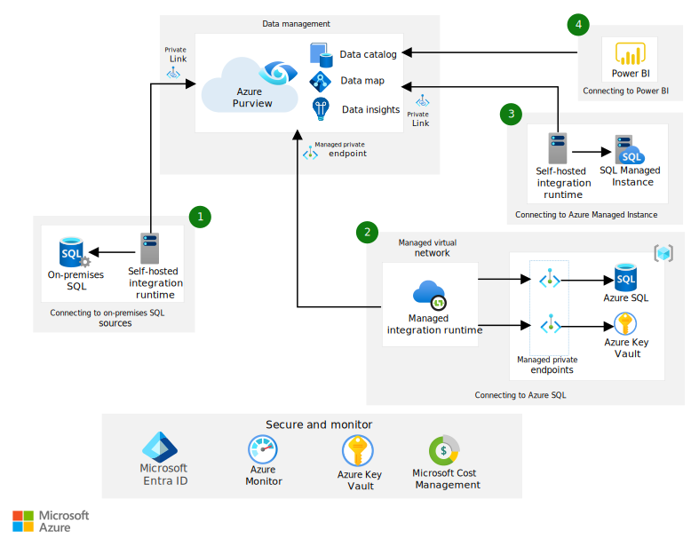

[!INCLUDE [header_file](../../../includes/sol-idea-header.md)]

This article describes how you can improve your organization's governance process by using Azure Purview in your Azure SQL estate.

## Architecture

*Download a [Visio file](https://arch-center.azureedge.net/azure-purview-sql-estate-architecture.vsdx) of this architecture.*

### Dataflow

The next four scenarios show the options available to you, to connect to Azure Purview securely.

1. Connect Azure Purview to **on-premises SQL** via Self-Hosted Integration Run time by Private Endpoint.

1. Connect Azure Purview to **Azure SQL** via Managed Virtual Network by Managed Private Endpoint.

1. Connect Azure Purview to **Azure SQL Managed Instance** via Self-Hosted Integration run time by Private Endpoint.

1. Connect Azure Purview natively to **Power BI.**

    > [!NOTE]
    > The information transferred from the sources to Azure Purview is metadata describing the data within the scanned sources. No actual data is transferred from the SQL sources to Azure Purview.
    >

#### Capabilities

- [Catalog](/azure/purview/overview#data-catalog). Azure Purview Data Catalog can automatically capture and describe core characteristics of data at the source. The characteristics include schema, technical properties, and location. Azure Purview glossary allows a business-friendly definition of data to be layered on top to improve search and discovery.

- [Classification](/azure/purview/concept-best-practices-classification). Azure Purview automatically classifies datasets and data elements with over 100 predefined sensitive-data classifications. It also allows users to define their own custom classification schemes that can be applied manually and automatically.

- [Ownership](/azure/purview/quickstart-create-collection). Azure Purview allows data ownership and stewardship to be applied to data assets and glossary items within the catalog.

- [Insights](/azure/purview/concept-insights). Insights in Azure Purview provide multiple pre-defined reports to help CDOs, data professionals, and data governance professionals gain a detailed understanding of the data.

### Components

The solution uses the following components:

- [Azure Purview](https://azure.microsoft.com/services/purview) is a unified data catalog that manages on-premises, multicloud, and software as a service (SaaS) data. This data governance service maintains  data landscape maps. Features include automated data discovery, sensitive-data classification, and data lineage.

- [Microsoft SQL Server](/sql) is a family of relational database management systems, or RDBMS. The servers are deployed and managed by your organization.

- [Azure SQL Database](https://azure.microsoft.com/products/azure-sql/database) is a fully managed SQL database built for the cloud with automatic updates, provisioning, scaling, and backups.

- [Azure SQL Managed Instance](https://azure.microsoft.com/products/azure-sql/managed-instance) is a cloud database service that provides all the features of SQL Server with added protection, connectivity, and automatic updates.

- [Power BI](https://powerbi.microsoft.com/what-is-power-bi) is a collection of software services and apps. These services create and share reports that connect and visualize sources of data. When you use Power BI with Azure Purview, it can be cataloged, classified, and have granular lineage illustrated end to end.

- [Azure Private Link](https://azure.microsoft.com/services/private-link) provides private connectivity from a virtual network to Azure platform as a service (PaaS), services that you own, or Microsoft partner services.

- [Azure Key Vault](https://azure.microsoft.com/services/key-vault) stores and controls access to secrets such as tokens, passwords, and API keys. Key Vault also creates and controls encryption keys and manages security certificates.

- [Azure AD](https://azure.microsoft.com/services/active-directory) offers cloud-based identity and access management services. These features provide a way for users to sign in and access resources.

- [Azure Monitor](https://azure.microsoft.com/services/monitor) collects and analyzes data on environments and Azure resources. This data includes app telemetry, such as performance metrics and activity logs.

## Scenario details

As more of your organization's data is loaded into Azure, the need to properly govern and manage that data across all your data sources and data consumers grows.

Without high-quality data in your Azure SQL estate, the business value can be diminished. The solution is to build a foundation for data governance and management that can produce and deliver trustworthy high-quality data.

Data needs to be managed at scale across on-premises, cloud, and multicloud storage. This management ensures compliance requirements are met around security, privacy, and usage. Well-managed data can also improve self-discovery, data sharing, and quality—improving the use of data in applications and analytics.

With [Azure Purview](/azure/purview/overview), you can:

- Ensure that definitions, classifications, and governance processes are applied uniformly for your data.
- Provide a central platform where you can apply definitions and ownership to your data.
- With a single view on reports and insights, you can generate data standards that should be imposed on your data.
- Focus on governance to find, classify, define, and enforce policies and standards across data.

Azure Purview can automatically discover, catalog, classify, and manage data across Microsoft SQL offerings, whether on-premises or in Azure. 

### Potential use cases

The solution described here is appropriate for organizations that would benefit from the following outcomes of well-governed data:

- Automatic discovery of data in the organization to accelerate cloud adoption.
- Secure data for compliance with data laws and regulations.
- Improved access, discovery, and quality of managed data to enhance analytics.

## Contributors

*This article is maintained by Microsoft. It was originally written by the following contributors.*

Principal author:

 * [Isabel Arevalo](https://www.linkedin.com/in/isabel-arevalo-she-her-b24bb162) | Senior Cloud Solution Architect

*To see non-public LinkedIn profiles, sign in to LinkedIn.*

## Next steps

- [Azure customer case studies](https://customers.microsoft.com/en-us/search?sq=%22Azure%20Purview%22&ff=&p=0&so=story_publish_date%20desc)
- [Microsoft Purview technical documentation and best practices](/azure/purview/concept-best-practices-accounts)
- [What is Microsoft Purview?](/azure/purview/overview)
- [What is Power BI?](https://powerbi.microsoft.com/what-is-power-bi)
- [Azure Active Directory](https://azure.microsoft.com/services/active-directory)
- [Azure Cost Management and Billing](https://azure.microsoft.com/services/cost-management)
- [Azure Monitor](https://azure.microsoft.com/services/monitor)
- [Key Vault](https://azure.microsoft.com/services/key-vault)

## Related resources

- [Data governance with Profisee and Microsoft Purview](/azure/architecture/reference-architectures/data/profisee-master-data-management-purview)
- [Migrate master data services to Azure with CluedIn and Azure Purview](/azure/architecture/reference-architectures/data/migrate-master-data-services-with-cluedin)
