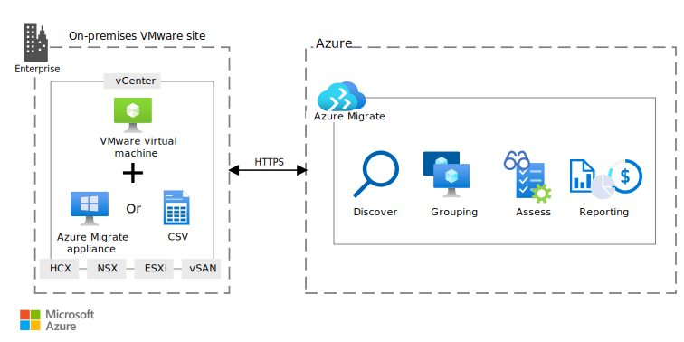

[!INCLUDE [header_file](../../../includes/sol-idea-header.md)]

Use Azure VMware Solution foundation block capacity planning to size and plan for capacity needed to run workloads.

## Architecture

This high-level diagram covers Azure VMware Solution capacity planning.

*Download a [Visio file](https://arch-center.azureedge.net/azure-vmware-solution-capacity.vsdx) of this architecture.*

### Workflow

Azure VMware Solution capacity planning covers the following key phases:

- Discovery: This phase focuses on gathering inventory from an on-premises VMware site.
- Grouping: This phase helps you group logically related VMs (such as an app and database).
- Assessment: This phase assesses grouped VMs for Azure VMware Solution suitability and for potential remediation.
- Reporting: This phase consolidates the assessment score and reports estimated costs.

Each phase is discussed in detail below.

#### Discovery

[Discovery](/azure/migrate/tutorial-discover-VMware): You can use Azure Migrate in two modes. In the first mode, Azure Migrate generates an OVA (Open Virtualization Appliance) template. This template can be used to bootstrap an Azure Migrate VM in an on-premises VMware site. Once the Azure Migrate instance is configured, it will send on-premises inventory data in Azure. In the second mode, a CSV file with a [pre-defined format](/azure/migrate/tutorial-discover-import#prepare-the-csv) can be used to upload on-premises inventory data. The CSV file expects four mandatory fields (VM/Server Name, No. of Cores, Memory, and [Eligible](/azure/migrate/tutorial-discover-import#supported-operating-system-names) OS Name). Other remaining optional fields (such as No. of disks, Disk IOPS, Throughput, and so on) can be added to improve the accuracy of sizing. Output from VMware utilities, such as [RVTools](https://www.robware.net/rvtools), can be used to create a CSV file.

#### Grouping

After VMware inventory details are gathered, it can be grouped together. [Grouping](/azure/migrate/how-to-create-a-group) helps you easily organize and manage a large number of VMs that are captured after discovery. Grouping can be done based on, but not limited to, a workload (HR, eCommerce application, and so on), an environment (prod versus non. Prod), location (such as US, EU, and so on), or criticality (mission critical, small-scale, and so on). Azure Migrate provides [dependency analysis](/azure/migrate/how-to-create-group-machine-dependencies-agentless) in VMware environments. Information obtained via dependency analysis can also be used for grouping related VMs together.

#### Assessment

Grouped VMs can be subjected to assessment. [Assessment](/azure/migrate/tutorial-assess-VMware-azure-VMware-solution) can be configured with parameters that are useful in determining right sizing/capacity. These parameters can cover target Azure VMware Solution site details, such as the location, node type, and so on. For Azure VMware Solution VMs, important parameters (such as FTT and RAID settings and CPU oversubscription) need to be provided. An assessment can be performed using [two criteria](/azure/migrate/tutorial-assess-VMware-azure-VMware-solution#decide-which-assessment-to-run). The first criterion is a _performance-based_ assessment, which assesses on-premises VMware VMs, using their performance profiles. Performance history, as far back as one month, can be selected for capturing a performance profile. An assessment can be further fine-tuned by selecting a specific percentile (such as 50th, 90th, 99th, and so on) for the assessment. An additional capacity margin can be provided by using a _comfort factor_, which increases the capacity by multiplying it with the comfort factor. The second criterion is as _on-premises_. As the name suggests, an assessment using this criterion is done by using a VM's existing specifications (such as CPU, Memory, and so on). Additional capacity can be added, as appropriate.

#### Reporting

Once an assessment is complete, [reporting](/azure/migrate/tutorial-assess-VMware-azure-VMware-solution#review-an-assessment) provides the final results. The results include the cost and readiness. It provides a summary of the number of VMware VMs assessed, the average estimated cost per VM, and the total estimated costs for all VMs. Reporting also provides Azure VMware Solution readiness with a clear breakdown of the VM numbers, across multiple readiness statuses, such as Ready, Not Ready, Ready with conditions, and so on. Those VMs that might need a potential remediation, before migration, are listed with specific reasons. This makes the entire migration plan easy to manage and orchestrate. Reporting also provides a number of Azure VMware Solution nodes that are needed to run assessed VMs. A projected utilization for CPU, memory, and storage in Azure VMware Solution is also reported.

### Components

- [Azure VMware Solution](https://azure.microsoft.com/services/azure-vmware)
- [Azure Migrate](https://azure.microsoft.com/services/azure-migrate)

## Scenario details

Azure VMware Solution is a native VMware offering that runs on Azure infrastructure. Customers can use Azure VMware Solution as an extension of their on-premises VMware environment. It's also possible to use Azure VMware Solution as a migration destination from an on-premises VMware environment. There are multiple options available to provide network connectivity between a customer's on-premises environment and Azure VMware Solution.

Before an Azure VMware Solution deployment can begin, you must understand how the overall capacity will help you make business and technical decisions. This article covers key design considerations in capacity planning.

### Potential use cases

Capacity planning, or sizing, is desired in the following use cases:

- Assess an existing VMware IT landscape: Typical on-premises VMware environments tend to grow organically over a period. Customers would want to understand just how big their on-premises VMware environment is. Complete an objective assessment to remove any guesswork in the decision-making process.
- Identify relationships between application components: Customers might want to consider Azure VMware Solution for only some of their workloads. Capacity planning for only a subset of workloads will enable customers to ensure that all the dependencies are factored in.
- Identify compatibility between on-premises VMware and the Azure VMware Solution environment: A workload might have a special software or configuration requirement, when running in on-premises VMware environment. If so, you should explore the possibility of meeting that requirement in Azure VMware Solution, to help your customer make appropriate decisions ahead of time.
- Understand monthly and yearly costs: Customers would like to understand the costs they'll incur on a monthly and yearly basis. A capacity planning exercise can help provide customers with potential costs.

## Contributors

*This article is maintained by Microsoft. It was originally written by the following contributors.*

Principal author:

 * [Mahesh Kshirsagar](https://www.linkedin.com/in/mahesh-kshirsagar-msft) | Cloud Solution Architect

## Next steps

Refer to following resources to understand more about Azure VMware Solution.

* [Azure VMware Solution](/azure/azure-vmware)
* [Azure VMware Solution Assessment overview](/azure/migrate/how-to-create-azure-vmware-solution-assessment)

## Related resources

Use the following guidance on other Azure VMware Solution ideas.

* [Enterprise-scale for Microsoft Azure VMware Solution](/azure/cloud-adoption-framework/scenarios/azure-vmware/enterprise-scale-landing-zone)
* [Network topology and connectivity for Azure VMware Solution](/azure/cloud-adoption-framework/scenarios/azure-vmware/eslz-network-topology-connectivity)
* [Azure VMware Solution Foundation - Networking](/azure/architecture/solution-ideas/articles/azure-vmware-solution-foundation-networking)
* [Azure VMware Solution Foundation - Landing Zone](/azure/architecture/solution-ideas/articles/azure-vmware-solution-foundation-landing-zone)
