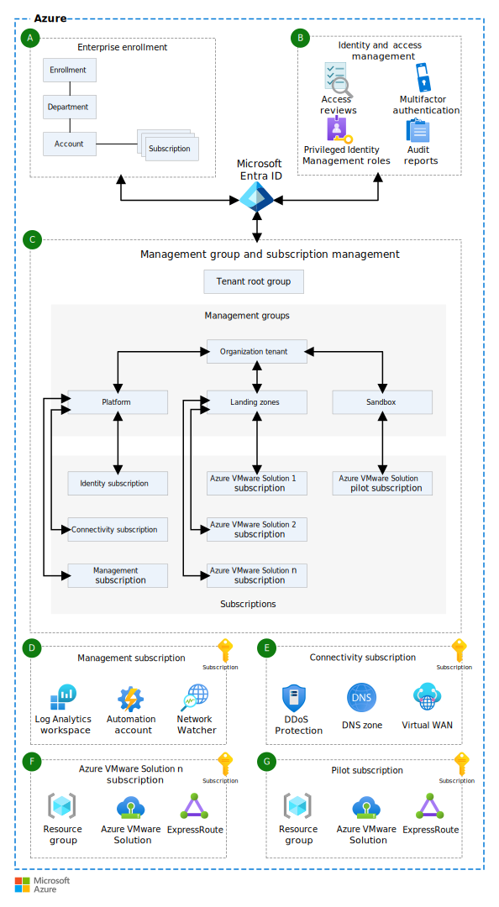

[!INCLUDE [header_file](../../../includes/sol-idea-header.md)]

This article covers considerations for deploying and running Azure VMware Solution as part of a landing zone environment.

## Architecture

The following high-level diagram covers Azure VMware Solution and a landing zone implementation.

*Download a [Visio file](https://arch-center.azureedge.net/azure-vmware-solution-landing-zone.vsdx) of this architecture.*

Azure Enterprise Scale Landing Zone (ESLZ) provides prescriptive deployment guidance on setting up Azure platform components (such as identity, network connectivity, management, and so on), along with application and workload components, such as Azure VMware Solution. A well-defined corelation between Azure platform components and Azure VMware Solution makes it easy to manage and scale Azure VMware Solution workloads. Key constituents of ESLZ for Azure VMware Solution deployment are discussed below.

### Workflow

#### Enterprise enrollment (A)

[Enterprise Enrollment](/azure/cloud-adoption-framework/ready/enterprise-scale/enterprise-enrollment-and-azure-ad-tenants) facilitates Azure VMware Solution subscriptions to be part of a hierarchical structure. This organization allows them to be reflective of an organization hierarchy (such as geographic, divisional, functional, and so on). Customers and partners can set up a cost budget and associated alerts at the account level, which holds the Azure VMware Solution subscriptions. Account owners can also set Azure VMware Solution subscription owners.

#### Identity and access management (B)

Azure VMware Solution Resource Provider (RP) exposes multiple [operations](/cli/azure/VMware#commands). Customers and partners want to control access to these operations, to specific roles. [Identity and access management](/azure/cloud-adoption-framework/ready/enterprise-scale/identity-and-access-management) can help you create such roles. Other operations (such as just-in-time (JIT) access, access reviews, and so on) can also be configured on these roles. For Azure VMware Solution workloads that might need Windows Authentication, services such as Azure AD Domain Services (Azure AD DS) or Active Directory Domain Services (AD DS) can be configured as part of identity and access management.

#### Management group and subscription management (C)

Azure VMware Solution resources can be deployed in an Azure subscription. This subscription can be part of [Management group and subscription Management](/azure/cloud-adoption-framework/ready/enterprise-scale/management-group-and-subscription-organization). In ESLZ, [Azure Policy](https://github.com/Azure/azure-policy) is used to define and apply operational governance requirements over management groups. By putting Azure VMware Solution subscriptions under a management group, they can be subjected to any operational governance requirements, via Azure Policy. An example of such policy requirement enforcement could be to prevent deploying VPN connectivity during Azure VMware Solution migration. Customers and partners can also circumvent limits that are associated with Azure VMware Solution subscriptions by spanning Azure VMware Solution workloads across multiple subscriptions.

#### Management subscription (D)

[Management subscription](/azure/cloud-adoption-framework/ready/enterprise-scale/management-and-monitoring) is part of the platform management group. Management and monitoring subscriptions can enable consolidating shared management and monitoring services. Azure VMware Solution workloads can use shared services, such as Log Analytics Workspace, to send their diagnostic data, which can be correlated with logs from other Azure services, such as Azure Application Gateway. By centralizing and consolidating diagnostics data across multiple Azure services, debugging and logs corelation becomes easy. Azure VMware Solution workloads can also use shared Azure Automation Update Management for variety of purposes such as Patch Management, Change Tracking, Configuration Management, and so on.

#### Connectivity subscription (E)

Platform Management Group also includes a [connectivity subscription](/azure/cloud-adoption-framework/ready/enterprise-scale/network-topology-and-connectivity), which centralizes all the networking requirements across Azure workloads, including Azure VMware Solution. Workloads running on Azure VMware Solution can use shared services, such as ExpressRoute, Azure Virtual WAN, Application Gateway, and so on. By reusing these services (as opposed to creating new services just for Azure VMware Solution), customers can achieve cost efficiency. Any network resources under a connectivity subscription are exposed to limited roles, such as NetOps (Network Operations) for holistic network management. By controlling access to network resources, debugging and troubleshooting networking issues becomes manageable and accountable.

#### Azure VMware Solution subscription (F)

Azure VMware Solution subscriptions are part of Landing Zone Management Group, which makes it possible to reap benefits that are associated with Azure Policies applied at that Management Group. These benefits can include restricting Azure VMware Solution deployment to specific Azure regions only, ensuring budgets are enabled before deployment, and so on. Multiple Azure VMware Solution subscriptions act as a measure for managing and scaling Azure VMware Solution workloads, without being affected by [Azure subscription limits](/azure/azure-resource-manager/management/azure-subscription-service-limits).

#### Azure VMware Solution sandbox pilot subscription (G)

Sandbox subscriptions are deployed under [Sandbox Management Group](/azure/cloud-adoption-framework/ready/enterprise-scale/implementation-guidelines#sandbox-governance-guidance), which provides a playground for experimenting with Azure services. At the same time, a sandbox subscription provides protection against impacting production workloads. An Azure VMware Solution sandbox subscription would have less restrictive policies, which allows you to have greater control over the service. By creating a separate Azure VMware Solution sandbox subscription, it is functionally marked to prevent the possibility of the subscription being used for production deployment.

### Components

- [Azure VMware Solution](https://azure.microsoft.com/services/azure-vmware)
- [Azure Active Directory](https://azure.microsoft.com/services/active-directory)
- [Azure ExpressRoute](https://azure.microsoft.com/services/expressroute)
- [Azure Policy](https://azure.microsoft.com/services/azure-policy)

## Scenario details

Azure VMware Solution can be deployed as part of either a new landing zone or an existing landing zone environment. Well-designed landing zones help you avoid operational overhead and reduce costs by promoting segregated Azure environments and the use of shared services.

> [!NOTE]
> [Enterprise-scale for Microsoft Azure VMware Solution](/azure/cloud-adoption-framework/scenarios/azure-vmware/enterprise-scale-landing-zone) provides further details. We recommend that you use the latest landing zone guidance available in it.

### Potential use cases

Running Azure VMware Solution as part of a landing zone environment helps address the following use-cases:

- Reuse an existing Azure tenancy infrastructure: Azure VMware Solution environment can be integrated with an existing Azure tenant. This way, customers can use their existing ownership chain for billing and accounting purposes.
- Reuse shared landing zones: Customers can reuse their existing shared landing zones, which run services as network connectivity, monitoring, and so on, with Azure VMware Solution environment. This reuse can reduce costs, as well as improve the operational efficiency.
- Separation of governance rules: Customers want to have different governance needs in dev/test environments, than in a production environment. Having separate landing zones for Azure VMware Solution environments enables the desired level of control, based on customer requirements.

## Contributors

*This article is maintained by Microsoft. It was originally written by the following contributors.*

Principal author:

 * [Mahesh Kshirsagar](https://www.linkedin.com/in/mahesh-kshirsagar-msft) | Cloud Solution Architect

## Next steps

Use the following guidance about other Azure VMware Solution ideas:

- [Network topology and connectivity for Azure VMware Solution](/azure/cloud-adoption-framework/scenarios/azure-vmware/eslz-network-topology-connectivity)
- [Azure VMware Solution Foundation - Networking](/azure/architecture/solution-ideas/articles/azure-vmware-solution-foundation-networking)
- [Azure VMware Solution Foundation - Capacity Planning](/azure/architecture/solution-ideas/articles/azure-vmware-solution-foundation-capacity)

## Related resources

Refer to following resources to learn more about Azure VMware Solution:

- [Enterprise-scale for Microsoft Azure VMware Solution](/azure/cloud-adoption-framework/scenarios/azure-vmware/enterprise-scale-landing-zone)
- [Azure VMware Solution](/azure/azure-vmware)
- [Enterprise-scale landing zone architecture](/azure/cloud-adoption-framework/ready/enterprise-scale/architecture)
