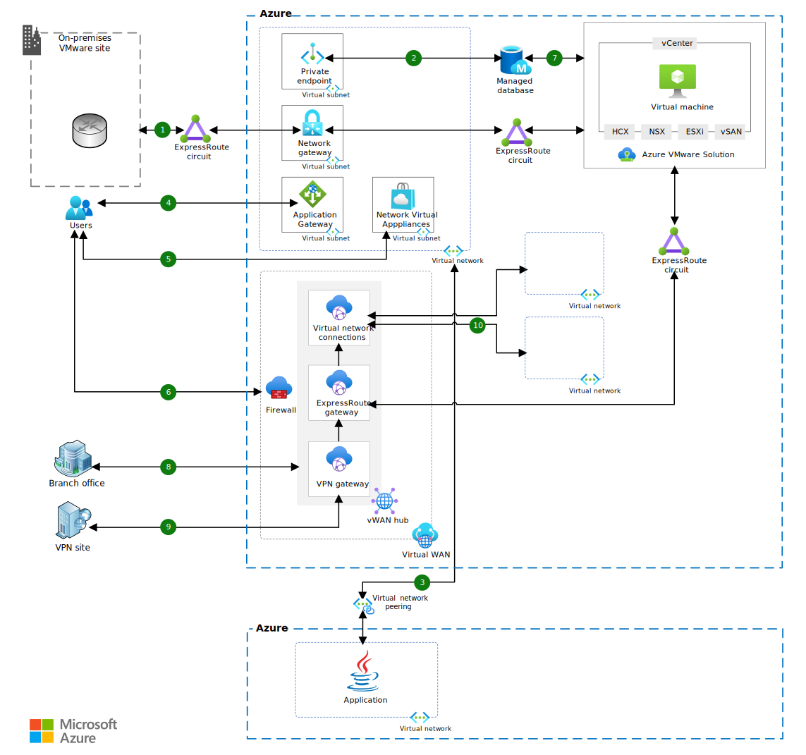

[!INCLUDE [header_file](../../../includes/sol-idea-header.md)]

Azure native services can assist in connecting Azure VMware Solution workloads to an on-premises environment and to external users.

## Architecture

The following high-level architecture diagram covers key networking scenarios.

*Download a [Visio file](https://arch-center.azureedge.net/azure-vmware-solution-networking.vsdx) of this architecture.*

This architecture showcases a key network design that enables the following scenarios:

- Connectivity between on-premises and Azure VMware Solution
- Connectivity between public internet and Azure VMware Solution
- Connectivity between branch/VPN sites and Azure VMware Solution
- Connectivity between Azure and Azure VMware Solution

Each route design is denoted by a number (1, 2, 3, and so on) and is discussed in detail below.

### Workflow

#### Azure ExpressRoute Global Reach (route 1)

Route 1 depicts the on-premises site connectivity with the Azure VMware Solution environment. This connectivity is established using [ExpressRoute Global Reach](/azure/expressroute/expressroute-global-reach). This connectivity consists of a pair of routers. The first router is referred to as the Microsoft Enterprise Edge (MSEE) router. This router establishes connectivity between an on-premises site and Azure. The second router is referred as the Dedicated Microsoft Enterprise Edge (D-MSEE) router. The second router establishes connectivity between Azure and the Azure VMware Solution Virtual Private Cloud (VPC) instance. Both routers are managed by Microsoft. D-MSEE router pricing is included in the Azure VMware Solution pricing. Network throughput for ExpressRoute Global Reach is capped at the smallest throughout between two circuits. This is the only connectivity option supported for VMware migration using [HCX](/azure/azure-vmware/tutorial-deploy-vmware-hcx).

#### Azure private endpoint (route 2)

Route 2 represents connectivity between Azure services and Azure VMware Solution instance over a [Private Endpoint](/azure/private-link/private-endpoint-overview). An Azure service, such as Azure SQL DB or Azure Cosmos DB, can project a private endpoint into an Azure Virtual Network (VNet). This private endpoint gets a private IP address assigned from the VNet's IP address space. An Azure VMware Solution instance is connected to a VNet via ExpressRoute. The instance can access a private endpoint in that VNet, as long as there is connectivity to Azure. This scenario represents initial steps towards the gradual modernization of VMs in Azure VMware Solution. As an example, this connectivity will enable a Web Server VM in Azure VMware Solution to connect with Azure SQL DB, which is a managed SQL database service.

#### Azure VNet peering (route 3)

Route 3 shows connectivity with an Azure VMware Solution instance from other Azure regions. This connectivity is enabled by [Azure Virtual Network peering](/azure/virtual-network/virtual-network-peering-overview). An Azure VMware Solution instance can be connected to only one VNet at the time of provisioning. This VNet can be peered with other VNets that run workloads inside of them. Any Azure VMware Solution VM can then connect with other workloads and exchange data in both directions. VNet peering provides low-latency, high-throughput connectivity over a Microsoft backbone network, which enables seamless connectivity between Azure VMware Solution and other workloads that run in Azure.

#### Azure Application Gateway (route 4)

Route 4 shows how Azure services can be integrated with Azure VMware Solution. In this route, external user requests arrive at [Azure Application Gateway](/azure/application-gateway/overview), which is commonly referred to as App Gateway. App Gateway is a layer 7 load balancer. It exposes a public IP address that can be associated with a DNS entry. App Gateway can use Azure VMware Solution VMs as its backend. The combination of App Gateway as a frontend and Azure VMware Solution VMs as a backend ensures that no public IP is exposed from the Azure VMware Solution environment. App Gateway provides services such as Web Application Firewall (WAF), which ensures that common security vulnerabilities (such as SQL injection, CSRF, XSS, and so on) are mitigated even before a request can reach the Azure VMware Solution environment. App Gateway is one of the ideal solutions for any web-facing workload that's running in an Azure VMware Solution environment.

#### NVA from Azure Marketplace (route 5)

Route 5 depicts the use of [Azure Marketplace](https://azuremarketplace.microsoft.com) solutions. Azure Marketplace provides a large collection of partner solutions across multiple IT solution categories, such as firewalls, Network Virtual Appliances (NVAs), load balancers, and so on. In this flow, customers can choose from their favorite vendor's solution for accepting external user requests. Depending on the configured routes and the security check, as evaluated by the vendor solution, the request can then be forwarded to Azure VMware Solution VMs.  Customers can take advantage of the license mobility that's offered by a partner from an on-premises environment, and they can use it in Azure VMware Solution.

#### Azure Virtual WAN (route 6)

Route 6 shows the use of a public IP address that's associated with [Azure Virtual WAN](/azure/azure-VMware/public-ip-usage) (vWAN). In this route, Azure vWAN is configured with a public IP address that's associated with its hub. A firewall rule is then configured with a D-NAT rule. The rule will route requests that arrive at the public IP address, to the private IP that's associated with the Azure VMware Solution VM. Additional firewall rules can also be configured using Azure Firewall Manager. Azure vWAN provides transitive connectivity for any-to-any network connectivity. This capability enables access to Azure VMware Solution (AVS) VMs from multiple on-premises sites/branches.

#### Azure PaaS endpoint (route 7)

Route 7 depicts connectivity from AVS to Azure PaaS services using a public endpoint. This connectivity is similar to route 2. However, one difference between the two routes lies in the Azure PaaS service endpoint. Route 7 uses a public endpoint, whereas route 2 uses a private endpoint. With more and more Azure services offering connectivity over a private endpoint, we recommend that you consume such services over s private endpoint. For those services that may not offer a private endpoint yet, AVS VMs can use their public endpoints for consuming them.

#### Azure ExpressRoute Gateway (route 8)

Route 8 shows connectivity from branch offices to AVS. This connectivity uses Azure vWAN' s VPN gateway. However, this can be easily changed to ExpressRoute gateway-based connectivity too. This type of connectivity is recommended when AVS workloads are to be accessed from multiple branch offices. This setup uses transitive connectivity between sites, using ER or a VPN gateway and AVS site enabled by Azure vWAN.

#### Azure VPN Gateway (route 9)

Route 9 depicts connectivity from either site-to-site (S2S) or point-to-site (P2S) VPN sites. This connectivity uses Azure vWAN's VPN gateway. AVS workloads can be made available to VPN sites by using this topology. Azure vWAN VPN gateways are built for higher scalability and throughput, compared to VPN gateways in conventional hub networks. This topology is suitable for customers who expect a higher reach for AVS workloads from multiple VPN sites.

#### Azure Virtual Network (route 10)

Route 10 shows connectivity to AVS workloads from other workloads that run in Azure Virtual Networks. This topology uses VNet to VNet connectivity provided by Azure vWAN. Unlike in a conventional hub and spoke networking topology, where transitive connectivity can be established through either Azure Firewall or through 3rd-party NVAs, Azure vWAN's VNet-to-VNet connectivity is transitive, without needing Azure Firewall or a 3rd-party NVA.

#### Public IP at NSX-T Edge in Azure VMware Solution (route 11)

Route 11 enables inbound and outbound internet connectivity to VMs running inside Azure VMware Solution private cloud. This connectivity uses public IP deployed on NSX-T Edge. This route provides SNAT as well as DNAT capabilities. While this route simplifies inbound and outbound to internet connectivity, it is recommended to evaluate this setup against [Internet connectivity design considerations](https://learn.microsoft.com/azure/azure-vmware/concepts-design-public-internet-access).

#### HCX Migration using Public IP at NSX-T Edge in Azure VMware Solution (route 12)

HCX version 4.2+ makes it possible to perform HCX migration using VPN or SDWAN solution. These are additional options on top of Azure ExpressRoute based connection. Route 12 brings yet another option for driving HCX migration using Public IP at the NSX edge of Azure VMware Solution. It is a good option where ExpressRoute or VPN based connectivity is not possible or can be time consuming. For best migration experience though, it is recommended to use ExpressRoute based connectivity. 

### Components

- [Azure VMware Solution](https://azure.microsoft.com/services/azure-vmware)
- [Azure ExpressRoute](https://azure.microsoft.com/services/expressroute)
- [Azure Traffic Manager](https://azure.microsoft.com/services/traffic-manager)
- [Azure Application Gateway](https://azure.microsoft.com/services/application-gateway)
- [Azure Virtual Network](https://azure.microsoft.com/services/virtual-network)
- [Azure Virtual WAN](https://azure.microsoft.com/services/virtual-wan)
- [Azure VPN Gateway](https://azure.microsoft.com/services/vpn-gateway)

## Scenario details

This article discusses how to use Azure native services (such as Azure ExpressRoute, Azure Traffic Manager, and Azure Application Gateway), as some key services that assist in connecting Azure VMware Solution workloads to an on-premises environment, as well as with external users.

> [!NOTE]
> See [Enterprise-scale for Microsoft Azure VMware Solution](/azure/cloud-adoption-framework/scenarios/azure-vmware/enterprise-scale-landing-zone) for the latest landing zone guidance.

### Potential use cases

Providing network connectivity can enable the following key use cases:

- Extend an on-premises VMware environment to Azure.
- Migrate VMware workloads from on-premises to Azure.
- Enable secure connectivity from the public internet to Azure VMware Solution workloads.
- Set up disaster recovery (DR) processes between an on-premises environment and an Azure VMware Solution environment, or between two Azure VMware Solution environments.

## Contributors

*This article is maintained by Microsoft. It was originally written by the following contributors.*

Principal author:

 * [Mahesh Kshirsagar](https://www.linkedin.com/in/mahesh-kshirsagar-msft) | Cloud Solution Architect

## Next steps

See the following guidance about additional AVS architectural options:

* [Azure VMware Solution Foundation - Landing Zone](/azure/architecture/solution-ideas/articles/azure-vmware-solution-foundation-landing-zone)
* [Azure VMware Solution Foundation - Capacity Planning](/azure/architecture/solution-ideas/articles/azure-vmware-solution-foundation-capacity)

## Related resources

Refer to the following related resources:

* [Enterprise-scale for Microsoft Azure VMware Solution](/azure/cloud-adoption-framework/scenarios/azure-vmware/enterprise-scale-landing-zone)
* [Azure VMware Solution](/azure/azure-vmware/)
* [Networking planning checklist](/azure/azure-vmware/tutorial-network-checklist)
