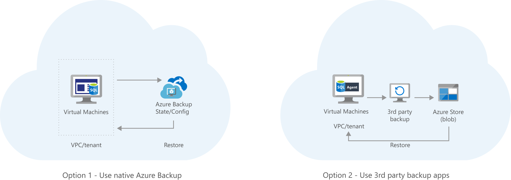

[!INCLUDE [header_file](../../../includes/sol-idea-header.md)]

Archive your on-premises data to Azure Blob storage.

This solution is built on the Azure managed services: [StorSimple](https://azure.microsoft.com/services/storsimple) and [Blob Storage](https://azure.microsoft.com/services/storage/blobs). These services run in a high-availability environment, patched and supported, allowing you to focus on your solution instead of the environment they run in.

## Architecture

*Download an [SVG](../media/backup-archive-cloud-application.svg) of this architecture.*

### Components

* Azure [StorSimple](https://azure.microsoft.com/services/storsimple) appliance running on-premises that can tier data to Azure Blob storage (both hot and cool tier). [StorSimple](https://azure.microsoft.com/services/storsimple) can be used to archive data from on-premises to Azure.
* [Blob Storage](https://azure.microsoft.com/services/storage/blobs): A cool or archive tier on Azure Blob storage is used to back up data that's less frequently accessed, while a hot tier is used to store data that's frequently accessed.

## Next steps

* [Learning path for StorSimple](/azure/storsimple)
* [Azure Blob Storage: Hot, cool, and Archive storage tiers](/azure/storage/blobs/access-tiers-overview)
