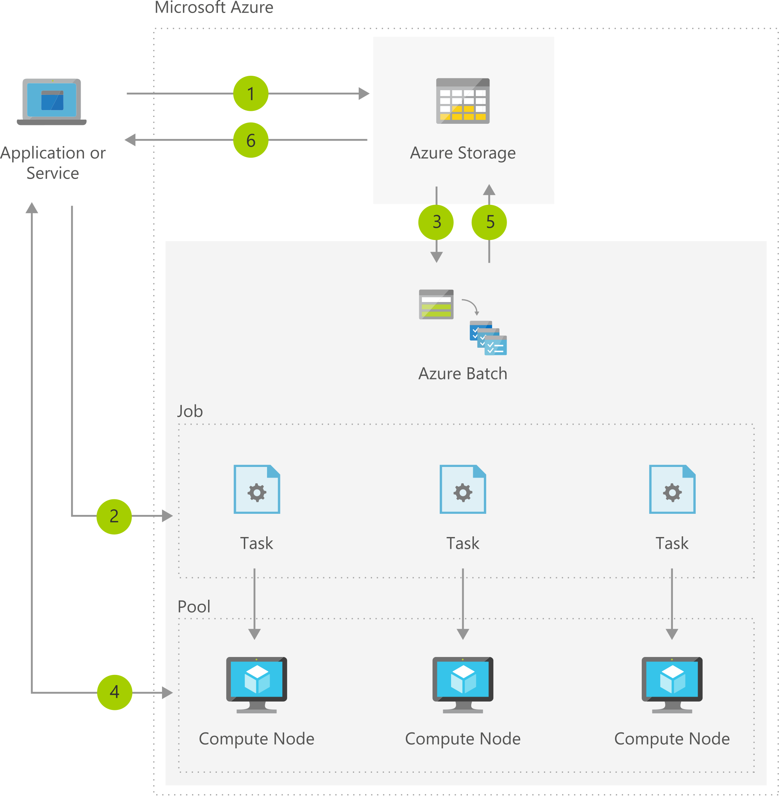

[!INCLUDE [header_file](../../../includes/sol-idea-header.md)]

Big compute and high performance computing (HPC) workloads are typically compute-intensive and can be run in parallel, taking advantage of the scale and flexibility of the cloud. The workloads are often run asynchronously using batch processing, with compute resources required to run the work and job scheduling required to specify the work. Examples of Big Compute and HPC workloads include financial risk Monte Carlo simulations, image rendering, media transcoding, file processing, and engineering or scientific simulations.

This solution implements a cloud-native application with Azure Batch, which provides compute resource allocation and management, application installation, resource autoscaling, and job scheduling as a platform service. Batch also offers higher-level workload accelerators specifically for running R in parallel, AI training, and rendering workloads.

This solution is built on managed services including Virtual Machines, Storage, and Batch. These Azure services run in a high-availability environment, patched and supported, allowing you to focus on your solution.

The following links provide documentation on deploying and managing the Azure products listed in the solution architecture:

* [Batch documentation](/azure/batch)

* [Virtual Machines](https://azure.microsoft.com/services/virtual-machines)

* [Azure Batch](https://azure.microsoft.com/services/batch)

* [Azure Blob Storage](https://azure.microsoft.com/services/storage)

## Architecture

*Download an [SVG](../media/big-compute-with-azure-batch.svg) of this architecture.*

### Data flow

1. Upload input files and the applications to your Azure Storage account.
1. Create a Batch pool of compute nodes, a job to run the workload on the pool, and the tasks in the job.
1. Batch downloads input files and applications.
1. Batch monitors task execution.
1. Batch uploads task output.
1. Download output files.

### Components

* [Azure Storage Accounts](https://azure.microsoft.com/services/storage): Massively scalable object storage for unstructured data.
* [Azure Batch](https://azure.microsoft.com/services/batch): Cloud-scale job scheduling and compute management.
* [Azure Virtual Machines](https://azure.microsoft.com/services/virtual-machines)
* [Azure Blob Storage](https://azure.microsoft.com/services/storage)

## Next steps

* [Quickstart: Upload, download, and list blobs using the Azure portal](/azure/storage/blobs/storage-quickstart-blobs-portal)
* [Quickstart: Run your first Batch job in the Azure portal](/azure/batch/quick-create-portal)
