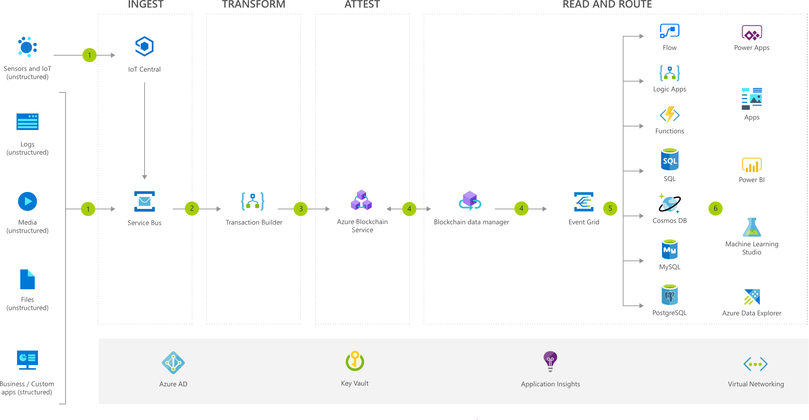

[!INCLUDE [header_file](../../../includes/sol-idea-header.md)]

Businesses use blockchain to digitize workflows they share with other organizations, such as moving physical assets across supply chains. The anatomy of blockchain apps is similar across use cases. Here, we use Azure Blockchain Service as the foundational managed blockchain network and build a consortium application that can ingest signals from relevant user interfaces and communicate ledger data to consuming apps across the consortium.

## Architecture

*Download an [SVG](../media/blockchain-workflow-application.svg) of this architecture.*

### Data flow

1. Relevant apps, devices, and data sources send events or data to a message broker (Azure Service Bus).
1. The distributed ledger technology (DLT) consumer Logic App fetches the data from the Service Bus and sends to transaction builder which builds and signs the transaction.
1. The signed transaction gets routed to Azure Blockchain Service (fully managed Ethereum consortium network) via a ledger-specific Logic App connector.
1. The blockchain data manager captures block and transaction data from configured transaction nodes, decodes events and properties and then sends the data to configured destinations.
1. Message broker sends ledger data to consuming business applications and off-chain database.
1. Information is analyzed and visualized using tools such as Power BI by connecting to off-chain database.

### Components

* [Azure Blockchain Service](https://azure.microsoft.com/services/blockchain-service): Build, govern, and expand consortium blockchain networks
* [Service Bus](https://azure.microsoft.com/services/service-bus): Connect across private and public cloud environments
* [Azure IoT Central](https://azure.microsoft.com/services/iot-central): Accelerate the creation of IoT solutions
* Application Insights: Detect, triage, and diagnose issues in your web apps and services
* [Event Grid](https://azure.microsoft.com/services/event-grid): Get reliable event delivery at massive scale
* [Logic Apps](https://azure.microsoft.com/services/logic-apps): Automate the access and use of data across clouds without writing code
* [Azure SQL Database](https://azure.microsoft.com/services/sql-database): Managed, intelligent SQL in the cloud
* [Azure Active Directory](https://azure.microsoft.com/services/active-directory): Synchronize on-premises directories and enable single sign-on
* [Key Vault](https://azure.microsoft.com/services/key-vault): Safeguard and maintain control of keys and other secrets
* [App Service](https://azure.microsoft.com/services/app-service): Quickly create powerful cloud apps for web and mobile
* [Virtual Network](https://azure.microsoft.com/services/virtual-network): Provision private networks, optionally connect to on-premises datacenters
* [Power BI Embedded](https://azure.microsoft.com/services/power-bi-embedded): Embed fully interactive, stunning data visualizations in your applications

## Next steps

* [Azure Blockchain documentation](/azure/blockchain/service)
* [Service Bus documentation](/azure/service-bus)
* [Azure IoT Central documentation](/azure/iot-central)
* [Application Insights documentation](/azure/azure-monitor/learn/tutorial-runtime-exceptions)
* [Event Grid Documentation](/azure/event-grid)
* [Logic Apps Documentation](/azure/logic-apps)
* [Azure SQL Database Documentation](/azure/sql-database)
* [Azure Active Directory Documentation](/azure/active-directory)
* [Key Vault documentation](/azure/key-vault)
* [App Service Documentation](/azure/app-service)
* [Virtual Network Documentation](/azure/virtual-network)
* [Power BI Documentation](/azure/power-bi-embedded)
