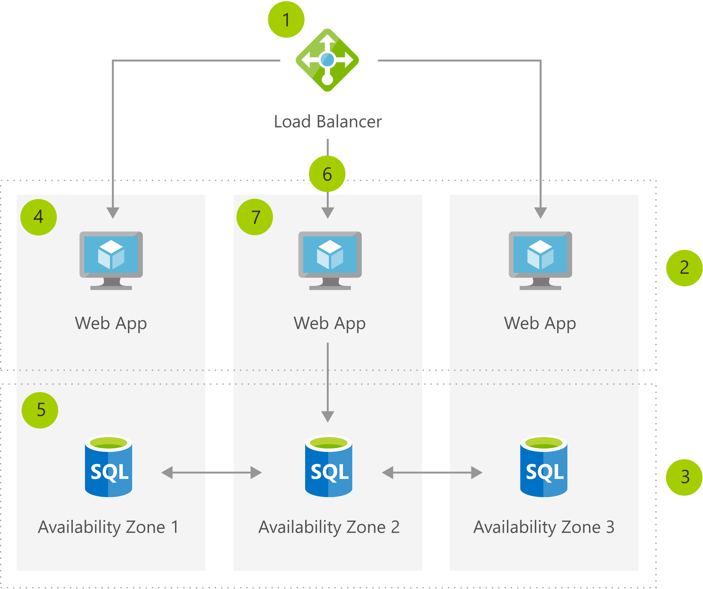

[!INCLUDE [header_file](../../../includes/sol-idea-header.md)]

Virtual machines (VMs) are physically separated across zones, and a virtual network is created using load balancers at each site. These locations are close enough for high availability replication, so your applications stay running, despite any issues at the physical locations.

## Potential use cases

This solution is ideal for the healthcare industry and the following scenarios:

* Hospitals
* Data centers

## Architecture

*Download an [SVG](../media/build-high-availability-into-your-bcdr-strategy.svg) of this architecture.*

### Dataflow

1. Create a zone-redundant Load Balancer.
1. Create a front-end subnet.
1. Create a DB subnet.
1. Create VMs in three availability zones.
1. Configure a zone-redundant SQL DB.
1. Add VMs to the load balancer's back-end pool.
1. Deploy your application on VMs, for redundancy and high availability.

### Components

* [Virtual Machines](https://azure.microsoft.com/services/virtual-machines): Provision Windows and Linux virtual machines in seconds
* [Azure SQL Database](https://azure.microsoft.com/services/sql-database): Managed, intelligent SQL in the cloud
* [Load Balancer](https://azure.microsoft.com/services/load-balancer): Deliver high availability and network performance to your applications

## Next steps

* [Virtual Machines documentation](/azure/virtual-machines)
* [SQL Database documentation](/azure/sql-database)
* [Load Balancer documentation](/azure/load-balancer)
