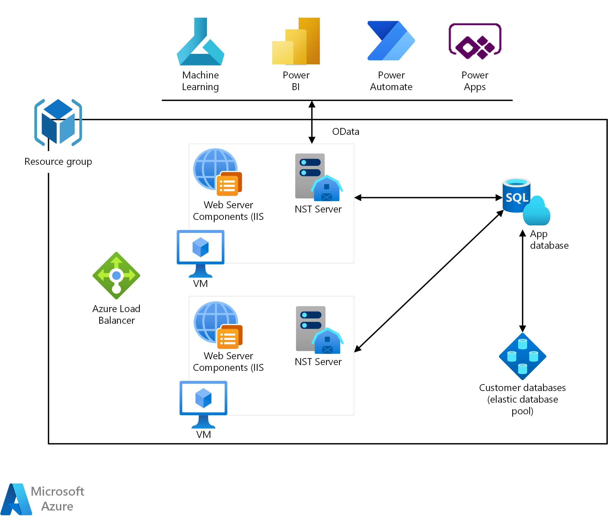

[!INCLUDE [header_file](../../../includes/sol-idea-header.md)]

Because Dynamics 365 Business Central SaaS isn't available in all countries/regions, this solution shows you how to use Business Central running as a VM in Azure.

## Architecture

  

*Download a [Visio file](https://arch-center.azureedge.net/business-central-as-a-service.vsdx)* of this architecture.

### Dataflow

This scenario demonstrates provisioning an environment ready for adding new tenant databases, new customers, and new demo tenants. The scenario is a complete environment, except for a customer database that will be built only once, and it allows usage for many different customers. For new customers, partners only need to deploy a new customer database and [mount](/dynamics365/business-central/dev-itpro/administration/mount-dismount-tenant) it.

The data flows through the scenario as follows:

1. Customers login using web browser, device (phone or tablet) or through API to access the Dynamics 365 Business Central.
1. [Virtual Machine](/azure/virtual-machines/windows/overview) as a middle-tier, provides Web Server Components and plays roles as a [NST Server](/dynamics365/business-central/dev-itpro/administration/configure-server-instance), connecting customers with databases. One Virtual Machine can be used for multiple customers and the partner just needs to provide different Business Central Server Instance with different ports numbers for each of customers. By using this model, support will be much easier as the partner needs to support only one server at a minimum. With [Azure Load Balancer](/azure/load-balancer/load-balancer-overview), this system will scale applications and create highly available services.
1. The application and business data reside in separate databases, both using Azure SQL for its databases. App database will be in one single database (S0 will be enough to run application database). The partner maintains the application centrally without affecting the various tenants that use the application. Tenant databases will be placed in an Azure elastic database pool (for starters, S4 pool with 200 DTU's will be enough). Each tenant database contains the business data for one or more specific companies from one client and doesn't contain all of the application metadata. If customers require more power, it's easy to change service tier on Azure SQL and an elastic database pool.
1. To provide better sustainability, all resources will be in one resource Group. All external services (Azure Machine Learning, Power Apps, Power Automate and Power BI) will communicate directly with the NST Server through exposed APIs and OData web services.

### Components

A [resource group](/azure/azure-resource-manager/management/manage-resource-groups-portal) is a container that holds related resources for an Azure solution. The resource group can include all the resources for the solution, or only those resources that you want to manage as a group. You decide how you want to allocate resources to resource groups based on what makes the most sense for your organization. Generally, add resources that share the same lifecycle to the same resource group so you can easily deploy, update, and delete them as a group.

[Azure Virtual Machines](https://azure.microsoft.com/products/virtual-machines) is one of several types of on-demand, scalable computing resources that Azure offers. Typically, you choose a virtual machine when you need more control over the computing environment than the other choices offer. A virtual machine is necessary for middle-tier services in Business Central architecture. Partners can choose between many different types of virtual machines with various numbers of CPUs and memory.

[Azure SQL Database](https://azure.microsoft.com/products/azure-sql/database) is a fully managed Platform as a Service (PaaS) Database Engine that handles most of the database management functions such as upgrading, patching, backups, and monitoring without user involvement. Azure SQL Database is always running on the latest stable version of SQL Server Database Engine and patched OS with 99.99% availability. PaaS capabilities that are built into Azure SQL Databases enable you to focus on the domain-specific database administration and optimization activities that are critical for your business.

To choose the right database option, the best way is to choose one of the service tiers. You can choose Standard or Premium service tier with different numbers of [DTUs](/azure/azure-sql/database/resource-limits-dtu-single-databases#standard-service-tier). If you aren't experienced with deploying Azure SQL databases, you can find more information [here](/dynamics365/business-central/dev-itpro/deployment/deploy-database-azure-sql-database).

[Azure SQL Database elastic pools](/azure/azure-sql/database/elastic-pool-overview) are a simple, cost-effective solution for managing and scaling multiple databases that have varying and unpredictable usage demands. The databases in an elastic pool are on a single server and share a set number of resources at a set price. Elastic pools in Azure SQL Database enable SaaS developers to optimize the price performance for a group of databases within a prescribed budget while delivering performance elasticity for each database.

Similarly, with standard Azure SQL, you can choose different tiers and different number of DTUs for your elastic database pool.

With [Azure Load Balancer](https://azure.microsoft.com/solutions/load-balancing-with-azure), you can scale your applications and create highly available services. Load balancer supports both inbound and outbound scenarios. Load balancer provides low latency and high throughput and scales up to millions of flows for all TCP and UDP applications.

## Scenario details

Dynamics 365 Business Central SaaS isn't available in all countries/regions. Therefore, it's important to demonstrate a similar model using Business Central running as a VM in Azure.

### Potential use cases

Partners can build their own architecture where they can deploy Business Central, and clients can use this SMB ERP solution as a service using the most of benefits of using Business Central as a cloud solution. This example shows how to establish a production environment for Business Central in a partner's private Azure environment. Topics like licensing and authentication are beyond the scope of this solution idea.

## Considerations

These considerations implement the pillars of the Azure Well-Architected Framework, which is a set of guiding tenets that can be used to improve the quality of a workload. For more information, see [Microsoft Azure Well-Architected Framework](/azure/architecture/framework).

### Cost optimization

Cost optimization is about looking at ways to reduce unnecessary expenses and improve operational efficiencies. For more information, see [Overview of the cost optimization pillar](/azure/architecture/framework/cost/overview).

It's important to note that the partner doesn't need a virtual machine for each customer. It can significantly reduce costs for middle-tier service (VM) by combining access and just changing ports.

There are various options for VM sizes depending on the usage and workload. The partner will need to track performances and to increase power when needed by scaling up the VM(s). For app databases, you can take the smallest Azure SQL as S0 or eventually S1. The same situation applies with an Azure elastic database pool, where you have various options and you need to start with smallest as it's easy scalable.

## Contributors

*This article is maintained by Microsoft. It was originally written by the following contributors.*

Principal author:

 * [Aleksandar Totovic](https://www.linkedin.com/in/aleksandartotovic) | Program Manager

## Next steps

- [Mounting a tenant database against the specified Business Central Server instance](/powershell/module/microsoft.dynamics.nav.management/mount-navtenant?view=businesscentral-ps-16)
- [Mounting a tenant database on the specified Business Central Server instance](/powershell/module/microsoft.dynamics.nav.management/mount-navtenantdatabase?view=businesscentral-ps-16)
- [Creating a normal tenant in a specific tenant database](/powershell/module/microsoft.dynamics.nav.management/new-navtenant?view=businesscentral-ps-16)
- [Creating a new Business Central Server instance](/powershell/module/microsoft.dynamics.nav.management/new-navserverinstance?view=businesscentral-ps-16)
- [Changing the service state of a Business Central Server instance](/powershell/module/microsoft.dynamics.nav.management/set-navserverinstance?view=businesscentral-ps-16)
- [Starting a server instance](/powershell/module/microsoft.dynamics.nav.management/start-navserverinstance?view=businesscentral-ps-16)
- [Azure SQL Database](/azure/azure-sql/database/sql-database-paas-overview)

## Related resources

- [Architecture - E-commerce front end](../../example-scenario/apps/ecommerce-scenario.yml)
- [Architecture - E-commerce website running in secured App Service Environment](./ecommerce-website-running-in-secured-ase.yml)
