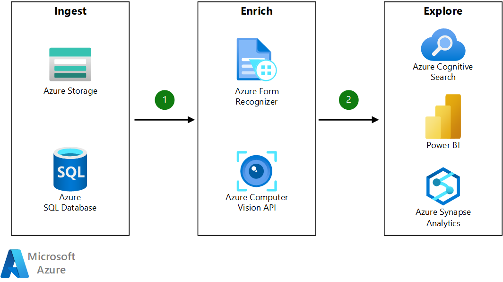

<!-- cSpell:ignore pracjain -->

[!INCLUDE [header_file](../../../includes/sol-idea-header.md)]

This architecture shows how to use [knowledge mining](https://azure.microsoft.com/solutions/knowledge-mining) in business process management to explore information, gain insight, and find relationships in your organization's data.

## Architecture

*Download a [Visio file](https://arch-center.azureedge.net/knowledge-mining-business-process-management.vsdx) of this architecture.*

### Dataflow

There are three steps in knowledge mining: ingest, enrich, and explore.

* **Ingest**

  The ingest step aggregates content from a range of sources, including structured and unstructured data.

  For business process management, you can ingest different types of content like project-related items including SOWs, requests for proposal, and sales team correspondence. Or, financial-related content can be ingested including: invoice archives, W2 forms, receipts, healthcare claim forms, bank statements, legal agreements, balance sheets, income statements, cash flow statements, company disclosures, SEC documents, and annual reports.

* **Enrich**

  During the enrich step, the AI capabilities of [Azure Applied AI Services](/azure/applied-ai-services) are used to extract information, find patterns, and deepen understanding.

  During this step, you can use optical character recognition (OCR) and forms recognition on the documents. You can use Azure Computer Vision for OCR and Azure Form Recognizer for forms recognition. Form Recognizer provides [prebuilt models](https://formrecognizer.appliedai.azure.com/studio) for documents like invoices, identity documents, and receipts. For more flexibility, you can build a custom model.

* **Explore**

  The explore step is exploring the data via search, bots, existing business applications, and data visualizations.

  Explore the content by automatically populating data from invoices into ELP systems, databases, or compile enriched documents in the knowledge store and project them into tabular or object stores. These physical stores can surface trends in an analytics dashboard, such as frequent issues, popular products, and much more.

### Components

These are the key technologies used for this technical content review and research:

* [Form Recognizer](https://azure.microsoft.com/services/form-recognizer)
* [Azure Computer Vision](https://azure.microsoft.com/services/cognitive-services/computer-vision)
* [Azure Cognitive Search](https://azure.microsoft.com/services/search)
* [Web API custom skills](/azure/search/cognitive-search-custom-skill-interface)

## Scenario details

This solution demonstrates how to use [knowledge mining](https://azure.microsoft.com/solutions/knowledge-mining) in business process management.

### Potential use cases

This solution is ideal for the finance industry. When organizations task employees with the review and research of technical data, it can be tedious to read page after page of dense text. Knowledge mining helps employees quickly review these materials. Knowledge mining can help avoid costly mistakes in scenarios where bidding competition is fierce or where you have to diagnosis problems quickly or in near real time. Examples include the following areas:

- Sales
- IT service management
- Finances
- Logistics

## Contributors

*This article is maintained by Microsoft. It was originally written by the following contributors.*

Principal author:

* [Kathryn Papandrew](https://www.linkedin.com/in/kathryn-jesaitis-papandrew-50411131) | Director, Specialist GBB

*To see non-public LinkedIn profiles, sign in to LinkedIn.*

## Next steps

* Use the [Knowledge Mining Solution Accelerator](/samples/azure-samples/azure-search-knowledge-mining/azure-search-knowledge-mining) to build an initial knowledge mining prototype with Azure Cognitive Search.
* Build an Azure Cognitive Search [custom skill](/azure/search/cognitive-search-custom-skill-interface).
* Learn about [extracting data from documents and forms by using OCR and Form Recognizer](/Shows/AI-Show/Extracting-Data-From-Documents-and-Forms-with-OCR-and-Form-Recognizer).
* Explore a Microsoft Learning path: [Implement knowledge mining with Azure Cognitive Search](/training/paths/implement-knowledge-mining-azure-cognitive-search).

## Related resources

- [Knowledge mining in auditing, risk, and compliance management](./auditing-and-risk-compliance.yml)
- [Knowledge mining for content research](./content-research.yml)
- [Knowledge mining in contract management](./contract-management.yml)
- [Knowledge mining for customer support and feedback analysis](./customer-feedback-and-analytics.yml)
- [Knowledge mining in digital asset management](./digital-asset-management.yml)
