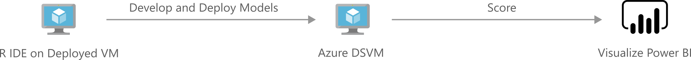

[!INCLUDE [header_file](../../../includes/sol-idea-header.md)]

This solution demonstrates how to build and deploy a machine learning model with SQL Server 2016 with R Services to recommend actions to maximize the purchase rate of leads targeted by a campaign.

## Architecture

*Download an [SVG](../media/campaign-optimization-with-sql-server.svg) of this architecture.*

## Overview

When a business launches a marketing campaign to interest customers in new or existing product(s), they often use a set of business rules to select leads for their campaign to target. Machine learning can be used to help increase the response rate from these leads. This solution demonstrates how to use a model to predict actions that are expected to maximize the purchase rate of leads targeted by the campaign. These predictions serve as the basis for recommendations to be used by a renewed campaign on how to contact (for example, e-mail, SMS, or cold call) and when to contact (day of week and time of day) the targeted leads. The solution presented here uses simulated data from the insurance industry to model responses of the leads to the campaign. The model predictors include demographic details of the leads, historical campaign performance, and product-specific details. The model predicts the probability that each lead in the database makes a purchase from a channel, on each day of the week at various times of day. Recommendations on which channel, day of week and time of day to use when targeting users are based then on the channel and timing combination that the model predicts will have the highest probability a purchase being made.

The Microsoft Marketing Campaign Optimization solution is a combination of a Machine learning prediction model and an interactive visualization tool, PowerBI. The solution is used to increase the response rate to a campaign by recommending the channel to contact (for example, e-mail, SMS, or cold call) as well as when to contact (day of week and time of day) targeted leads for use in a new campaign. The solution uses simulated data, which can easily be configured to use your own organization's data, to model the acquisition campaign response. The model uses predictors such as demographics, historical campaign performance and product details. The solution predicts the probability of a lead conversion from each channel, at various times of the day and days of the week, for every lead in the database. The final recommendation for targeting each lead is decided based upon the combination of channel, day of week and time of day with the highest probability of conversion. The solution has been modeled after a standardized data science process, where the data preparation, model training and evaluation can be easily done by a data scientist and the insights visualized and correlated to KPIs by marketing via Power BI visualization.

## Business Manager Perspective

This solution template uses (simulated) historical data to predict how and when to contact leads for your campaign. The recommendations include the best channel to contact a lead (in our example, email, SMS, or cold call), the best day of the week and the best time of day in which to make the contact.

SQL Server R Services brings the compute to the data by allowing R to run on the same computer as the database. It includes a database service that runs outside'the SQL Server process and communicates securely with the R runtime.

This solution packet shows how to create and refine data, train R models, and perform predictions on the SQL Server machine. The final predictions table in SQL Server provides recommendations for how and when to contact each lead. This data is then visualized in Power BI.

Power BI also presents visual summaries of the effectiveness of the campaign recommendations (shown here with simulated data). You can try out this dashboard by clicking the Try it Now link.

The Recommendations tab of this dashboard shows the predicted recommendations. At the top is a table of individual leads for our new deployment. This includes fields for the lead ID, campaign and product, populated with leads on which our business rules are to be applied. This is followed by the model predictions for the leads, giving the optimal channel and time to contact each one, and then the estimated probabilities that the leads will buy our product using these recommendations. These probabilities can be used to increase the efficiency of the campaign by limiting the number of leads contacted to the subset most likely to buy.

Also on the Recommendations tab are various summaries of recommendations and demographic information on the leads.

The Campaign Summary tab of the dashboard shows summaries of the historical data used to create the predicted recommendations. While this tab also shows values of Day of Week, Time of Day, and Channel, these values are actual past observations, not to be confused with the recommendations shown on the Recommendations tab.

## Data Scientist Perspective

SQL Server R Services brings the compute to the data by running R on the computer that hosts the database. It includes a database service that runs outside the SQL Server process and communicates securely with the R runtime.

This solution walks through the steps to create and refine data, train R models, and perform scoring on the SQL Server machine. The final scored database table in SQL Server gives the recommendations for how and when to contact each lead. This data is then visualized in PowerBI, which also contains a summary of the success of the recommendations used in your new campaign after it has completed. (Simulated data is shown in this template to illustrate the feature.)

Data scientists who are testing and developing solutions can work from the convenience of their R IDE on their client machine, while [pushing the compute to the SQL Server machine](/sql/advanced-analytics/r/getting-started-with-sql-server-r-services). The completed solutions are deployed to SQL Server 2016 by embedding calls to R in stored procedures. These solutions can then be further automated with SQL Server Integration Services and SQL Server agent.

Click on the Deploy button to test the automation and the entire solution will be made available in your Azure subscription.

## Pricing

Your Azure subscription used for the deployment will incur consumption charges on the services used in this solution, approximately $1.15/hour for the default VM.

Please ensure that you stop your VM instance when not actively using the solution. Running the VM will incur higher costs.

Please delete the solution if you are not using it.