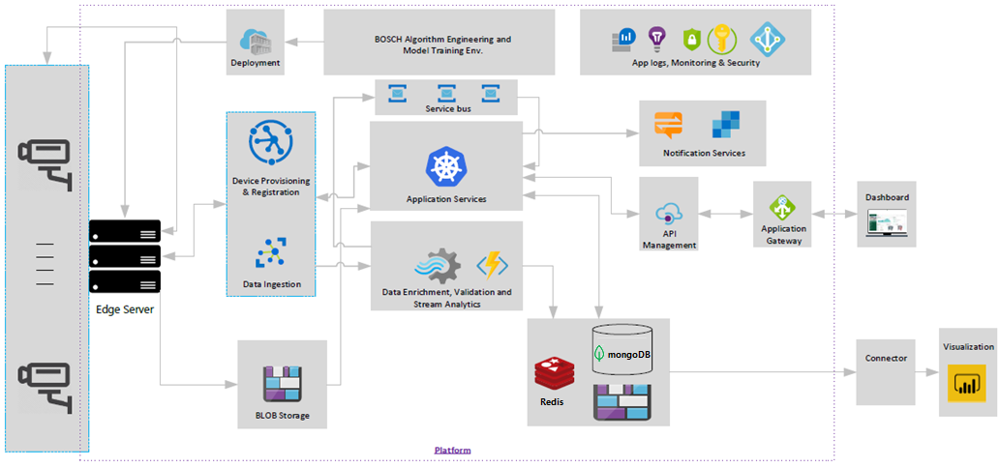

As workplaces and other group spaces reopen after the COVID-19 shutdown, people need to follow health and safety guidelines for safe social distancing, mask and PPE use, and occupancy limits. **Bosch COVID-19 Safe Solution** combines existing closed-circuit TV (CCTV) infrastructure with the [Azure intelligent edge](https://azure.microsoft.com/overview/future-of-cloud/) and other Azure and Microsoft services to help organizations monitor, comply with, and improve these health and safety practices.

This article showcases a COVID-19 Safe Solution which is being implemented in workplace facilities across Europe, North America and Latin America across industries as diverse as steel manufacturing, building construction and automotive assembly. Goals were to:

- Ensure a safe work environment when resuming manufacturing after the COVID-19 lockdown.
- Monitor and enforce compliance with face mask policy, social distancing, and occupancy limits on factory premises.
- Increase visibility and control through efficient reporting and interactive dashboards.
- Deliver alerts and notifications so health and safety stakeholders could address safety violations and concerns.
- Improve compliance, reduce violations, and enable well-informed safety decisions over time.

## Potential use cases

- Spaces with existing CCTV infrastructure.
- Stores, restaurants, offices, factories and warehouses, public transportation, hospitals, schools, and entertainment and recreation spaces.
- Organizations with multiple locations, to enable widespread, systemic data analysis and actions.

## Architecture

*Download a [Visio file][visio-download] of this architecture.*

1. CCTVs send video data to Internet of Things (IoT) Edge servers. Edge computing handles device registration, provisioning, and data ingestion.
2. The Bosch Algorithm Engineering and Model Training Environment uses custom vision analytics to continually retrain machine learning (ML) models, and directly updates edge servers.
3. Edge servers send data to onboard and cloud stream analytics and blob storage. IoT Edge intelligent devices limit costs by preprocessing and sending only necessary data to the cloud.
4. Stream analytics perform data enrichment and validation on both edge and cloud data.
5. Service bus device-to-cloud and cloud-to-device messaging send data and telemetry to and from the cloud.
6. An interactive visual dashboard app provides near real-time compliance monitoring and alerts.
7. The Azure cloud provides application logs, monitoring, security, application gateway, and API management for the app.
6. Redis, mongoDB, and blob storage store cloud data for Power BI analytics and visualizations via a custom connector.
8. The app sends notifications and alerts to stakeholders via Microsoft Teams.

## Components

- [Azure IoT Edge](https://azure.microsoft.com/services/iot-edge/) servers with onboard storage, computing, artificial intelligence (AI), and machine learning (ML) capabilities can quickly recognize and respond to sensor input.
- Bosch video analytics use [Custom Vision](https://azure.microsoft.com/services/cognitive-services/custom-vision-service/) skills and [Azure Machine Learning](https://azure.microsoft.com/services/machine-learning/) to continually improve monitoring, detection, and real-time alert triggering.
- [Azure Digital Twins](https://azure.microsoft.com/services/digital-twins/) IoT service creates comprehensive models of physical environments in a spatial intelligence graph. Rather than simply tracking individual devices, Digital Twins can virtually replicate the physical world by modeling the relationships between people, places, and devices.
- [Azure Stream Analytics (ASA)](https://azure.microsoft.com/services/stream-analytics) provides real-time serverless stream processing that can run the same queries in the cloud and on the edge. ASA on IoT Edge can filter or aggregate data that needs to be sent to the cloud for further processing or storage.
- [Azure Storage](https://azure.microsoft.com/services/storage/) provides flexible, scalable, secure [Blob storage](https://azure.microsoft.com/services/storage/blobs/) for unstructured data in the Azure cloud or on the IoT Edge. The current solution also uses [Redis](https://azure.microsoft.com/services/cache/) and [mongoDB](https://www.mongodb.com/cloud/atlas/azure-mongodb) data storage.
- [Azure Service Bus](https://azure.microsoft.com/services/service-bus/) messaging through [Azure IoT Hub](https://azure.microsoft.com/services/iot-hub/) connects devices to Azure cloud resources, and can use queries to filter data to be sent to the cloud.
- [Azure Kubernetes Service (AKS)](https://azure.microsoft.com/services/kubernetes-service/) is a managed service for developing, deploying, and managing containerized applications. In this solution, AKS manages an interactive visual dashboard app that tracks and analyzes safety violations.
- By integrating with the Azure cloud, the solution can use services like [Azure Monitor](https://azure.microsoft.com/services/monitor/), [Azure Security Center](https://azure.microsoft.com/services/security-center/), and [Azure Active Directory](https://azure.microsoft.com/services/active-directory/).
- Integration with Microsoft [Teams](https://support.office.com/article/manage-notifications-in-teams-1cc31834-5fe5-412b-8edb-43fecc78413d) allows automated notifications of relevant stakeholders like HR and Security.
- [Microsoft Power BI](https://powerbi.microsoft.com) visualizations enable well-informed and data-driven reporting and decision making.

## Next steps
For more information:
- Contact [iotcovidsupport@microsoft.com](mailto:iotcovidsupport@microsoft.com )
- See [https://www.bosch-india-software.com](https://www.bosch-india-software.com/en/)

## Related resources
- [What is Azure Digital Twins?](/azure/digital-twins/overview)
- [Azure Stream Analytics on IoT Edge](/azure/stream-analytics/stream-analytics-edge)
- [Store data at the edge with Azure Blob Storage on IoT Edge](/azure/iot-edge/how-to-store-data-blob)

[visio-download]: ./cctv-mask-detection-content-visio.vsdx
