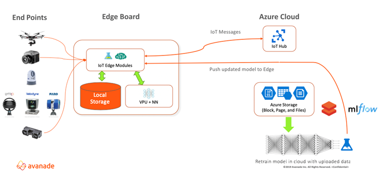

# People safe solutions at the IoT Edge

Bosch Covid Safe Solution combines existing closed-circuit TV (CCTV) infrastructure with [Azure intelligent edge](https://azure.microsoft.com/overview/future-of-cloud/), custom computer vision, video analytics, and machine learning, and cloud capabilities to help organizations monitor and comply with safety practices like social distancing, occupancy limits, and face mask/PPE use.

The solution uses to combine Internet of Things (IoT) edge processing with cloud services.
like digital twins and stream analytics, 
combining Internet of Things (IoT) edge devices with the storage, computing, artificial intelligence (AI), and machine learning (ML) capabilities.

IoT Edge technology can quickly recognize and respond to sensor input by using onboard processing. IoT Edge intelligent devices can respond quickly or even offline, and limit costs by preprocessing and sending only necessary data to the cloud.
Bosch video analytics suite uses custom computer vision and machine learning to continually improve monitoring, detection, and real-time alert triggering for safety violations.
Azure IoT Hub in the cloud controls the devices and connects them to Azure resources. 
Customized audio and visual alerts in local languages inform violators and initiate corrective action. 
Interactive visual display dashboards help safety officers track and analyze violations. Integration with MS Teams allows notification of relevant stakeholders like HR and Security.
Power BI visualizations enable well-informed and data-driven safety decision making.

https://www.bosch-india-software.com/en/

## Use cases

- This article presents the implementation of a COVID-19 Safe Solution at a major North American auto manufacturing facility.
- The solution can adapt to stores, restaurants, offices, factories and warehouses, public transportation, hospitals, schools, and entertainment and recreation spaces.
- The solution can detect and register violations across many locations to enable widespread, systemic corrective and preventive actions.

## Architecture

Goals were to:

- Ensure a safe work environment when resuming manufacturing after the COVID-19 lockdown.
- Monitor and enforce compliance with face mask policy, social distancing, and occupancy limits on factory premises.
- Increase visibility and control through efficient reporting and interactive dashboards.
- Deliver alerts and notifications to health and safety stakeholders to address safety concerns and violations.
- Increase compliance and reduce safety violations over time.

- Social distancing measurement
- Occupancy counts
- PPE and face mask detection

Using the 

## Potential use cases

- Turn public touchpoints to touch-free interfaces for uses like building and room access, elevator controls, retail and vending machine sales, and transit and traffic signaling.
- Use voice or other contactless controls with typical mobile endpoints like phones.

## Architecture

1. End points like microphones, cameras, and touchscreens collect data.
2. Onboard voice processing units on the IoT Edge devices apply cognitive skillsets and updated machine learning models to local data.
3. The IoT hub in the Azure cloud controls and communicates with the edge devices, receiving data and sending updated models.
4. Azure Storage stores the uploaded data.
5. Azure Machine Learning uses the data to retrain its AI models.
6. IoT Hub pushes updated machine learning models to the edge devices.

## Components

Digital twins
Stream analytics
- [Azure IoT Edge](https://azure.microsoft.com/services/iot-edge/) service deploys cloud workloads to run on IoT Edge devices via standard containers. Modules can run AI, other Azure and third-party services, or your own business logic. IoT Edge intelligent devices can respond quickly and offline, and limit costs by preprocessing and sending only necessary data to the cloud.
- [Azure IoT Hub](https://azure.microsoft.com/services/iot-hub/) provides a cloud-hosted backend to connect virtually any IoT device with Azure cloud services. IoT Hub enables highly secure and reliable bi-directional communication, management, and provisioning for IoT Edge devices.
- [Azure Storage](https://azure.microsoft.com/services/storage/) provides flexible, scalable, secure storage in the Azure cloud. The current solution uses [block blobs](https://azure.microsoft.com/pricing/details/storage/blobs/) to store unstructured data, [page blobs](https://azure.microsoft.com/pricing/details/storage/page-blobs/) to read and write random small data segments, and [file storage](https://azure.microsoft.com/pricing/details/storage/files/) for file shares.
- [Azure Cognitive Services](https://azure.microsoft.com/services/cognitive-services/) are a family of AI services and cognitive APIs that help build intelligent apps. For example, voice control can use the [Speech to Text](https://azure.microsoft.com/services/cognitive-services/speech-to-text/) and [Speaker Recognition](https://azure.microsoft.com/services/cognitive-services/speaker-recognition/) services. Extending the solution to image or facial recognition could use [Computer Vision](https://azure.microsoft.com/services/cognitive-services/computer-vision/), [Custom Vision](https://azure.microsoft.com/services/cognitive-services/custom-vision-service/), and [Facial Recognition](https://azure.microsoft.com/services/cognitive-services/face/).
- [Machine Learning (ML)](https://wikipedia.org/wiki/Machine_learning) uses algorithms to improve machine predictions or decisions automatically through experience. Machine learning algorithms build and continually *train* mathematical *models*. [Azure Machine Learning](https://azure.microsoft.com/services/machine-learning/) lets you build, train, deploy, track, and manage ML models at cloud scale.

## Next steps

- Voice control is the basic function in this solution. The platform can potentially extend to multiple sense recognition, like faces and gestures.
- The solution can support global deployment by using Cognitive Services [Speech Translation](https://azure.microsoft.com/services/cognitive-services/speech-translation/) APIs.
