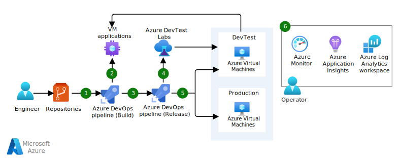

Azure Virtual Machines is an option for hosting custom applications when you want flexible and granular management of your compute. Virtual machines (VMs) should be subject to the same level of engineering rigor as Platform-as-a-Service (PaaS) offerings throughout the development lifecycle. For example, implementing automated build and release pipelines to push changes to the VMs.

This article describes a high-level DevOps workflow for deploying application changes to VMs using continuous integration (CI) and continuous deployment (CD) practices using Azure Pipelines. 

## Architecture

*Download a [Visio file](https://arch-center.azureedge.net/cicd-for-azure-vms.vsdx) of this architecture.*

### Components

The architecture uses these components.

##### GitHub repository

GitHub serves as the code repository that provides version control and a platform for collaborative projects. 

##### Azure Pipelines

Azure Pipelines can automatically build application source code and infrastructure code from your code repository. It has a Build system for producing packages and other build artifacts and a Release Management system for setting up a pipeline to deploy your changes through dev, test, and production environments. The pipeline uses Infrastructure-as-Code (IaC) templates to provision or update your infrastructure as necessary in each environment, and then deploys the updated build. 

> For product documentation, see [Azure Pipelines](https://azure.microsoft.com/services/devops): runs automated builds, tests, and deployments.

An alternate technology option for CI/CD pipelines is GitHub Actions. There are advantages because the source code and the pipeline are set side-by-side. However, in this design, Azure Pipelines was chosen because of its integration with Azure DevTest Labs and VM Applications (discussed next). 

##### VM Applications

Azure VM Applications is recommended for simplified deployment of application changes. When there's a new version of an application, you can just deploy the VM application package without ever affecting the VM image. VM Applications facilitate CI/CD processes for package deployment through Azure Pipelines.

> For product documentation, see [VM Applications](/azure/virtual-machines/vm-applications). 

##### Azure DevTest Labs

For VMs, using Azure DevTest Labs is highly recommended for running automated test pipelines. DevTest Labs can quickly provision development and test stages with reusable templates and artifacts. Also, automatically tear down test resources that aren't in use. DevTest Labs is integrated with Azure Pipelines.

> For product documentation, see [Azure DevTest Labs](https://azure.microsoft.com/services/devtest-lab).

##### Azure Virtual Machines

Infrastructure-as-a-Service (IaaS) compute with Linux or Windows image that runs the application.

> For product documentation, see [Virtual Machines](https://azure.microsoft.com/services/virtual-machines).

##### Azure Monitor

An observability resource  that collects and stores metrics and logs, application telemetry, and platform metrics for the Azure services. Use this data to monitor the application, set up alerts, dashboards, and perform root cause analysis of failures. 

> For product documentation, see [Azure Monitor](https://azure.microsoft.com/services/monitor):  collects and stores metrics and logs, including application telemetry.

### Workflow

1. Azure Pipelines triggers automated build and test jobs (continuous integration).
1. The application is packaged through VM Application. It's versioned and pushed to VM application registry.
1. Azure Pipelines orchestrates the deployment of infrastructure changes and the updated VM application (continuous deployment). 
1. Azure DevTest Labs provisions the compute and orchestrates the application deployment development and test environments.
1. The changes are deployed to pre-production and production environments.
1. Azure Monitor collects observability data such as, logs and metrics so that an operator can analyze health, performance, and usage data. Application Insights collects all application-specific monitoring data, such as traces. Azure Log Analytics is used to store all that data. 

[!INCLUDE [header_file](../../../includes/sol-idea-header.md)]

## Next steps

* [Integrate DevTest Labs into Azure Pipelines](/azure/devtest-labs/devtest-lab-integrate-ci-cd)
* [Create and deploy VM Applications](/azure/virtual-machines/vm-applications-how-to?tabs=portal)

## Related resources

* [Run a Linux VM on Azure](/azure/architecture/reference-architectures/n-tier/linux-vm)
