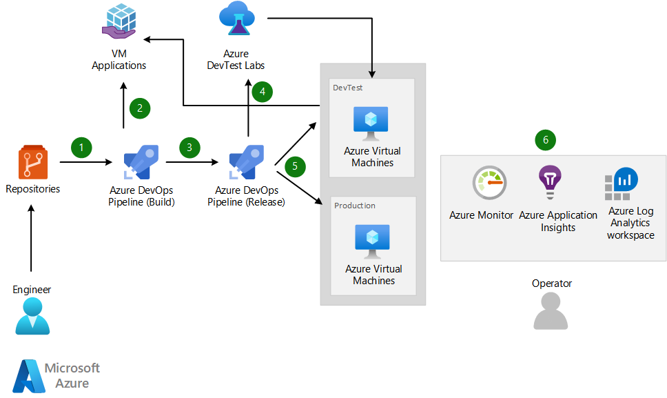

[!INCLUDE [header_file](../../../includes/sol-idea-header.md)]

Azure Virtual Machines are still a valid choice for hosting applications when you want flexible and granular management of your compute. Virtual machines (VMs) should be subject to the same level of engineering rigor as Platform-as-a-Service (PaaS) offerings throughout the development lifecycle to avoid failures. For example, implementing automated build and release pipelines to push changes.

This article describes a high-level DevOps workflow for deploying application changes to VMs using continuous integration (CI) and continuous deployment (CD) practices using Azure Pipelines. 

Azure Pipelines can automatically build application source code and infrastructure code from your code repository. It has a Build system for producing packages and other build artifacts and a Release Management system for setting up a pipeline to deploy your changes through dev, test, and production environments. The pipeline uses Infrastructure-as-Code (IaC) templates to provision or update your infrastructure as necessary in each environment, and then deploys the updated build. 

VM Applications is recommended for simplified deployment of application changes. When there's a new version of an application, you can just deploy the VM app package without ever affecting the VM image. The application package can be deployed using Azure Pipelines.

For VMs, using Azure DevTest Labs is highly recommended for running automated test pipelines. DevTest Labs can quickly  provision development and test stages and automatically tear down test resources that aren't in use. DevTest Labs is integrated with Azure Pipelines.

## Architecture

*Download a [Visio file](https://arch-center.azureedge.net/cicd-for-azure-vms.vsdx) of this architecture.*

### Components

* [Virtual Machines](https://azure.microsoft.com/services/virtual-machines) with Linux or Windows image that runs the application.
* [VM Applications](azure/virtual-machines/vm-applications) creates application packages and facilitates CI/CD processes for deployment through Azure Pipelines.
* [Azure Pipelines](https://azure.microsoft.com/services/devops): runs automated builds, tests, and deployments.
* [Azure DevTest Labs](https://azure.microsoft.com/services/devtest-lab) creates test environments with reusable templates and artifacts.
* [Azure Monitor](https://azure.microsoft.com/services/monitor):  collects and stores metrics and logs, including application telemetry.

### Workflow

1. The developer pushes code changes to a feature branch in the code respository. 
1. Continuous integration triggers automated build and test processes.
1. Continuous deployment trigger orchestrates deployment of application artifacts and infrastructure changes with environment-specific parameters.
    1. VM application builds the VM image with the application already installed.
1. The changes are deployed to Dev, Test, and Prod environments.
1. 1. Azure Monitor collects logs and metrics so that an operator can analyze health, performance, and usage data.

## Next steps

* [Run a Linux VM on Azure](/azure/architecture/reference-architectures/n-tier/linux-vm)
* [Integrate DevTest Labs into Azure Pipelines](https://docs.microsoft.com/en-us/azure/devtest-labs/devtest-lab-integrate-ci-cd)
* [Create and deploy VM Applications](/azure/devtest-labs/devtest-lab-integrate-ci-cd)
* [Use Azure DevOps to manage a virtual machine in Azure DevTest Labs](/azure/devops/pipelines/apps/cd/azure/deploy-provision-devtest-lab)

