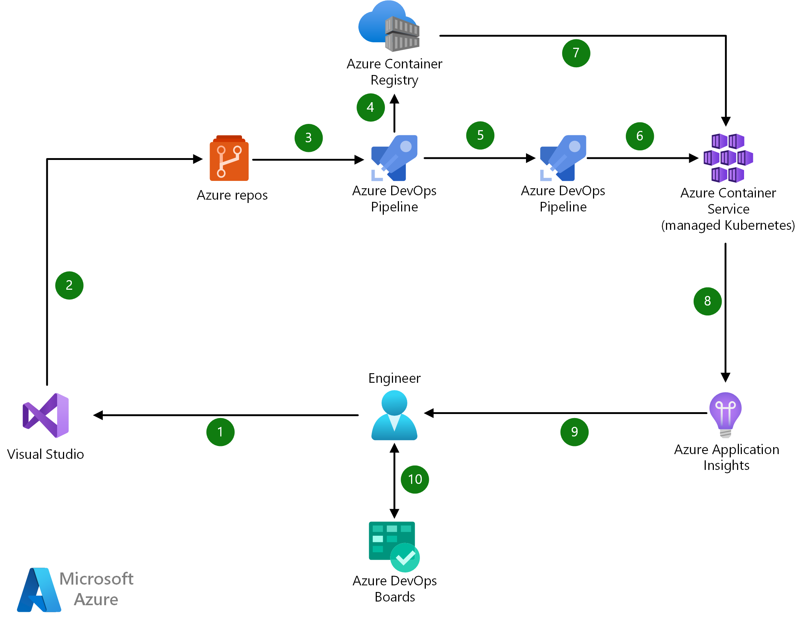

# CI/CD for Containers

[!INCLUDE [header_file](../../../includes/sol-idea-header.md)]

Containers make it easy for you to continuously build and deploy your applications. By orchestrating deployment of those containers using Kubernetes in Azure Kubernetes Service (AKS), you can achieve replicable, manageable clusters of containers.

By setting up a continuous build to produce your container images and orchestration, Azure DevOps increases the speed and reliability of your deployment.

## Architecture

*Download an [SVG](../media/cicd-for-containers.svg) of this architecture.*

## Data Flow

1. Change application source code
1. Commit Application Code
1. Continuous integration triggers application build, container image build and unit tests
1. Container image pushed to Azure Container Registry
1. Continuous deployment trigger orchestrates deployment of application artifacts with environment-specific parameters
1. Deployment to Azure Kubernetes Service (AKS)
1. Container is launched using Container Image from Azure Container Registry
1. Application Insights collects and analyses health, performance, and usage data
1. Review health, performance and usage information
1. Update backlog item

## Components

* [Container Registry](https://azure.microsoft.com/services/container-registry): Store and manage container images across all types of Azure deployments
* [Azure Kubernetes Service (AKS)](https://azure.microsoft.com/services/kubernetes-service): Simplify the deployment, management, and operations of Kubernetes
* Application Insights: Detect, triage, and diagnose issues in your web apps and services
* [Azure DevOps](https://azure.microsoft.com/services/devops): Build and deploy multi-platform apps to get the most from Azure services

## Next steps

* [Pushing Docker images to Azure Container Registry](https://docs.microsoft.com/azure/container-registry/container-registry-get-started-docker-cli)
* [Authenticate Azure Kubernetes Service (AKS) cluster to Azure Container Registry](https://docs.microsoft.com/azure/container-registry/container-registry-auth-aks)
* [Performance monitoring with Application Insights](https://docs.microsoft.com/azure/application-insights/app-insights-detect-triage-diagnose)
* [Git on Azure DevOps](https://docs.microsoft.com/vsts/git/gitquickstart?tabs=visual-studio)

## Pricing Calculator

* [Customize and get pricing estimates](https://azure.com/e/91c84e39f4df46afaf6c6c433b2c7d78)
