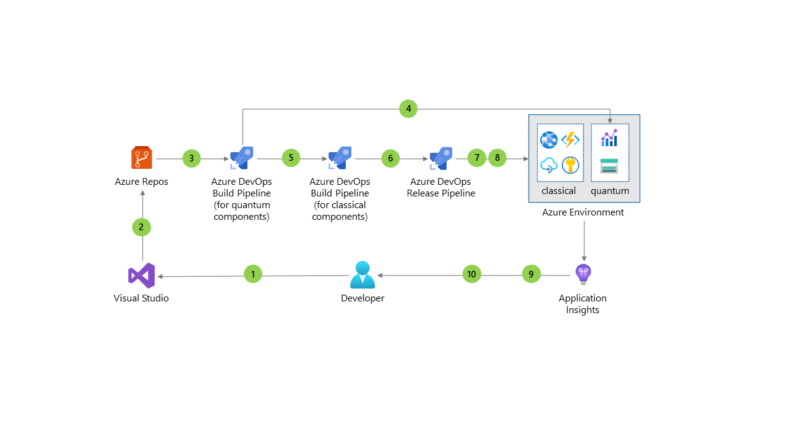

[!INCLUDE [header_file](../../../includes/sol-idea-header.md)]

Quantum computing applies the unique behavior of quantum physics to computing. This approach provides dramatically faster compute than classical computing, especially in areas like optimization, simulation, and machine learning. However, quantum computing components have a different development and operating model from that of classical software. Typically, one or more classical compute components orchestrates the [execution of quantum jobs](/azure/quantum/how-to-work-with-jobs) at runtime.

The resulting combination of classical and quantum components must be reflected in the build process. This is true for both the [loosely coupled](../../example-scenario/quantum/loosely-coupled-quantum-computing-job.yml) and the [tightly coupled](../../example-scenario/quantum/tightly-coupled-quantum-computing-job.yml) integration approaches. The quantum components have special requirements in their [software development lifecycle](/azure/quantum/overview-what-is-qsharp-and-qdk#what-can-i-do-with-the-qdk). For quality assurance, quantum jobs should be run on simulators, sized on resource estimators, and, in some cases, run on quantum hardware. After successful tests, developers can integrate the job artifacts into the classical components that submit the job to quantum targets at runtime.

This solution shows how to implement continuous integration and continuous delivery (CI/CD) for quantum computing by using Azure services like Azure Quantum, Azure Repos, and Azure Pipelines. 

## Potential use cases
This solution applies when quantum computing jobs are run as part of a classical application. It applies to these broad categories:
- Optimization
- Simulation
- Machine learning 

## Architecture

*Download a [PowerPoint file](https://arch-center.azureedge.net/cicd-quantum.pptx) of this architecture.*

### Dataflow

1. The developer changes the source code of the application components.
1. Changes are committed to the source code repository.
1. Changes to quantum code trigger the quantum build pipeline. The build pipeline checks out the code, compiles it, estimates required resources, and runs the algorithm on a simulator.
1. The compiled quantum algorithm is submitted to a quantum environment for testing.
1. Changes trigger a build pipeline for the classical components. The pipeline checks out the code, compiles it, and runs unit and integration tests.
1. Successful compilation and tests trigger a release pipeline. The pipeline first provisions the Azure environment by deploying the Azure Resource Manager templates that are stored in the repository (Infrastructure as Code).
1. Compiled classical application artifacts are deployed to Azure. The quantum jobs are submitted to a quantum workspace during runtime.
1. Application Insights monitors runtime behavior, health, performance, and usage information.
1. Backlog items are updated as needed, depending on monitoring results.
1. The developer uses Application Insights for application feedback and optimization.

### Components

This solution uses the following DevOps tools:

* [Azure Repos](https://azure.microsoft.com/services/devops/repos) provides unlimited, cloud-hosted private Git repos. It's used here to store the quantum and classical code and the Azure Resource Manager templates that are used to provision the environment.
* [Azure Pipelines](https://azure.microsoft.com/services/devops/pipelines) enables you to continuously build, test, and deploy to the cloud. Here, it's used to implement CI/CD, including the environment provisioning before code deployment.

As an alternative, you can use GitHub repositories and GitHub actions to implement the CI/CD processes.

The solution uses the following other components:

* A client application orchestrates the quantum job. You can implement integration by using a [tightly coupled](../../example-scenario/quantum/tightly-coupled-quantum-computing-job.yml) or a [loosely coupled](../../example-scenario/quantum/loosely-coupled-quantum-computing-job.yml) approach.
* [Azure Quantum](https://azure.microsoft.com/services/quantum) provides a [workspace](/azure/quantum/how-to-create-workspace) for assets that are associated with running quantum computing applications. Jobs are run on quantum simulators, quantum hardware, or optimization solvers, depending on the provider that you choose.
* [Azure Active Directory](https://azure.microsoft.com/services/active-directory) coordinates user authentication and protects access to the Azure Quantum workspace.
* [Azure Key Vault](https://azure.microsoft.com/services/key-vault) safeguards and maintains control of keys and other secrets, like the quantum workspace name.
* [Azure Storage](https://azure.microsoft.com/services/storage) holds the input and output data of the quantum job.
* [Application Insights](/azure/azure-monitor/app/app-insights-overview) monitors the application, detects application anomalies like poor performance and failures, and sends telemetry to the Azure portal.

## Next steps

* For an overview of Microsoft Quantum, a full-stack, open-cloud quantum computing ecosystem, see [Microsoft Quantum](https://azure.microsoft.com/solutions/quantum-computing) and complete the [Quantum computing foundations](/learn/paths/quantum-computing-fundamentals) learning path.
* For more information about the Azure Quantum service, see [Azure Quantum](https://azure.microsoft.com/services/quantum).
* For general information about Azure Quantum job management, see [Work with Azure Quantum jobs](/azure/quantum/how-to-work-with-jobs).
* For more information about Azure DevOps, see the [Azure DevOps documentation](/azure/devops).

## Related resources

* [The operational excellence pillar](/azure/architecture/framework/devops/overview) of the Microsoft Azure Well-Architected Framework
* [DevOps Checklist](../../checklist/dev-ops.md)
* [Choose an Azure compute service for your application](../../guide/technology-choices/compute-decision-tree.md)
