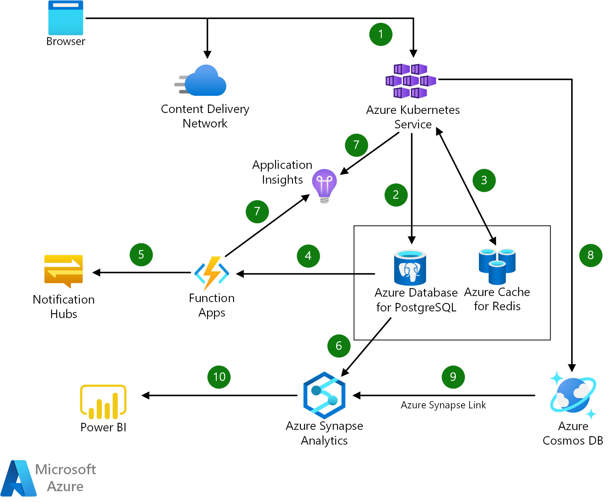

[!INCLUDE [header_file](../../../includes/sol-idea-header.md)]

This article presents a solution for using Azure services to build cloud-native applications.

*Apache® and [Apache Spark](https://spark.apache.org) are either registered trademarks or trademarks of the Apache Software Foundation in the United States and/or other countries. No endorsement by The Apache Software Foundation is implied by the use of these marks.*

## Architecture

*Download a [Visio file](https://arch-center.azureedge.net/cloud-native-apps.vsdx) of this architecture.*

### Dataflow

1. Azure Kubernetes Service (AKS) is used to deploy and manage containerized applications. The orchestration uses continuous integration and delivery (CI/CD) and enterprise-grade security and governance.
1. Azure Database for PostgreSQL provides a fully managed database as a service for PostgreSQL. This service offers built-in high availability and the rich feature set of Postgres.
1. Azure Cache for Redis offloads database activity by managing session state and asset caching.
1. Events like user movement or activity trigger functions in the Azure Functions serverless compute platform. The functions generate alerts.
1. Azure Notification Hubs sends timely notifications to users on their preferred service or medium.
1. Azure Synapse Analytics supplies insights into the data. Apache Spark capabilities in this analytics service provide big data processing and machine learning functionality.
1. Application Insights monitors application performance for degradation or anomalies. This Azure Monitor feature also auto-scales applications to meet changing performance requirements.
1. Azure Cosmos DB is used to track user interaction with applications. This fully managed NoSQL database scales as needed to meet changing demand.
1. The hybrid transactional and analytical processing (HTAP) capability of Azure Synapse Link for Azure Cosmos DB integrates user data into analytics processing. The result is near real-time insight into user-app interaction.
1. Power BI visualizations display predictive, real-time, and historical transaction data.

### Components

- [AKS](https://azure.microsoft.com/products/kubernetes-service) allows you to quickly deploy a production-ready Kubernetes cluster in Azure.
- [Azure Database for PostgreSQL](https://azure.microsoft.com/products/postgresql) is a fully managed relational database service based on the community edition of the open-source PostgreSQL database engine.
- [Azure Cache for Redis](https://azure.microsoft.com/products/cache) is a secure data cache and messaging broker that provides high-throughput and low-latency access to data for applications.
- [Azure Cosmos DB](https://azure.microsoft.com/products/cosmos-db) is a fully managed NoSQL database service for building and modernizing scalable, high-performance applications.
- [Notification Hubs](https://azure.microsoft.com/products/notification-hubs) sends push notifications from any back end to any mobile device.
- [Functions](https://azure.microsoft.com/products/functions) is a serverless compute service that lets you run event-triggered code without having to explicitly provision or manage infrastructure.
- [Application Insights](https://azuremarketplace.microsoft.com/marketplace/apps/Microsoft.AppInsights) is an extensible application performance management service that's a feature of [Monitor](https://azure.microsoft.com/products/monitor). You can use Application Insights to monitor live applications and continuously improve performance and usability.
- [Azure Synapse Analytics](https://azure.microsoft.com/products/synapse-analytics) is an analytics service that brings together enterprise data warehousing and big data analytics within a unified experience.
- [Power BI](https://powerbi.microsoft.com) is a suite of business tools for self-service and enterprise business intelligence. Here, it's used to analyze and visualize data.

## Scenario details

Cloud-native applications are a key part of a successful digital transformation strategy. These applications use technologies like microservices, containers, managed services, and CI/CD. As a result, these apps offer advantages over other apps, such as agility, scalability, and reduced time to market.

This solution uses various cloud-native technologies:

- Containerized applications that are orchestrated by AKS
- A CI/CD experience
- The Functions serverless compute platform
- Other fully managed cloud services:
  - Azure Database for PostgreSQL
  - Azure Cosmos DB
  - Azure Cache for Redis

The solution also provides near real-time analytics through:

- Power BI for visualizations of predictive and historical data.
- Azure Synapse Analytics, which uses Apache Spark for big data processing and machine learning.

### Potential use cases

Because the cloud-native applications in this solution use Azure managed services, analytics, and machine learning, they're responsive to customer needs. These applications benefit many industries:

- E-commerce
- Content streaming
- Internet of Things (IoT)
- Government
- Education
- Finance

## Next steps

- To read about organizations that use cloud-native applications on Azure, see the following customer stories:
  - [Mars Veterinary Health](https://customers.microsoft.com/story/815549-pet-care-leader-turns-monolith-app-into-a-global-distributed-solution-on-azure)
  - [Chipotle Mexican Grill](https://customers.microsoft.com/story/787157-chipotle-retailers-azure)

- For more information about Azure Synapse Link, see these resources:
  - To find out how to use Azure Synapse Link to run near real-time analytics over operational data in Azure Cosmos DB, see [What is Azure Synapse Link for Azure Cosmos DB?](/azure/cosmos-db/synapse-link).
  - Use cases for Azure Synapse Link cover many areas. Examples include real-time personalization, predictive maintenance and anomaly detection in IoT scenarios, and supply chain analytics, forecasting, and reporting. To explore these use cases, see [Azure Synapse Link for Azure Cosmos DB: Near real-time analytics use cases](/azure/cosmos-db/synapse-link-use-cases).

- To find out more about other solution components, see the following resources:

  - [AKS](/azure/aks/intro-kubernetes)
  - [Azure Database for PostgreSQL](/azure/postgresql/overview)
  - [Azure Cache for Redis](/azure/azure-cache-for-redis/cache-overview)
  - [Azure Cosmos DB](/azure/cosmos-db/introduction)
  - [Notification Hubs](/azure/notification-hubs/notification-hubs-push-notification-overview)
  - [Functions](/azure/azure-functions/functions-overview)
  - [Application Insights](/azure/azure-monitor/app/app-insights-overview)
  - [Azure Synapse Analytics](/azure/synapse-analytics/sql-data-warehouse/sql-data-warehouse-overview-what-is)
  - [Power BI](/power-bi/fundamentals/power-bi-overview)

## Related resources

- [Microservices architecture design](../../microservices/index.yml)
- [Code walkthrough: Serverless application with Functions](../../serverless/code.yml)
