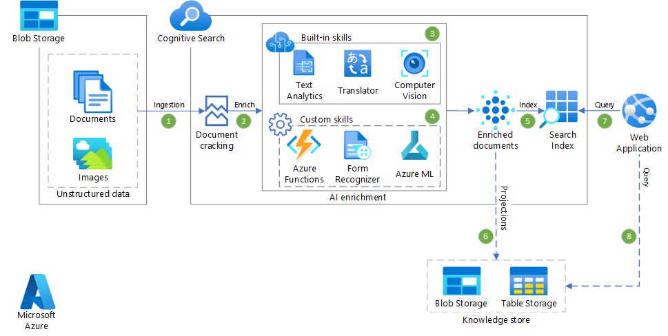

Large, unstructured datasets like the [JFK Files](https://www.archives.gov/research/jfk/2017-release), which contains over 34,000 pages of documents about the CIA investigation of the 1963 JFK assassination, include typewritten and handwritten notes, photos and diagrams, and other unstructured data that standard search solutions can't parse.

*AI enrichment* in Azure Cognitive Search can extract and enhance searchable, indexable text from images, blobs, and other unstructured data sources like the JFK Files by using pre-trained machine learning skillsets from the Cognitive Services [Computer Vision](/azure/cognitive-services/computer-vision/home) and [Text Analytics](/azure/cognitive-services/text-analytics/overview) APIs. You can also create and attach [custom skills](/azure/search/cognitive-search-custom-skill-interface) to add special processing for domain-specific data like CIA Cryptonyms. Azure Cognitive Search can then index and search the context.

The Azure Cognitive Search skills in this example solution fall into the following categories:

- *Image-processing* built-in skills like [optical character recognition (OCR)](/azure/search/cognitive-search-skill-ocr), [print extraction](/azure/cognitive-services/computer-vision/concept-recognizing-text#read-api), and [image analysis](/azure/search/cognitive-search-skill-image-analysis) include object and face detection, tag and caption generation, and celebrity and landmark identification. These skills create text representations of image content, which are searchable using the query capabilities of Azure Cognitive Search. Document *cracking* is the process of extracting or creating text content from non-text sources.

- *Natural language processing* built-in skills like [entity recognition](/azure/search/cognitive-search-skill-entity-recognition), [language detection](/azure/search/cognitive-search-skill-language-detection), [key phrase extraction](/azure/search/cognitive-search-skill-keyphrases), and [text recognition](/azure/cognitive-services/computer-vision/concept-recognizing-text) map unstructured text to searchable and filterable fields in an index.

- *Custom skills* that capture domain-specific data. These skills are build with the [custom skills interface](/azure/search/cognitive-search-custom-skill-interface).

## Potential use cases

- Increase the value and utility of unstructured text and image content in search and data science apps.
- Use custom skills to integrate open-source, third-party, or first-party code into indexing pipelines.
- Make scanned JPG, PNG, or bitmap documents full-text searchable.
- Produce better outcomes than standard PDF text extraction for PDFs with combined image and text.
- Create new information from inherently meaningful raw content or context that's hidden in larger unstructured or semi-structured documents.

## Architecture

This diagram illustrates the process of passing unstructured data through the Cognitive Search skills pipeline to produce structured, indexable data.

1. Blob storage provides unstructured document and image data to Cognitive Search.
1. Cognitive Search applies pre-built cognitive skillsets to the data, including OCR, text and handwriting recognition, image analysis, entity recognition, and full-text search.
1. The Cognitive Search extensibility mechanism uses an Azure Function to apply the CIA Cryptonyms custom skill to the data.
1. The pre-built and custom skillsets deliver structured knowledge that Azure Cognitive Search can index.

### Components

Azure Cognitive Search works with other Azure components to provide this solution.

#### Azure Blob Storage

[Azure Blob Storage](https://azure.microsoft.com/services/storage/blobs) is REST-based object storage for data that you can access from anywhere in the world via HTTPS. You can use Blob storage to expose data publicly to the world, or to store application data privately. Blob storage is ideal for large amounts of unstructured data like text or graphics.

#### Azure Cognitive Search

[Cognitive Search](https://azure.microsoft.com/services/search) indexes the content and powers the user experience. You use Cognitive Search capabilities to apply [pre-built cognitive skills](/azure/search/cognitive-search-predefined-skills) to the content, and use the extensibility mechanism to add [custom skills](/azure/search/cognitive-search-custom-skill-interface).

- The [Computer Vision API](https://azure.microsoft.com/services/cognitive-services/computer-vision) uses [text recognition APIs](/azure/cognitive-services/computer-vision/concept-recognizing-text) to extract and recognize text information from images. [Read](/azure/cognitive-services/computer-vision/concept-recognizing-text#read-api) uses the latest recognition models, and is optimized for large, text-heavy documents and noisy images. [OCR](/azure/cognitive-services/computer-vision/concept-recognizing-text#ocr-optical-character-recognition-api) isn't optimized for large documents, but supports more languages. The current example solution uses OCR to produce data in the [hOCR format](https://en.wikipedia.org/wiki/HOCR).

- The [Text Analytics API](/azure/cognitive-services/text-analytics/overview) extracts text information from unstructured documents by using capabilities like [Named Entity Recognition (NER)](/azure/cognitive-services/text-analytics/how-tos/text-analytics-how-to-entity-linking), [key phrase extraction](/azure/search/cognitive-search-skill-keyphrases), and [full-text search](/azure/search/search-lucene-query-architecture).

- [Custom skills](/azure/search/cognitive-search-custom-skill-interface) extend Cognitive Search to apply specific enrichment transformations to content. The current example solution creates a custom skill to apply [CIA Cryptonyms](https://www.maryferrell.org/php/cryptdb.php), which decode uppercase code names in CIA documents. For example, the CIA assigned the cryptonym `GPFLOOR` to Lee Harvey Oswald, so the custom CIA Cryptonym skill links any JFK files containing that cryptonym with Oswald.

#### Azure Functions

[Azure Functions](/azure/azure-functions/functions-overview) is a serverless compute service that lets you run small pieces of event-triggered code without having to explicitly provision or manage infrastructure. This example solution uses an Azure Function method to apply the CIA Cryptonyms list to the JFK Files as a custom skill.

#### Azure App Service

This example solution also builds a standalone web app in [Azure App Service](/azure/app-service/) for testing, demonstrating, searching the index, and exploring connections in the enriched and indexed documents.

## Considerations

- The code project and demo showcase a particular Cognitive Search use case. This example solution isn't intended to be a framework or scalable architecture for all scenarios, but to provide a general guideline and example.
- [OCR](/azure/cognitive-services/computer-vision/concept-recognizing-text#ocr-optical-character-recognition-api) results vary greatly depending on scan and image quality. The [Computer Vision Read API](/azure/cognitive-services/computer-vision/concept-recognizing-text#read-api) uses the latest recognition models, but has less [language support](/azure/cognitive-services/computer-vision/language-support#text-recognition) than OCR.
- Some scanned and native PDF formats may not parse correctly in Cognitive Search.
- The JFK Files sample project and demo create a public website and publicly readable storage container for extracted images, so don't use this solution with non-public data.

## Deploy this scenario

This example solution uses Azure Cognitive Search AI enrichment to extract meaning from the original complex, unstructured JFK Files dataset. You can [work through the project](https://github.com/microsoft/AzureSearch_JFK_Files), watch the process in action in an [online video](/shows/AI-Show/Using-Cognitive-Search-to-Understand-the-JFK-Documents), or explore the JFK Files with an [online demo](https://aka.ms/jfkfiles-demo).

## Next steps

Explore the JFK dataset:

- Explore the [JFK Files project](https://github.com/microsoft/AzureSearch_JFK_Files) on GitHub.
- Watch the process in action in an [online video](/shows/AI-Show/Using-Cognitive-Search-to-Understand-the-JFK-Documents).
- Explore the JFK Files [online demo](https://aka.ms/jfkfiles-demo).

Read product documentation:

- [Azure Cognitive Search](/azure/search/cognitive-search-resources-documentation)
- [Get started with AI enrichment](/azure/search/cognitive-search-concept-intro)
- [Computer Vision](/azure/cognitive-services/computer-vision/home)
- [Text Analytics](/azure/cognitive-services/text-analytics/overview)
- [Recognize printed and handwritten text](/azure/cognitive-services/computer-vision/concept-recognizing-text)
- [How to use Named Entity Recognition in Text Analytics](/azure/cognitive-services/text-analytics/how-tos/text-analytics-how-to-entity-linking)
- [Azure Blob storage](/azure/storage/blobs/storage-blobs-introduction)
- [Azure Functions](/azure/azure-functions/)

Try the Microsoft Learn path:

- [Implement knowledge mining with Azure Cognitive Search](/learn/paths/implement-knowledge-mining-azure-cognitive-search)
