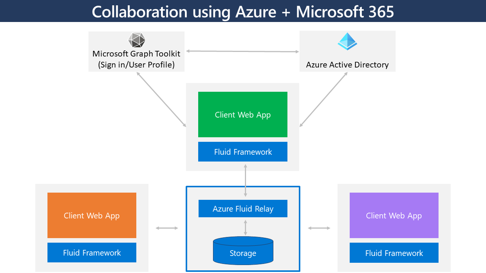

[!INCLUDE [header_file](../../../includes/sol-idea-header.md)]

Collaboration is critical to business efficiency and productivity. Tools like Microsoft Teams provide a great way to collaborate via chat, audio, and video. Word, Excel, and PowerPoint online make it easy to collaborate on various types of documents and spreadsheets with colleagues and customers around the world.  

You can use Azure services to add real-time collaborative functionality to custom applications just as you do with  off-the-shelf solutions. This example solution shows how you can use libraries and Azure services to meet custom collaboration requirements. In addition to real-time collaboration, this solution supports user presence status. Users can work together in the custom app to collect ideas, see when new ideas are added, modified, or deleted in real time, and avoid data conflicts during collaboration sessions. 

To meet these requirements, the solution uses Fluid Framework and Azure Fluid Relay. It authenticates users against Azure Active Directory (Azure AD) by using the Login component of the Microsoft Graph Toolkit and the Microsoft Authentication Library (MSAL) provider.

## Potential use cases

This solution applies to companies that build custom application solutions that require:
- Secure application access.
- Real-time data collaboration among multiple users.
- Built-in collaboration data-storage capabilities.

## Architecture

*Download a [PowerPoint file](https://arch-center.azureedge.net/Real-time-data-collaboration.pptx) of this architecture.*

### Workflow

- An application uses the Login component of the Microsoft Graph Toolkit to enable a user to sign in. The Login component uses the MSAL provider to validate the user’s credentials against Azure AD.
- After the user signs in, the client web app uses Fluid Framework to connect to Fluid Relay and creates a collaboration session.
- More users sign in and participate in the collaboration session. Fluid Framework merges the data sent and received in each client to ensure that it's synchronized for all users. The [total order broadcast algorithm and eventual consistency](https://fluidframework.com/docs/concepts/tob) are used to ensure this synchronization.  
- As users continue to collaborate, Fluid Relay automatically stores the collaboration data. 
- As new users join the collaboration session, each user's client retrieves previously stored data and ensures that the user is synchronized with other users in the session.

### Components

- [Fluid Framework](https://www.fluidframework.com) is a collection of client libraries for distributing and synchronizing shared state. These libraries allow multiple clients to simultaneously create and operate on shared data structures by using coding patterns similar to those used to work with local data.
- [Fluid Relay](https://azure.microsoft.com/services/fluid-relay) is a managed service of Fluid Framework. It helps developers build real-time collaborative experiences and replicate state across connected JavaScript clients in real time.
- [Azure AD](https://azure.microsoft.com/services/active-directory) is the Microsoft cloud-based identity and access management service that helps your employees sign in and access resources.
- [Microsoft Graph Toolkit](https://docs.microsoft.com/graph/toolkit/overview) is a collection of reusable, framework-agnostic components and authentication providers for accessing and working with Microsoft Graph.
- [Azure Static Web Apps](https://azure.microsoft.com/services/app-service/static) is a service that automatically builds and deploys full stack web apps to Azure from a code repository.

## Deploy this scenario

Get a [code sample](https://github.com/microsoft/brainstorm-fluidframework-m365-azure) that demonstrates this scenario.

## Next steps 

For more information about the technologies used in this solution, see these articles:

- [Azure AD](/azure/active-directory/fundamentals)
- [Azure Fluid Relay](/azure/azure-fluid-relay)
- [Azure Static Web Apps](/azure/static-web-apps/overview)
- [Fluid Framework](https://fluidframework.com)
- [Microsoft Graph](/graph/overview)
- [Microsoft Graph Toolkit](/graph/toolkit/overview)
- [Total order broadcast and eventual consistency in Fluid Framework](https://fluidframework.com/docs/concepts/tob)

## Related resources

- [Enhanced-security hybrid messaging infrastructure—web access](../../example-scenario/hybrid/secure-hybrid-messaging-web.yml)
- [Enhanced-security hybrid messaging infrastructure—mobile access](../../example-scenario/hybrid/secure-hybrid-messaging-mobile.yml)
- [Manage Microsoft 365 tenant configuration by using Microsoft365DSC and Azure DevOps](../../example-scenario/devops/manage-microsoft-365-tenant-configuration-microsoft365dsc-devops.yml)
- [Power Automate deployment at scale](../../example-scenario/power-automate/power-automate.yml)
