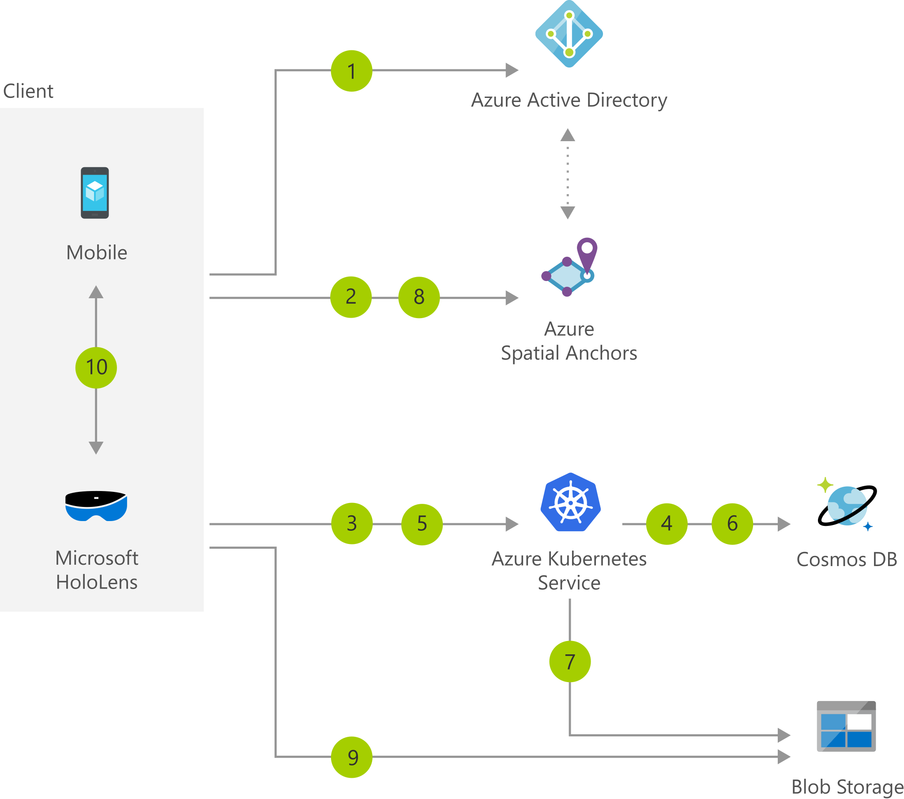

[!INCLUDE [header_file](../../../includes/sol-idea-header.md)]

This article describes how you can use a mixed reality scenario to enable clients, designers, and onsite engineers to easily share and review designs as 3D holograms in the context of their environment.

## Architecture

*Download an [SVG](../media/collaborative-design-review-powered-by-mixed-reality.svg) of this architecture.*

### Dataflow

1. Users of the client application authenticate using their Azure Active Directory credentials from HoloLens or a mobile device.
1. Device 1 creates an anchor using Azure Spatial Anchors and gets back an anchor ID.
1. Device 1 sends the anchor ID to the app's web service to create a collaboration session. It also specifies which hologram is to be displayed via its ID in Azure Blob storage.
1. Session information, including a 6-digit code to join the session, is stored in Azure Cosmos DB. That code is returned to the client, allowing the user of that device to invite others to join.
1. Device 2 connects to the app's web service and enters the code to join the session (displayed on Device 1).
1. The web service retrieves the anchor ID for the session and the ID of the hologram associated to that session from Azure Cosmos DB.
1. The web service retrieves a SAS key to access the hologram associated to the session from Blob storage. It then returns the anchor ID and SAS key to Device 2.
1. Device 2 queries Azure Spatial Anchors to get coordinates for the anchor ID retrieved in step 6.
1. Device 2 fetches the hologram from Blob storage using the SAS key obtained from the app service.
1. Device 1 and Device 2 exchange state information over a peer-to-peer networking channel (or through a service relay of your choice).

### Components

* [Azure Active Directory](https://azure.microsoft.com/services/active-directory): Synchronize on-premises directories and enable single sign-on
* [Blob Storage](https://azure.microsoft.com/services/storage/blobs): REST-based object storage for unstructured data
* [Azure Cosmos DB](https://azure.microsoft.com/services/cosmos-db): Globally distributed, multi-model database for any scale

## Scenario details

Businesses and teams across industries have to spend time and money on design reviews. 2D images lose essential detail and context, and physical prototypes are extremely expensive. With this mixed reality scenario, clients, designers, and onsite engineers can easily share and review designs as 3D holograms in the context of their environment, accelerating design decisions and reducing time to market.

### Potential use cases

* Remote assistance to problem-solve in real-time
* Tailored, immersive experiences with 3D and the IIoT
* Knowledge-based work instructions to capture and scale expertise

## Next steps

* [Azure Active Directory documentation](/azure/active-directory/fundamentals/active-directory-access-create-new-tenant)
* [Blob Storage documentation](/azure/storage/blobs/storage-quickstart-blobs-dotnet?tabs=windows)
* [Azure Cosmos DB documentation](/azure/cosmos-db/create-sql-api-dotnet)

## Related resources

- [Prototyping and manufacturing for enterprises](/windows/mixed-reality/enthusiast-guide/prototyping-manufacturing)
- [Mixed reality architecture design](/azure/architecture/guide/mixed-reality/mixed-reality-overview)
- [Mixed reality structural elements](/windows/mixed-reality/design/core-concepts-landingpage)
- [Design and prototype for mixed reality](/windows/mixed-reality/design/design)
