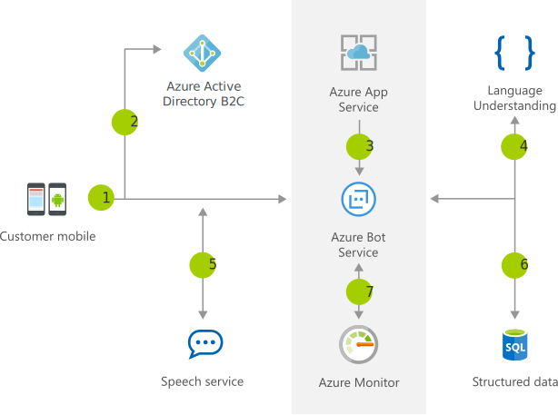

[!INCLUDE [header_file](../../../includes/sol-idea-header.md)]

The Azure Bot Service with Language Understanding enables developers to create conversational interfaces for banking, travel, and entertainment commerce scenarios. For example, a hotel concierge can use a bot to enhance traditional e-mail and phone call interactions. The bot validates a customer via Azure Active Directory and uses Azure Cognitive Services to contextually process customer service text and voice requests. Add the Speech recognition service to support voice commands.

## Architecture

*Download an [SVG](../media/commerce-chatbot-customer-service.svg) of this architecture.*

## Data Flow

1. The customer uses your mobile app.
1. Using Azure Active Directory B2C, the user authenticates.
1. Using the custom Application Bot, the user requests information.
1. Cognitive Services helps process the natural language request.
1. The response is reviewed by the customer, who can refine the question using natural conversation.
1. Once the user is happy with the results, the Application Bot updates the customer's reservation.
1. Application Insights monitors runtime performance to help development with Bot performance and usage.

## Components

Key technologies used to implement this architecture:

* [Azure Active Directory B2C](https://azure.microsoft.com/services/active-directory/external-identities/b2c)
* [Azure App Service](https://azure.microsoft.com/services/app-service)
* [Azure Bot Service](https://azure.microsoft.com/services/bot-service)
* [Azure Cognitive Services Language Understanding](https://azure.microsoft.com/services/cognitive-services/language-understanding-intelligent-service)
* [Azure Cognitive Services Speech Services](https://azure.microsoft.com/services/cognitive-services/speech-services)
* [Azure SQL Database](https://azure.microsoft.com/services/sql-database)
* [Azure Monitor](https://azure.microsoft.com/services/monitor): Application Insights is a feature of Azure Monitor.

## Next Steps

* [Artificial intelligence (AI) - Architectural overview](../../data-guide/big-data/ai-overview.md)
* [Choosing a Azure Cognitive Services technology](../../data-guide/technology-choices/cognitive-services.md)
* [What are Azure Cognitive Services?](/azure/cognitive-services/what-are-cognitive-services)
* [What is Language Understanding (LUIS)?](/azure/cognitive-services/luis/what-is-luis)
* [What is the Speech service?](/azure/cognitive-services/speech-service/overview)
* [What is Azure Active Directory B2C?](/azure/active-directory-b2c/overview)
* [Introduction to Bot Framework Composer](/composer/introduction)
* [What is Application Insights](/azure/azure-monitor/app/app-insights-overview)

### Microsoft Learn modules

* [How to build a basic chatbot](/learn/modules/how-build-basic-chatbot/)
* [Create Intelligent Bots with the Azure Bot Service](/learn/paths/create-bots-with-the-azure-bot-service/)
* [Create conversational AI solutions](/learn/paths/create-conversational-ai-solutions/)

Fully deployable architectures:

* [Chatbot for hotel reservations](../../example-scenario/ai/commerce-chatbot.yml)
* [Build an enterprise-grade conversational bot](../../reference-architectures/ai/conversational-bot.yml)
* [Speech-to-text conversion](../../reference-architectures/ai/speech-ai-ingestion.yml)