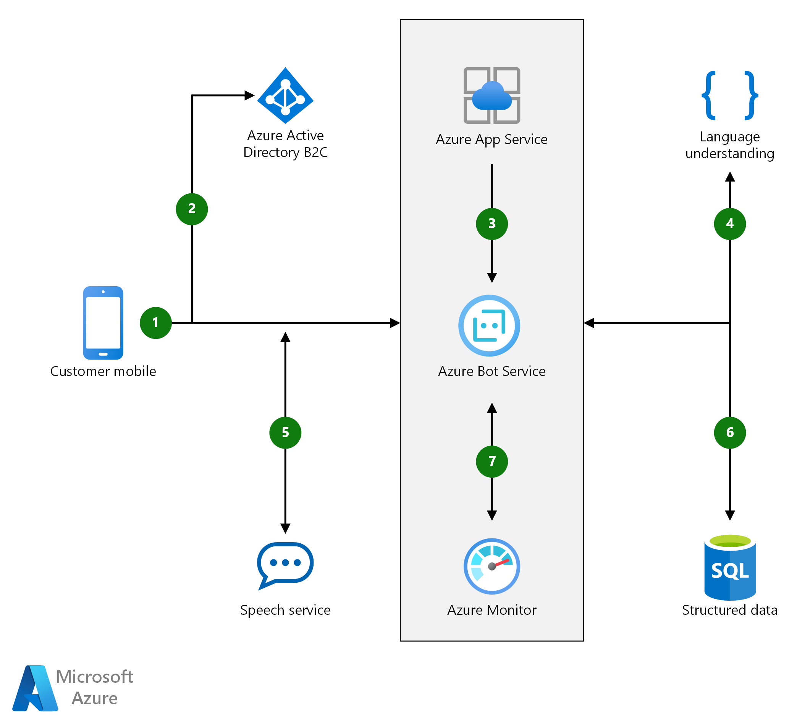

[!INCLUDE [header_file](../../../includes/sol-idea-header.md)]

[Azure Bot Service](/azure/bot-service) with [Language Understanding](/azure/cognitive-services/luis) enables developers to create conversational interfaces for banking, travel, and entertainment commerce scenarios.

## Architecture

*Download a [Visio file](https://arch-center.azureedge.net/commerce-chatbot-customer-service.vsdx) of this architecture.*

### Dataflow

1. The customer uses your mobile app.
1. The customer authenticates by using Azure Active Directory B2C.
1. The customer requests information by using the custom application Bot.
1. Cognitive Services helps process the natural language request.
1. The response is reviewed by the customer, who can refine the question using natural language.
1. Once the customer is happy with the results, the Application Bot updates the reservation.
1. Application Insights monitors the live application to diagnose issues and help understand how to improve Bot performance and usability.

### Components

Key technologies used to implement this architecture:

* [Azure Active Directory B2C](https://azure.microsoft.com/services/active-directory/external-identities/b2c)
* [Azure App Service](https://azure.microsoft.com/services/app-service)
* [Azure Bot Service](https://azure.microsoft.com/services/bot-service)
* [Azure Cognitive Services Language Understanding](https://azure.microsoft.com/services/cognitive-services/language-understanding-intelligent-service)
* [Azure Cognitive Services Speech Services](https://azure.microsoft.com/services/cognitive-services/speech-services)
* [Azure SQL Database](https://azure.microsoft.com/services/sql-database)
* [Azure Monitor](https://azure.microsoft.com/services/monitor): Application Insights is a feature of Azure Monitor.

## Scenario details

[Azure Bot Service](/azure/bot-service) with [Language Understanding](/azure/cognitive-services/luis) enables developers to create conversational interfaces for banking, travel, and entertainment commerce scenarios. For example, a hotel concierge can use a bot to enhance customer e-mail and phone call interactions. The bot validates customers with Azure Active Directory. Azure Cognitive Services is then used to contextually process customer service text and voice requests. Add the [Speech service](/azure/cognitive-services/speech-service) to recognize and support voice commands.

### Potential use cases

This solution applies to the following scenarios:

- Banking and finance
- Travel and hospitality (such as a hotel concierge bot to enhance emails and phone calls)
- Entertainment commerce (and retail)

## Next steps

Product documentation:

* [What are Azure Cognitive Services?](/azure/cognitive-services/what-are-cognitive-services)
* [What is Language Understanding (LUIS)?](/azure/cognitive-services/luis/what-is-luis)
* [What is the Speech service?](/azure/cognitive-services/speech-service/overview)
* [What is Azure Active Directory B2C?](/azure/active-directory-b2c/overview)
* [Introduction to Bot Framework Composer](/composer/introduction)
* [What is Application Insights](/azure/azure-monitor/app/app-insights-overview)

Microsoft Learn modules:

* [How to build a basic chatbot](/training/modules/how-build-basic-chatbot)
* [Create Intelligent Bots with the Azure Bot Service](/training/paths/create-bots-with-the-azure-bot-service)
* [Create conversational AI solutions](/training/paths/create-conversational-ai-solutions)
* [Add conversational intelligence to your apps by using Language Understanding Intelligent Service (LUIS)](/training/modules/create-and-publish-a-luis-model)

## Related resources

Azure Architecture Center overview articles:

* [Artificial intelligence (AI) - Architectural overview](../../data-guide/big-data/ai-overview.md)
* [Choosing an Azure Cognitive Services technology](../../data-guide/technology-choices/cognitive-services.md)

Azure Architecture Center articles describing chatbot architectures:

* [Chatbot for hotel booking](../../example-scenario/ai/commerce-chatbot.yml)
* [Build an enterprise-grade conversational bot](../../reference-architectures/ai/conversational-bot.yml)
* [Speech-to-text conversion](/azure/architecture/example-scenario/ai/speech-to-text-transcription-analytics)
