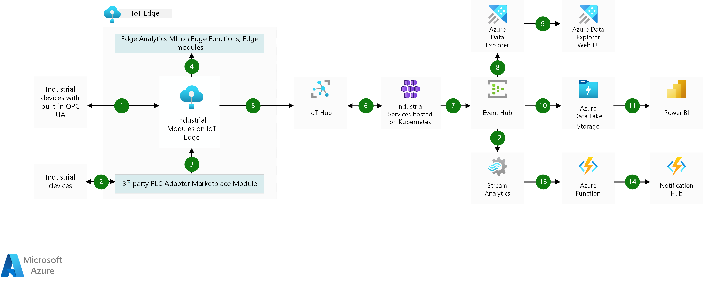

[!INCLUDE [header_file](../../../includes/sol-idea-header.md)]

This solution idea demonstrates how end manufacturers can connect their assets to the cloud using [Open Platform Communication Unified Architecture (OPC UA)](https://opcfoundation.org/about/opc-technologies/opc-ua) and the [Microsoft Industrial Components](https://azure.github.io/Industrial-IoT/industrial-iot-components.html).

## Architecture

*Download a [Visio file](https://arch-center.azureedge.net/condition-monitoring.vsdx) of this architecture.*

### Dataflow

The data flows through the solution as follows:

1. Industrial devices that can natively communicate OPC UA can directly connect to Azure IoT Edge. IoT Edge is the compute power that sits on your on-premises network. It's the runtime environment of the Industrial Modules: OPC Publisher, OPC Twin, and Discovery. Modules are containers that run Azure services, third party services, or your own code. The OPC Publisher module connects to OPC UA servers and publishes OPC UA telemetry data to Azure IoT Hub. OPC Twin creates a digital twin of an OPC UA server in the cloud and provides OPC UA browse/read/write/method call capabilities via a cloud-based Representational State Transfer (REST) interface. The Discovery module provides discovery services on the edge, which include OPC UA server discovery.
1. Industrial devices that can't communicate through OPC UA need a third party PLC adapter to connect to IoT Edge. Adapters are obtainable as modules in the [Azure Marketplace](https://azuremarketplace.microsoft.com/marketplace).
1. The third party PLC adapters enable connectivity between the devices and IoT Edge.
1. For analytical capabilities closer to where the data originates, you can obtain modules like Azure Machine Learning on Edge or Azure Functions, from the Azure Marketplace. These modules provide low latency and operation in a disconnected state.
1. Azure IoT Hub connects the devices virtually to the cloud for further data processing. It enables a security-enhanced bidirectional communication between IoT applications and devices.
1. The Industrial Services are made up of several microservices exposing a REST API. All Industrial Services are deployed to an Azure Kubernetes Service cluster. They implement business logic and functionality for discovery, registration, remote control, and post-processing telemetry of industrial devices. The REST APIs can be used in any programming language and framework that can call an HTTP endpoint.
1. Azure Event Hubs transforms and stores the data. It provides a distributed stream processing platform with low latency and seamless integration.
1. In one case, store and analyze the data using Azure Data Explorer. The telemetry processor in the Industrial IoT platform forwards contextualized samples to Azure Data Explorer and other consumers.
1. Azure Data Explorer has a web UI you can use to visualize the telemetry.
1. In another case, after the Industrial Services process the data, Azure Data Lake stores and further analyzes the data. Azure Data Lake is a massively scalable data lake with enterprise-grade security and auditing, which allows batch, stream, and interactive analytic programs to run with simplicity. Azure Data Lake solves many of the productivity and scalability challenges that prevent you from maximizing the value of your data assets.
1. Explore your data with visual reports and collaborate, and publish and share them with others. Power BI integrates with other tools, including Microsoft Excel, so you can get up to speed quickly and work seamlessly with your existing solutions.
1. In a third case, Azure Stream Analytics is a real time analytics service. It's easily extensible with custom code and built-in machine learning capabilities for more advanced scenarios.
1. Azure Functions is a serverless compute service, which allows you to run small pieces of code called functions without worrying about application infrastructure. With Azure Functions, the cloud infrastructure provides all the up-to-date servers you need to keep your application running at scale.
1. Azure Notification Hubs allows you to send notifications to a wide range of mobile platforms, and can allow notification of operators and administrators on certain events or alerts that require immediate attention.

### Components

Data is loaded from these different data sources using several Azure components:

- [IoT Edge](/azure/iot-edge/about-iot-edge) moves cloud analytics and custom business logic to devices so that your organization can focus on business insights instead of data management. Scale out your IoT solution by packaging your business logic into standard containers, then you can deploy those containers to any of your devices and monitor it all from the cloud.
- The Azure Industrial IoT Industrial Modules run inside Azure IoT Edge to connect your shop floor. The [OPC Publisher](https://github.com/Azure/Industrial-IoT/tree/main/docs/opc-publisher) module connects to OPC UA servers and publishes OPC UA telemetry data from these servers to Azure IoT Hub. [OPC Twin](https://github.com/Azure/Industrial-IoT/tree/main/docs/opc-publisher#opc-ua-client-opc-twin) provides discovery, registration, and remote control of industrial devices through REST APIs. The [Discovery Module](https://github.com/Azure/Industrial-IoT/tree/main/docs/opc-publisher#discovery-configuration) provides discovery services on the edge, which include OPC UA server discovery.
- [IoT Hub](/azure/iot-hub) is a managed service, hosted in the cloud, that acts as a central message hub for bi-directional communication between your IoT application and the devices it manages. You can use Azure IoT Hub to build IoT solutions with reliable and secure communications between millions of IoT devices and a cloud-hosted solution backend. You can connect virtually any device to IoT Hub.
- [Industrial Services on Azure Kubernetes](https://github.com/Azure/Industrial-IoT/tree/master/docs/services) is made up of several cloud components that divide into Microservices providing REST API and Agent services that can provide processing and daemon like functionality.
- [Azure Event Hubs](/azure/event-hubs/event-hubs-about) is a big data streaming platform and event ingestion service. It can receive and process millions of events per second. Data sent to an event hub can be transformed and stored by using any real-time analytics provider or batching/storage adapters.
- [Azure Data Explorer](https://azure.microsoft.com/services/data-explorer) is a fast and highly scalable data exploration service for log and telemetry data. You can use Azure Data Explorer to develop a time series service. Azure Data Explorer includes native support for creation, manipulation, and analysis of multiple time series with near real-time monitoring solutions and workflows.

  Azure Data Explorer can ingest data from [Azure IoT Hub](https://azure.microsoft.com/services/iot-hub), [Azure Event Hubs](https://azure.microsoft.com/services/event-hubs), [Azure Stream Analytics](https://azure.microsoft.com/services/stream-analytics), [Power Automate](https://powerautomate.microsoft.com), [Azure Logic Apps](https://azure.microsoft.com/services/logic-apps), Kafka, Apache Spark, and many other services and platforms. Ingestion is scalable, and there are no limits. Supported Azure Data Explorer ingestion formats include JSON, CSV, Avro, Parquet, ORC, TXT, and other formats.

- The Azure Data Explorer [Web UI](/azure/data-explorer/web-query-data) lets you run queries and [build data visualization dashboards](/azure/data-explorer/azure-data-explorer-dashboards).
- [Azure Data Lake](/azure/storage/blobs/data-lake-storage-introduction) makes Azure Storage the foundation for building enterprise data lakes on Azure. Designed from the start to service multiple petabytes of information while sustaining hundreds of gigabits of throughput, it allows you to easily manage massive amounts of data.
- [Power BI](/power-bi) is a suite of business analytics tools to analyze data and share insights. Power BI can query a semantic model stored in Analysis Services, or it can query Azure Synapse directly.
- [Azure Stream Analytics](https://azure.microsoft.com/services/stream-analytics) is a real-time analytics and complex event-processing engine that is designed to analyze and process high volumes of fast streaming data from multiple sources simultaneously. Patterns and relationships can be identified in information extracted from many input sources including devices, sensors, clickstreams, social media feeds, and applications.
- [Azure Functions](/azure/azure-functions) allows you to run small pieces of code called functions without worrying about application infrastructure. Azure Function is a great solution for processing bulk data, integrating systems, working with IoT, and building simple APIs and microservices.

## Scenario details

Manufacturers can monitor their equipment's key parameters to discover anomalies before they become critical issues. OPC UA is a platform-independent and service-oriented interoperability standard for a secure and reliable data exchange. OPC UA is used by various industrial systems and devices such as industry PCs, PLCs, and sensors. It's a standard that is driven by the OPC Foundation.

### Potential use cases

* Manufacturing
* Electrical power and energy
* Construction and facilities
* Upstream oil and gas

## Next steps

- For a detailed view of the Industrial Modules and Services, see the Azure Industrial IoT Platform [architecture](https://github.com/Azure/Industrial-IoT/blob/master/docs/architecture.md).
- For a detailed view of all the individual microservices and agent processes, see [Architectural details](https://github.com/Azure/Industrial-IoT/tree/main).
- You can find more information on how to get started with the Azure Industrial IoT Platform in the [Industrial IoT GitHub repository](https://github.com/Azure/Industrial-IoT/tree/main).

## Related resources

- [Azure industrial IoT analytics guidance](../../guide/iiot-guidance/iiot-architecture.yml)
- [IoT and data analytics](../..//example-scenario/data/big-data-with-iot.yml)
- [End-to-end computer vision at the edge for manufacturing](../../reference-architectures/ai/end-to-end-smart-factory.yml)
- [IoT Edge railroad maintenance and safety system](../../example-scenario/predictive-maintenance/iot-predictive-maintenance.yml)
