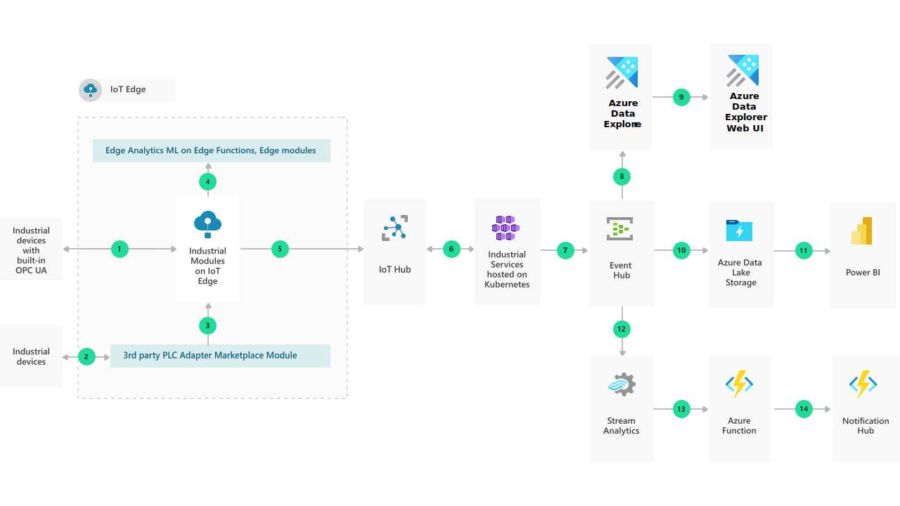

[!INCLUDE [header_file](../../../includes/sol-idea-header.md)]

This solution idea demonstrates how end manufacturers can connect their assets to the cloud using OPC UA (Open Platform Communication Unified Architecture) and the Industrial Components. They can monitor their equipment's key parameters to discover anomalies before they become critical issues. OPC UA is a platform-independent and service-oriented interoperability standard for a secure and reliable data exchange. OPC UA is used by various industrial systems and devices such as industry PCs, PLCs, and sensors. It's a standard that is driven by the OPC Foundation.

## Architecture

### Data flow

The data flows through the solution as follows:

1. Industrial devices that can natively communicate OPC UA can directly connect to IoT Edge. IoT Edge is the compute power that sits on your on-premises network. It's the runtime environment of the Industrial Modules (OPC Publisher, OPC Twin, and Discovery Module). Modules are containers that run Azure services, 3rd party services, or your own code. The OPC Publisher module connects to OPC UA servers and publishes OPC UA telemetry data to Azure IoT Hub. OPC Twin creates a digital twin of an OPC UA server in the cloud and provides OPC UA browse/read/write/method call capabilities via a cloud-based REST (Representational State Transfer) interface. The Discovery module provides discovery services on the edge, which include OPC UA server discovery.
1. Industrial devices that can't communicate through OPC UA need a 3rd party PLC adapter to connect to IoT Edge. Adapters are obtainable as modules in the [Azure Marketplace](https://azuremarketplace.microsoft.com/marketplace/).
1. The 3rd party PLC adapters enable a connectivity between the devices and IoT Edge.
1. For analytical capabilities closer to where the data originates, you can obtain modules like Machine Learning on Edge or Functions, from the Azure Marketplace. These modules provide low latency and operation in a disconnected state.
1. Azure IoT Hub connects the devices virtually to the cloud for further data processing. It enables a security-enhanced bidirectional communication between IoT applications and devices.
1. The Industrial Services are made up of several microservices exposing a REST API. All Industrial Services are deployed to an Azure Kubernetes Service cluster. They implement business logic and functionality for discovery, registration, remote control, and post-processing telemetry of industrial devices. The REST APIs can be used in any programming language and framework that can call an HTTP endpoint.
1. Azure Event Hubs transforms and stores the data. It provides a distributed stream processing platform with low latency and seamless integration.

There are three predominant use cases in which the data provided by the Industrial Services is used:

8. _Alternative 1:_ Store and analyze the data using Azure Time Series Insights (TSI). The telemetry processor in the Industrial IoT platform forwards contextualized samples to TSI and other consumers.
1. The Time Series Insights Explorer is a web application you can use to visualize the telemetry.
1. _Alternative 2:_ After the Industrial Services process the data, Azure Data Lake stores and further analyzes the data. Azure Data Lake is a massively scalable data lake with enterprise-grade security and auditing, which allows batch, stream, and interactive analytic programs to run with simplicity. Azure Data Lake solves many of the productivity and scalability challenges that prevent you from maximizing the value of your data assets.
1. Explore your data with visual reports and collaborate, publish and share them with others. Power BI integrates with other tools, including Microsoft Excel, so you can get up to speed quickly and work seamlessly with your existing solutions.
1. _Alternative 3:_ Azure Stream Analytics is a real time analytics service. It's easily extensible with custom code and built-in machine learning capabilities for more advanced scenarios.
1. Azure Functions is a serverless compute service, which allows you to run small pieces of code (called "functions") without worrying about application infrastructure. With Azure Functions, the cloud infrastructure provides all the up-to-date servers you need to keep your application running at scale.
1. Azure Notification Hubs allow you to send notifications to a wide range of mobile platforms and can allow notification of operators and administrators on certain events or alerts which require immediate attention.

### Components

Data is loaded from these different data sources using several Azure components:

- [IoT Edge](/azure/iot-edge/about-iot-edge) Azure IoT Edge moves cloud analytics and custom business logic to devices so that your organization can focus on business insights instead of data management. Scale out your IoT solution by packaging your business logic into standard containers, then you can deploy those containers to any of your devices and monitor it all from the cloud.
- Industrial Modules – The Azure Industrial IoT platform includes modules that run inside Azure IoT Edge to connect your shop floor. The [OPC Publisher](https://github.com/Azure/Industrial-IoT/blob/master/docs/modules/publisher.md) module connects to OPC UA servers and publishes OPC UA telemetry data from these servers to Azure IoT Hub. [OPC Twin](https://github.com/Azure/Industrial-IoT/blob/master/docs/modules/twin.md) provides discovery, registration, and remote control of industrial devices through REST APIs. The [Discovery Module](https://github.com/Azure/Industrial-IoT/blob/master/docs/modules/discovery.md) provides discovery services on the edge which include OPC UA server discovery.
- [Azure IoT Hub](/azure/iot-hub/) IoT Hub is a managed service, hosted in the cloud, that acts as a central message hub for bi-directional communication between your IoT application and the devices it manages. You can use Azure IoT Hub to build IoT solutions with reliable and secure communications between millions of IoT devices and a cloud-hosted solution backend. You can connect virtually any device to IoT Hub.
- [Industrial Services on Azure Kubernetes](https://github.com/Azure/Industrial-IoT/tree/master/docs/services) The platform is made up of several cloud components that divide into Microservices providing REST API and Agent services that can provide processing and daemon like functionality.
- [Azure Event Hubs](/azure/event-hubs/event-hubs-about/) is a big data streaming platform and event ingestion service. It can receive and process millions of events per second. Data sent to an event hub can be transformed and stored by using any real-time analytics provider or batching/storage adapters.
- [Time Series Insights](/azure/time-series-insights/) Azure Time Series Insights is a fully managed analytics, storage, and visualization service that makes it simple to explore and analyze billions of IoT events simultaneously. It gives you a global view of your data, which lets you quickly validate your IoT solution and avoid costly downtime to mission-critical devices.
- [Time Series Insights Explorer](/azure/time-series-insights/time-series-insights-explorer) The Time Series Insights explorer demonstrates the powerful data visualization capabilities provided by the service and can be accessed within your own environment.
- [Azure Data Lake](/azure/storage/blobs/data-lake-storage-introduction) makes Azure Storage the foundation for building enterprise data lakes on Azure. Designed from the start to service multiple petabytes of information while sustaining hundreds of gigabits of throughput, it allows you to easily manage massive amounts of data.
- [Power BI](/power-bi) is a suite of business analytics tools to analyze data and share insights. Power BI can query a semantic model stored in Analysis Services, or it can query Azure Synapse directly.
- [Azure Stream Analytics](https://azure.microsoft.com/services/stream-analytics/) is a real-time analytics and complex event-processing engine that is designed to analyze and process high volumes of fast streaming data from multiple sources simultaneously. Patterns and relationships can be identified in information extracted from a number of input sources including devices, sensors, clickstreams, social media feeds, and applications.
- [Azure Functions](/azure/azure-functions/) allows you to run small pieces of code (called "functions") without worrying about application infrastructure. Azure Function is a great solution for processing bulk data, integrating systems, working with the internet-of-things (IoT), and building simple APIs and micro-services.

## Next steps

- For a detailed view of the Industrial Modules and Services, see the Azure Industrial IoT Platform [architecture](https://github.com/Azure/Industrial-IoT/blob/master/docs/architecture.md), and a detailed view of all the individual Microservices and Agent processes is shown [here](https://github.com/Azure/Industrial-IoT/blob/master/docs/architecture-details.md).
- You can find more information on how to get started with the Azure Industrial IoT Platform in the [Industrial IoT GitHub repository](https://github.com/Azure/Industrial-IoT/blob/master/docs/architecture-details.md).
