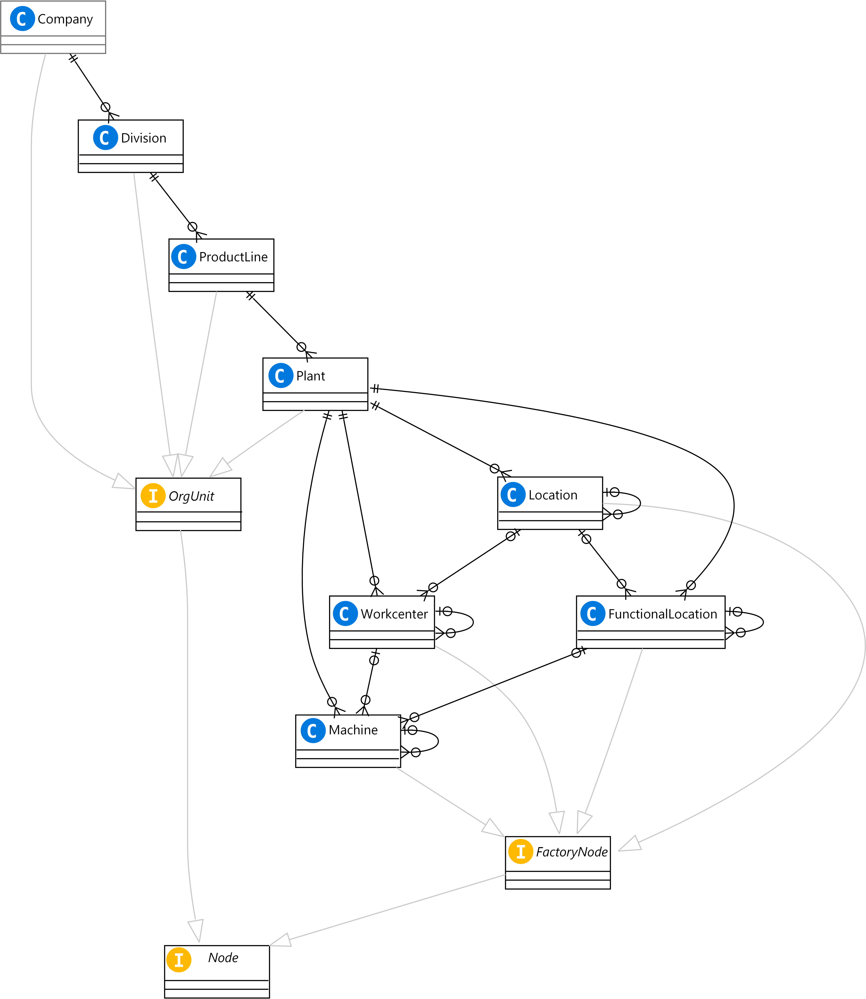

This scenario explores a connected factory hierarchy service implementation. A hierarchy service centrally defines the organization of production assets like machines within factories, from both an operational and maintenance point of view. Business stakeholders can use this information as a common data source for monitoring plant conditions or overall equipment effectiveness (OEE).

## Problem

Production assets like machines are organized within factories in context-specific hierarchies. Machines can be organized by their physical location, maintenance requirements, or products. Individual stakeholders, processes, and IT systems define asset organization differently.

Multiple IT systems might define hierarchical structures redundantly. Information from enterprise resource management (ERP) systems might be replicated across multiple applications. These redundancies can lead to inconsistencies, heterogeneous governance concepts, and missing correlations between master data and application-specific hierarchies.

Changes to hierarchical structures and the metadata that defines them are very time consuming. If a new machine is added or a production line is reorganized, changes need to be applied manually in multiple places. The consistency of these changes must be verified manually.

Decentralized access control increases the need for manual processes, and makes links between application-specific hierarchies difficult to establish. These issues impact business agility and scalability. 

Another challenge is that individual sites or organizations might use different ERP systems, often for historical reasons such as acquisitions. Standardizing ERP systems might not be feasible within a reasonable time frame. This heterogeneous ERP landscape adds even more complexity and challenge to the process of integrating shop floor applications with ERP systems.

## Solution

A hierarchy service addresses these problems by providing a centralized, consolidated, and consistent overall hierarchy definition. Anytime an application needs to reference hierarchy data, it retrieves the latest definitions from the hierarchy service. Any changes to the hierarchy always reflect across all applications, without manual steps.

Every node in the hierarchy contains a system-defined unique identifier issued by the service. This ID uniquely identifies items, such as a specific machine in a specific factory, across applications throughout an entire organization. The ID can also be added to telemetry data sent by machines, to contextualize that data based on the hierarchy.

To maintain a separation of concerns, the hierarchy service only contains information about nodes, relationships, and references to corresponding master data, such as the ERP ID of a given machine. The system maintains other information, such as actual master data records or application-specific parameters, separately.

A dedicated master data document service can provide master data records. A shop floor application can maintain parameters like thresholds or default cavity values that are defined on a machine level. The hierarchy service remains lean and efficient, and avoids evolving into a parallel master data management system.

The hierarchy service acts as the single point of integration with ERP systems, decoupling the lifecycle of ERP systems from the hierarchy. You can integrate with ERP systems manually via graphical UI, bulk import, or an API the hierarchy service provides.

A maintenance view and an operational view cover the needs of both perspectives. The service provides access control to govern changes. Business stakeholders can define and maintain the hierarchy by using a graphical UI, without involving IT personnel. 

[Azure Digital Twins](/azure/digital-twins) can help build a hierarchy service by creating a model of nodes, like machines, work centers, and locations, and their relationships. Each node has metadata that includes identifiers from ERP systems. You can use this contextual information in downstream applications to gain insights into production states, aggregate machine data, or identify machines that can fulfill a given order.

## Potential use cases

Potential uses for this solution include:

- Standardizing asset organization across IT systems.
- Easily incorporating new machines or changes to production lines.
- Centrally managing several different ERP systems within an enterprise.

## Architecture

The following example hierarchy service is an ASP.NET Core REST API hosted on [Azure Kubernetes Services (AKS)](/azure/aks/intro-kubernetes).

1. The **web app** lets users manage the hierarchy through a UI.
1. **Azure Digital Twins Explorer** lets users manage the hierarchy directly against Azure Digital Twins.
1. The **IO API** supports bulk import and export for manufacturing-specific scenarios.
1. The **Query API** provides query capabilities for manufacturing-specific data needs. The API improves Azure Digital Twins query performance by using an in-memory cache.
1. The **Admin API** supports atomic business operations and validation of business rules.

### Data model

The hierarchy service provides a consolidated data model that supports defining and querying hierarchical views of production assets. The hierarchy service can validate business rules to enforce hierarchy consistency and data integrity.

Data is retrieved from either [Azure Digital Twins](/azure/digital-twins), or an in-memory cache when materializing large graphs. The cache improves performance for queries that would have long response times when issued directly against Azure Digital Twins. The in-memory cache improves the speed of a 3,000-node graph traversal from about 10 seconds to less than a second.

### Supported operations

The hierarchy service lets you filter query operations by node types and node attributes. The service supports the following operations:

**Admin**

|Operation|Filter|Description|
|---|---|---|
|`post`|`/api/v0.1/nodes`|Add new node with relations into hierarchy.|
|`delete`|`/api/v0.1/nodes/{nodeId}`|Remove a leaf node from hierarchy.|
|`put`|`/api/v0.1/nodes/{nodeId}`|Update existing node and relationships with parents.|

**Query**

|Operation|Filter|Description|
|---|---|---|
|`get`|`/api/v0.1/nodes`|Get nodes by their attribute values.|
|`get`|`/api/v0.1/nodes/{nodeId}`|Get a node by Id.|
|`get`|`/api/v0.1/nodes/{nodeId}/subtree`|Get subtree of a hierarchy node.|
|`get`|`/api/v0.1/nodes/{nodeId}/children`|Get direct children of a hierarchy node.|
|`get`|`/api/v0.1/nodes/{nodeId}/parent`|Get parent of a hierarchy node.|

**Bulk**

|Operation|Filter|Description|
|---|---|---|
|`get`|`/api/v0.1/bulk`|Export hierarchy data.|
|`post`|`/api/v0.1/bulk`|Import hierarchy data file.|
|`post`|`/api/v0.1/bulk/validate`|Validate hierarchy data import file.|
|`get`|`/api/v0.1/bulk/status/{operationId}`|Get the status of a bulk import operation.|

### Components

- [Azure Digital Twins](https://azure.microsoft.com/services/digital-twins/#overview) is an IoT platform that creates digital representations of real-world things, places, processes, and people in the cloud.

- [Azure Digital Twins Explorer](/samples/azure-samples/digital-twins-explorer/digital-twins-explorer) lets you connect to an Azure Digital Twins instance to understand, visualize, and modify your digital twin data.

- [Azure Kubernetes Services (AKS)](/azure/aks/intro-kubernetes) offers serverless Kubernetes for running microservices, integrated continuous integration and continuous deployment (CI/CD), and enterprise-grade security and governance.

- [Azure App Service](https://azure.microsoft.com/services/app-service/#overview) is a platform-as-a-service (PaaS) for building and hosting apps on managed virtual machines (VMs). App Service manages the underlying compute infrastructure that runs your apps. App Service monitors resource usage quotas and app metrics, logs diagnostic information, and raises alerts based on metrics.

- [Azure Data Explorer](https://azure.microsoft.com/services/data-explorer/#overview) is a fast, fully managed data analytics service for real-time analysis of large data volumes streaming from applications, websites, and IoT devices.

### Alternatives

- This solution uses AKS for running the microservices that query master data from the various connected services. You can also run the microservices in [Azure Container Instances (ACI)](https://azure.microsoft.com/services/container-instances). ACI offers the fastest and simplest way to run a container in Azure, without having to adopt a higher-level service like AKS.

- Instead of hosting the web application separately from the microservices running in AKS, you can deploy the web app inside the AKS cluster. Then there's no need to introduce another service such as Azure App Service.

- Consider hosting [SAP on Azure](https://azure.microsoft.com/solutions/sap), to use all the benefits and integrations with the Azure platform and the [Microsoft 365 ecosystem](https://news.microsoft.com/2021/01/22/sap-and-microsoft-expand-partnership-and-integrate-microsoft-teams-across-solutions).

- Consider using [Azure Monitor](https://azure.microsoft.com/services/monitor/) to analyze and optimize the performance of the AKS cluster and other resources, and to monitor and diagnose networking issues.

This system design is intentionally simple to avoid the introduction of more services or dependencies. Consider supporting the following functionality:

- Change notifications. This solution implements cache synchronization by periodically polling Azure Digital Twins for changes. You can also use [Azure Digital Twins event notifications](/azure/digital-twins/concepts-event-notifications) to initiate a cache refresh and to notify downstream applications.

- Telemetry data. The example doesn't use the Azure Digital Twins [telemetry data processing capability](/azure/digital-twins/concepts-data-ingress-egress). You can extend the solution to process telemetry data if the resulting data rates are compatible with the [Azure Digital Twins service limits](/azure/digital-twins/reference-service-limits).

- Integration with [Azure Data Explorer](https://azure.microsoft.com/services/data-explorer/#overview). You can ingest data directly into a store that can manage manufacturing data rates. Azure Digital Twins/Azure Data Explorer joint queries via the [Azure Digital Twins query plugin for Azure Data Explorer](/azure/digital-twins/concepts-data-explorer-plugin) provide contextualization.

## Considerations

The following considerations apply to this solution:

### Availability

Consider [deploying AKS in availability zones](/azure/aks/availability-zones). An AKS cluster distributes resources such as nodes and storage across logical sections of the underlying Azure infrastructure. Deploying AKS in [availability zones](/azure/availability-zones/az-overview) ensures that nodes in one availability zone are physically separated from nodes defined in another availability zone. Multiple availability zones configured across an AKS cluster provide high availability by minimizing the chances that hardware failure or planned maintenance will disrupt service.

### DevOps

You can use a solution like [Azure Pipelines](https://azure.microsoft.com/services/devops/pipelines) or [GitHub Actions](https://docs.github.com/actions) to deploy the microservices to the AKS cluster automatically with [CI/CD processes](/azure/architecture/example-scenario/apps/devops-with-aks).

### Scalability

AKS services can [scale up or out, manually or automatically](/azure/aks/scale-cluster). The [AKS cluster autoscaler](/azure/aks/cluster-autoscaler) can automatically scale an entire cluster to meet application demands on AKS. The cluster autoscaler watches for cluster pods that can't be scheduled because of resource constraints. When the autoscaler detects issues, it increases the number of nodes in the node pool to meet the application demand.

Azure App Service can also scale up or out, manually or automatically.

### Security

Use [role-based access control (RBAC)](/azure/role-based-access-control/overview) to restrict who can access and use the connected factory resources, and limit data access based on the user's identity or role. This solution uses [Azure Active Directory (Azure AD)](/azure/active-directory/fundamentals/active-directory-whatis) for identity and access control, and [Azure Key Vault](/azure/key-vault/general/overview) to manage keys and secrets.

To improve AKS security, apply and enforce built-in security policies by using [Azure Policy](/azure/governance/policy/overview). Azure Policy helps enforce organizational standards and assess compliance at scale. The [Azure Policy Add-on for AKS](/azure/governance/policy/concepts/policy-for-kubernetes) can apply individual policy definitions or groups of policy definitions called initiatives to your cluster.

## Pricing

In general, use the [Azure pricing calculator](https://azure.microsoft.com/pricing/calculator) to estimate costs. Use the [AKS calculator](https://azure.microsoft.com/pricing/calculator/?service=kubernetes-service) to estimate the cost of running AKS in Azure. See the Cost section in [Microsoft Azure Well-Architected Framework](/azure/architecture/framework/) to learn about other considerations.

## Next steps

- [Industrial services on Azure Kubernetes](https://github.com/Azure/Industrial-IoT/tree/master/docs/services)
- [Develop with Azure Digital Twins (Learning path)](/learn/paths/develop-azure-digital-twins)
- [Introduction to Kubernetes on Azure (Learning path)](/learn/paths/intro-to-kubernetes-on-azure)

## Related resources

- [Predictive maintenance for Industrial IoT](iot-predictive-maintenance.yml)
- [Condition monitoring for Industrial IoT](condition-monitoring.yml)
- [IoT and data analytics](../../example-scenario/data/big-data-with-iot.yml)
- [Advanced Azure Kubernetes Service (AKS) microservices architecture](../../reference-architectures/containers/aks-microservices/aks-microservices-advanced.yml)
- [Microservices with AKS](microservices-with-aks.yml)
