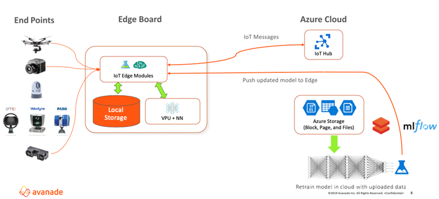

# Contactless interfaces with Azure intelligent edge

Contactless business is the new normal. The world has become more aware of, and endangered by, surfaces that are touched by many people every day. Contactless interfaces reduce or eliminate physical touchpoints like traffic light buttons, touch screens, door handles, and elevator controls by creating touch-free experiences that are both safe and pleasing for users.

Avanade and the Microsoft COVID-19 task force partnered to develop contactless interfaces using the [Azure intelligent edge](https://azure.microsoft.com/overview/future-of-cloud/) platform. This solution combines intelligent and perceptive Internet of Things (IoT) edge devices with cloud storage, computing, artificial intelligence (AI), and machine learning (ML) capabilities.

IoT edge devices can quickly recognize and respond to speech, image, gesture, or multi-modal input by using onboard processing. Azure IoT Hub in the cloud controls the devices and connects them to Azure resources. Azure Cognitive Services and Machine Learning continually retrain and update models to improve interface accuracy and performance.

## Potential use cases

- Turn public touchpoints to touch-free interfaces for uses like building and room access, elevator controls, retail and vending machine sales, and transit and traffic signaling.
- Use voice or other contactless controls with typical mobile endpoints like phones.

## Architecture

1. End points like microphones, cameras, and touchscreens collect data.
2. Onboard voice processing units on the IoT edge devices apply cognitive skillsets and updated machine learning models to local data.
3. The IoT hub in the Azure cloud controls and communicates with the edge device, receiving data and sending updated models.
4. Azure Storage stores the uploaded data.
5. Azure Machine Learning uses the data to retrain its AI models.
6. IoT Hub pushes updated machine learning models to the edge devices.

## Components

- [Azure IoT Edge](https://azure.microsoft.com/services/iot-edge/) service deploys cloud workloads to run on IoT edge devices via standard containers. Modules can run AI, other Azure and third-party services, or your own business logic. IoT Edge intelligent devices can respond quickly or offline, and limit costs by preprocessing and sending only necessary data to the cloud. The [IoT Edge runtime](https://github.com/Azure/iotedge) is free and open-source.
- [Azure IoT Hub](https://azure.microsoft.com/services/iot-hub/) provides a cloud-hosted backend to connect virtually any IoT device with Azure cloud services. IoT Hub enables highly secure and reliable bi-directional communication, management, and provisioning for IoT Edge devices.
- [Azure Storage](https://azure.microsoft.com/services/storage/) provides flexible, scalable, secure storage in the Azure cloud. The current solution uses [block blobs](https://azure.microsoft.com/pricing/details/storage/blobs/) to store unstructured data, [page blobs](https://azure.microsoft.com/pricing/details/storage/page-blobs/) to read and write random small data segments, and [file storage](https://azure.microsoft.com/pricing/details/storage/files/) for file shares.
- [Azure Cognitive Services](https://azure.microsoft.com/services/cognitive-services/) are a family of AI services and cognitive APIs that help build intelligent apps. Voice control uses the [Speech to Text](https://azure.microsoft.com/services/cognitive-services/speech-to-text/) and [Speaker Recognition](https://azure.microsoft.com/services/cognitive-services/speaker-recognition/) services. Extending the solution to image or facial recognition could use [Computer Vision](https://azure.microsoft.com/services/cognitive-services/computer-vision/), [Custom Vision](https://azure.microsoft.com/services/cognitive-services/custom-vision-service/), and [Facial Recognition](https://azure.microsoft.com/services/cognitive-services/face/).
- [Machine Learning (ML)](https://wikipedia.org/wiki/Machine_learning) is a subset of AI that uses algorithms to improve machine predictions or decisions automatically through experience. Machine learning algorithms build and continually *train* a mathematical *model*. [Azure Machine Learning](https://azure.microsoft.com/services/machine-learning/) lets you build, train, deploy, track, and manage ML models at cloud scale.

## Next steps

- Voice control is the basic function in this solution. The platform can potentially extend to multiple sense recognition, like faces and gestures.
- The solution can support global deployment by using Cognitive Services [Speech Translation](https://azure.microsoft.com/services/cognitive-services/speech-translation/) APIs.
