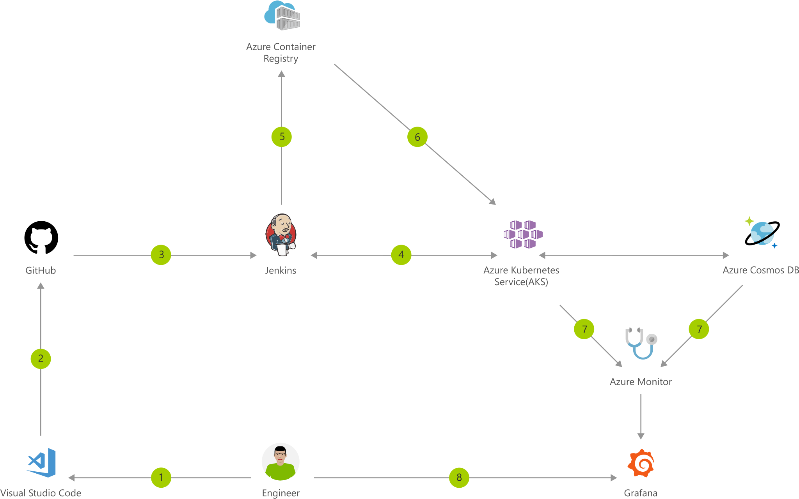

[!INCLUDE [header_file](../../../includes/sol-idea-header.md)]

Containers make it easy for you to continuously build and deploy applications. By orchestrating the deployment of those containers using Azure Kubernetes Service (AKS), you can achieve replicable, manageable clusters of containers.

By setting up a continuous build to produce your container images and orchestration, you can increase the speed and reliability of your deployment.

## Architecture

*Download an [SVG](../media/container-cicd-using-jenkins-and-kubernetes-on-azure-container-service.svg) of this architecture.*

### Data flow

1. Change application source code.
1. Commit code to GitHub.
1. Continuous Integration Trigger to Jenkins.
1. Jenkins triggers a build job using Azure Kubernetes Service (AKS) for a dynamic build agent.
1. Jenkins builds and pushes Docker container to Azure Container Registry.
1. Jenkins deploys your new containerized app to Kubernetes on Azure.
1. Container Service (AKS), backed by Azure Cosmos DB.
1. Grafana displays visualization of infrastructure and application metrics via Azure Monitor.
1. Monitor application and make improvements.

### Components

* [Azure Kubernetes Service (AKS)](https://azure.microsoft.com/services/kubernetes-service): Simplify the deployment, management, and operations of Kubernetes.
* [Container Registry](https://azure.microsoft.com/services/container-registry): Store and manage container images across all types of Azure deployments.
* [Azure Cosmos DB](https://azure.microsoft.com/services/cosmos-db): Globally distributed, multi-model database for any scale.
* [Azure Monitor](https://azure.microsoft.com/services/monitor): Highly granular and real-time monitoring data for any Azure resource.
* [Visual Studio Code](https://azure.microsoft.com/products/visual-studio): Build and deploy multi-platform apps to get the most from Azure services.

## Deploy this scenario

* [Deploy to Azure](https://azure.microsoft.com/resources/templates/jenkins-cicd-container)

## Next steps

* [Integrating Jenkins with Azure Container Service and Kubernetes](/azure/container-service/kubernetes/container-service-kubernetes-jenkins)
* [Pushing Docker images to Azure Container Registry](/azure/container-registry/container-registry-get-started-docker-cli)
* [Connect existing Node.js to Cosmos DB using the MongoDB connector](/azure/cosmos-db/create-mongodb-nodejs)
* [Monitor your Azure services using Grafana](/azure/monitoring-and-diagnostics/monitor-send-to-grafana)
* [Get the Azure Extension Pack for Visual Studio Code](https://marketplace.visualstudio.com/items?itemName=ms-vscode.vscode-azureextensionpack)
