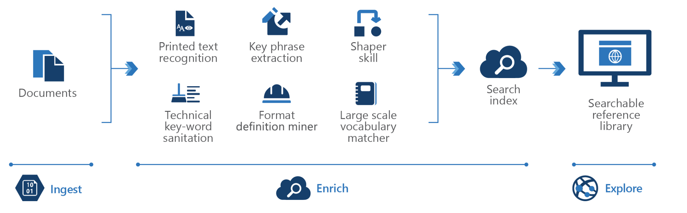

<!-- cSpell:ignore pracjain -->

This architecture describes how knowledge mining can be used for content research.

When organizations task employees to review and research of technical data, it can be tedious to read page after page of dense text. Knowledge mining helps employees quickly review these dense materials. In industries where bidding competition is fierce, or when the diagnosis of a problem must be quick or in near real-time, companies can use knowledge mining to avoid costly mistakes.

## Data Flow

There are three steps: Ingest, Enrich and Exploration. First, the unstructured and structured data is ingested then enrichment of this data with AI to extract information and find and finally explore the newly structured data via search, existing business applications or analytics solutions.

1. The user can ingest different types of technical content like product manual, user guides, engineering standard documents, patent records, medical journals, pharmaceutical fillings
2. This content is enriched by using optical character recognition, key phrase extraction, entity recognition, language translation, customized models to extract industry-specific terms such as product names or engineering standards, customized models to flag potential risks or other essential information, customized models for HIPAA compliance
3. And finally, the user can integrate the search index in to a searchable directory or a exiting business application

## Components

Key technologies used to implement tools for technical content review and research

- [Azure Cognitive Search](/azure/search/)
- [Microsoft Text Analytics API](https://azure.microsoft.com/services/cognitive-services/text-analytics/)
- [Microsoft Translator Text API](https://azure.microsoft.com/services/cognitive-services/translator-text-api/)
- [Microsoft Form Recognizer](https://azure.microsoft.com/services/cognitive-services/form-recognizer/)
- [Web API custom skill interface](/azure/search/cognitive-search-custom-skill-interface)

## Next steps

Using the [knowledge mining solution accelerator](/samples/azure-samples/azure-search-knowledge-mining/azure-search-knowledge-mining/) to build an initial knowledge mining prototype with Azure Cognitive Search.

Building custom skills with Microsoft's [Custom Web API](/azure/search/cognitive-search-custom-skill-interface)