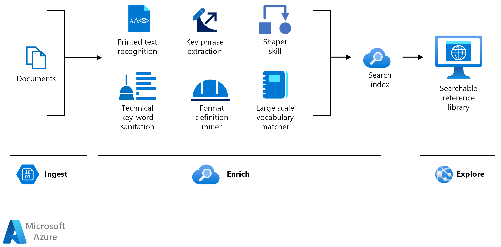

<!-- cSpell:ignore pracjain -->

[!INCLUDE [header_file](../../../includes/sol-idea-header.md)]

This article describes how to use [knowledge mining](https://azure.microsoft.com/solutions/knowledge-mining) technologies like key phrase extraction and entity recognition to quickly review dense technical material.

## Architecture

There are three steps in knowledge mining: ingest, enrich, and explore.

*Download a [Visio file](https://arch-center.azureedge.net/knowledge-mining-content-research.vsdx) of this architecture.*

### Dataflow

- **Ingest**

  The ingest step aggregates content from a range of sources, including structured and unstructured data. For content research, you can ingest different types of technical content like product manuals, user guides, engineering standard documents, patent records, medical journals, and pharmaceutical fillings.

- **Enrich**

  The enrich step uses AI capabilities to extract information, find patterns, and deepen understanding. Enrich your content using optical character recognition, key phrase extraction, entity recognition, and language translation. Use custom models to extract industry-specific terms such as product names or engineering standards, to flag potential risks or other essential information, or for HIPAA compliance.

- **Explore**

  The explore step is exploring data via search, bots, applications, and data visualizations. For example, you can integrate the search index Azure Cognitive Search into a searchable directory or an existing business application.

### Components

The following key technologies are used to implement tools for technical content review and research:

- [Azure Cognitive Search](https://azure.microsoft.com/services/search) is a cloud search service that supplies infrastructure, APIs, and tools for searching. You can use Azure Cognitive Search to build search experiences over private, heterogeneous content in web, mobile, and enterprise applications.
- The [web API custom skill interface](/azure/search/cognitive-search-custom-skill-interface) is used to integrate a custom skill into an Azure Cognitive Search enrichment pipeline.
- [Azure Cognitive Service for Language](https://azure.microsoft.com/services/cognitive-services/language-service) is part of [Azure Cognitive Services](https://azure.microsoft.com/services/cognitive-services) that offers many natural language processing services. You can use these services to understand and analyze text.
- [Text analytics](https://azure.microsoft.com/services/cognitive-services/text-analytics) is a collection of APIs and other features from Azure Cognitive Service for Language that you can use to extract, classify, and understand text within documents.
- [Azure Cognitive Services Translator](https://azure.microsoft.com/services/cognitive-services/translator) is part of the Cognitive Services family of REST APIs. You can use Translator for real-time document and text translation.
- [Azure Form Recognizer](https://azure.microsoft.com/services/cognitive-services/form-recognizer) is part of Azure Applied AI Services. Form Recognizer uses machine-learning models to extract key-value pairs, text, and tables from documents such as invoices, receipts, ID cards, and business cards.

## Scenario details

This architecture shows how to use knowledge mining for content research.

### Potential use cases

When organizations task employees to review and research technical data, it can be tedious to read page after page of dense text. Knowledge mining helps employees quickly review these dense materials. In industries where bidding competition is fierce, or when the diagnosis of a problem must be quick or in near real-time, companies can use knowledge mining to avoid costly mistakes and gain faster insights during content research.

Industries that rely on knowledge mining include:

- Education
- Marketing
- Banking (finance)
- Service providers
- Retail
- News and media

## Next steps

- To build an initial knowledge mining prototype with Azure Cognitive Search, use the [knowledge mining solution accelerator](/samples/azure-samples/azure-search-knowledge-mining/azure-search-knowledge-mining).
- Build and Azure Cognitive Search [custom skill](/azure/search/cognitive-search-custom-skill-interface).
- Explore the learning path [Knowledge mining with Azure Cognitive Search](/training/paths/implement-knowledge-mining-azure-cognitive-search).
- To learn more about the components in this solution, see these resources:

  - [Azure Cognitive Search documentation](/azure/search)
  - [Text analytics REST API reference - Azure Cognitive Services](/rest/api/cognitiveservices-textanalytics)
  - [What is Azure Cognitive Services Translator?](/azure/cognitive-services/translator/translator-overview)
  - [What is Azure Form Recognizer?](/azure/applied-ai-services/form-recognizer/overview)

## Related resources

- [Knowledge mining in auditing, risk, and compliance management](./auditing-and-risk-compliance.yml)
- [Knowledge mining in business process management](./business-process-management.yml)
- [Knowledge mining in contract management](./contract-management.yml)
- [Knowledge mining for customer support and feedback analysis](./customer-feedback-and-analytics.yml)
- [Knowledge mining in digital asset management](./digital-asset-management.yml)
