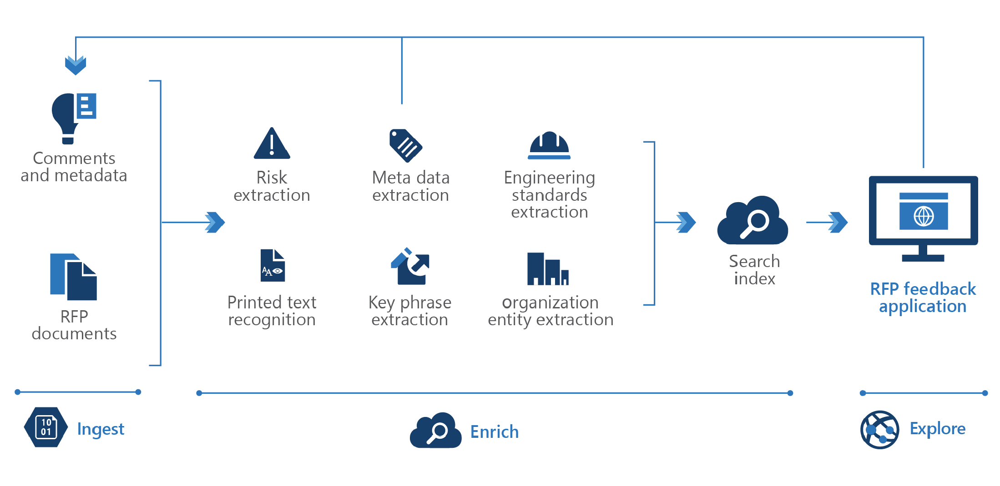

<!-- cSpell:ignore pracjain -->

[!INCLUDE [header_file](../../../includes/sol-idea-header.md)]

This article describes how to use [knowledge mining](https://azure.microsoft.com/solutions/knowledge-mining) in contract management to help your organization scour thousands of pages of material to create an accurate bid.

## Architecture

There are three steps in knowledge mining: ingest, enrich, and explore.

*Download a [Visio file](https://arch-center.azureedge.net/knowledge-mining-contract-management.vsdx) of this architecture.*

### Dataflow

- **Ingest**

  The ingest step aggregates content from a range of sources, including structured and unstructured data. For contract management, you can ingest different types of content like user guides, forms, product manuals, product pricing proposals, cost sheets, and project reports.

- **Enrich**

  The enrich step uses AI capabilities to extract information, find patterns, and deepen understanding. The content is enriched by using key phrase extraction, optical character recognition, entity recognition, and customized models to flag potential risk or essential information.

- **Explore**

  The explore step is exploring data via search, bots, existing business applications, and data visualizations. For example, you can integrate the search index into a portal to expand the knowledge base as users share more information.

### Components

The following key technologies are used to implement tools for technical content review and research:

- [Azure Cognitive Search](https://azure.microsoft.com/services/search) is a cloud search service that supplies infrastructure, APIs, and tools for searching. You can use Azure Cognitive Search to build search experiences over private, heterogeneous content in web, mobile, and enterprise applications.
- The [web API custom skill interface](/azure/search/cognitive-search-custom-skill-interface) is used to integrate a custom skill into an Azure Cognitive Search enrichment pipeline.
- [Azure Cognitive Service for Language](https://azure.microsoft.com/services/cognitive-services/language-service) is part of [Azure Cognitive Services](https://azure.microsoft.com/services/cognitive-services) that offers many natural language processing services. You can use these services to understand and analyze text.
- [Text analytics](https://azure.microsoft.com/services/cognitive-services/text-analytics) is a collection of APIs and other features from Azure Cognitive Service for Language that you can use to extract, classify, and understand text within documents.
- [Azure Cognitive Services Translator](https://azure.microsoft.com/services/cognitive-services/translator) is part of the Cognitive Services family of REST APIs. You can use Translator for real-time document and text translation.
- [Azure Form Recognizer](https://azure.microsoft.com/services/cognitive-services/form-recognizer) is part of Azure Applied AI Services. Form Recognizer uses machine-learning models to extract key-value pairs, text, and tables from documents such as invoices, receipts, ID cards, and business cards.

## Scenario details

This architecture shows how you can use [knowledge mining](https://azure.microsoft.com/solutions/knowledge-mining) in contract management.

### Potential use cases

Many companies create products for multiple sectors. Because these companies work with various vendors and buyers, their business opportunities increase exponentially. Knowledge mining can help organizations scour thousands of pages of sources to create a competitive bid. Minor details in the bidding process can make the difference between a healthy profit or lost opportunity on a project.

Industries that rely on knowledge mining for contract management include:

- Marketing
- Retail
- Logistics
- Manufacturing

## Next steps

- To build an initial knowledge mining prototype with Azure Cognitive Search, use the [knowledge mining solution accelerator](/samples/azure-samples/azure-search-knowledge-mining/azure-search-knowledge-mining).
- Build an Azure Cognitive Search [custom skill](/azure/search/cognitive-search-custom-skill-interface).
- Explore the learning path [Knowledge mining with Azure Cognitive Search](/training/paths/implement-knowledge-mining-azure-cognitive-search).
- To learn more about the components in this solution, see these resources:

  - [Azure Cognitive Search documentation](/azure/search)
  - [Text analytics REST API reference - Azure Cognitive Services](/rest/api/cognitiveservices-textanalytics)
  - [What is Azure Cognitive Services Translator?](/azure/cognitive-services/translator/translator-overview)
  - [What is Azure Form Recognizer?](/azure/applied-ai-services/form-recognizer/overview)

## Related resources

- [Knowledge mining in auditing, risk, and compliance management](./auditing-and-risk-compliance.yml)
- [Knowledge mining in business process management](./business-process-management.yml)
- [Knowledge mining for content research](./content-research.yml)
- [Knowledge mining for customer support and feedback analysis](./customer-feedback-and-analytics.yml)
- [Knowledge mining in digital asset management](./digital-asset-management.yml)
