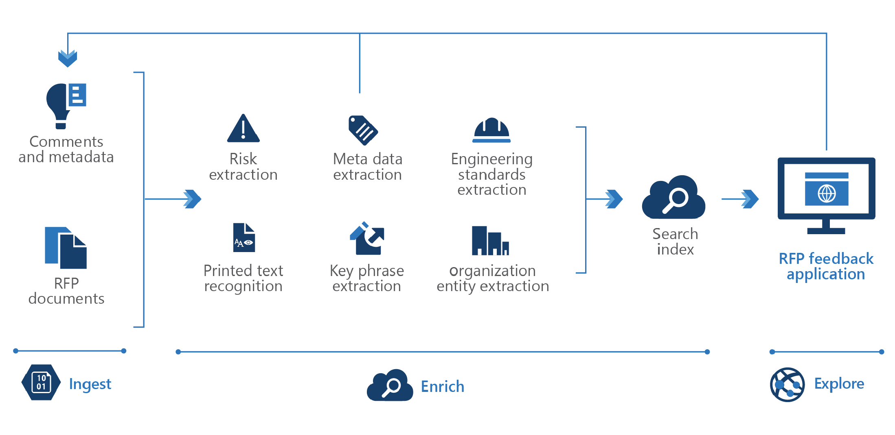

<!-- cSpell:ignore pracjain -->

Many companies create products for multiple sectors, hence the business opportunities with different vendors and buyers increases exponentially. Knowledge mining can help organizations to scour thousands of pages of sources to create an accurate bid. Minor details in the bidding process can make the difference between a healthy profit or lost opportunity on a project.

## Data Flow

There are three steps: Ingest, Enrich and Exploration.

First, the unstructured and structured data is ingested then enrichment of this data with AI to extract information and find and finally explore the newly structured data via search, existing business applications or analytics solutions.

1. The user can ingest different types of content like user guides, forms, product manuals, product pricing proposals, cost sheets, project reports
2. This content is enriched by using key phrase extraction, optical character recognition, entity recognition, customized models to flag potential risk or essential information
3. And finally, the user can integrate the search index in to the portal to expand the knowledge base as users share more information

## Components

Key technologies used to implement tools for technical content review and research

- [Azure Cognitive Search](/azure/search/)
- [Microsoft Text Analytics API](https://azure.microsoft.com/services/cognitive-services/text-analytics/)
- [Microsoft Translator Text API](https://azure.microsoft.com/services/cognitive-services/translator-text-api/)
- [Microsoft Form Recognizer](https://azure.microsoft.com/services/cognitive-services/form-recognizer/)
- [Web API custom skill interface](/azure/search/cognitive-search-custom-skill-interface)

## Next steps

Using the [knowledge mining solution accelerator](/samples/azure-samples/azure-search-knowledge-mining/azure-search-knowledge-mining/) to build an initial knowledge mining prototype with Azure Cognitive Search.

Building custom skills with Microsoft's [Custom Web API](/azure/search/cognitive-search-custom-skill-interface)