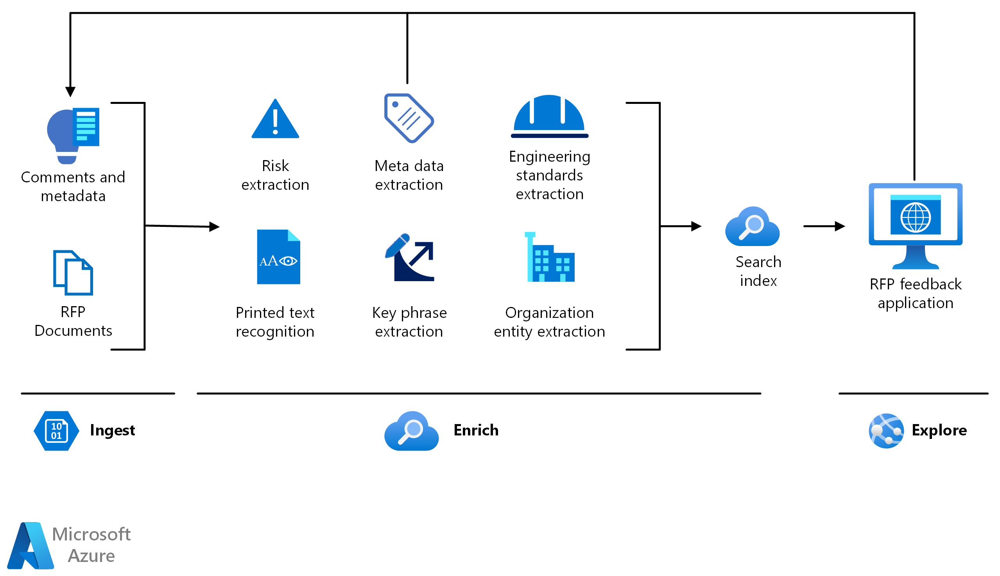

<!-- cSpell:ignore pracjain -->

[!INCLUDE [header_file](../../../includes/sol-idea-header.md)]

This architecture demonstrates how to use [knowledge mining](https://azure.microsoft.com/solutions/knowledge-mining) in contract management.

## Potential use cases

Many companies create products for multiple sectors, as such the business opportunities with different vendors and buyers increases exponentially. Knowledge mining can help organizations to scour thousands of pages of sources to create a competitive bid. Minor details in the bidding process can make the difference between a healthy profit or lost opportunity on a project.

## Architecture

There are three steps in knowledge mining: ingest, enrich, and explore.

### Data flow

- **Ingest**

  The ingest step aggregates content from a range of sources, including structured and unstructured data. For contract management, you can ingest different types of content like user guides, forms, product manuals, product pricing proposals, cost sheets, and project reports.

- **Enrich**

  The enrich step uses AI capabilities to extract information, find patterns, and deepen understanding. The content is enriched by using key phrase extraction, optical character recognition, entity recognition, and customized models to flag potential risk or essential information.

- **Explore**

  The explore step is exploring data via search, bots, existing business applications, and data visualizations. For example, you can integrate the search index into a portal to expand the knowledge base as users share more information.

### Components

Key technologies used to implement tools for technical content review and research

- [Azure Cognitive Search](/azure/search/)
- [Microsoft Text Analytics API](https://azure.microsoft.com/services/cognitive-services/text-analytics)
- [Microsoft Translator Text API](https://azure.microsoft.com/services/cognitive-services/translator-text-api)
- [Microsoft Form Recognizer](https://azure.microsoft.com/services/cognitive-services/form-recognizer)
- [Web API custom skill interface](/azure/search/cognitive-search-custom-skill-interface)

## Next steps

- Use the [knowledge mining solution accelerator](/samples/azure-samples/azure-search-knowledge-mining/azure-search-knowledge-mining) to build an initial knowledge mining prototype with Azure Cognitive Search.

- Build an Azure Cognitive Search [custom skill](/azure/search/cognitive-search-custom-skill-interface).

- Explore the Microsoft Learning Path [knowledge mining with Azure Cognitive Search](/learn/paths/implement-knowledge-mining-azure-cognitive-search).
