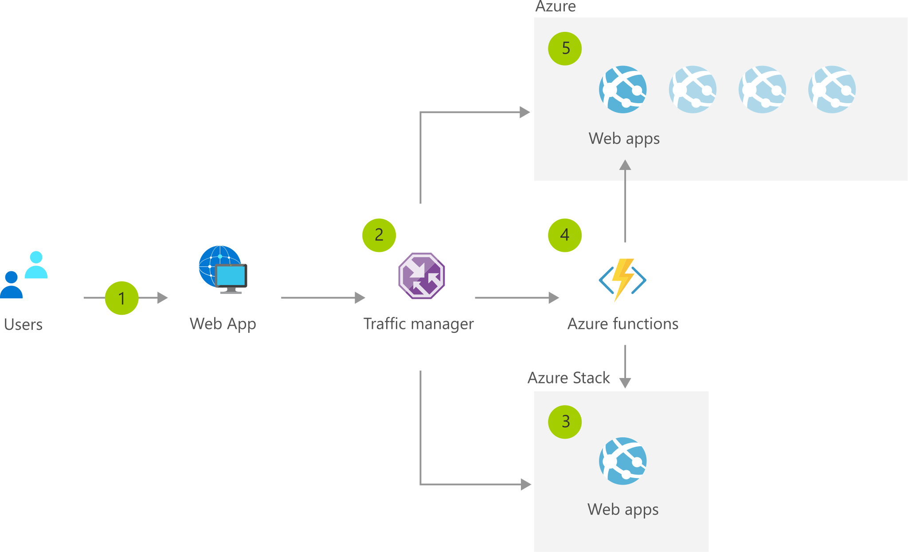

[!INCLUDE [header_file](../../../includes/sol-idea-header.md)]

Modern software is increasingly connected and distributed. The consistency of Azure Stack with Azure infrastructure and platform services enable you to scale resources cross cloud to meet increased load as needed, and decrease resources as demand drops. Optimize cost and maximize resource efficiency while remaining compliant with cross cloud architecture.

## Architecture

*Download an [SVG](../media/cross-cloud-scaling.svg) of this architecture.*

### Dataflow

1. A large number of users attempt to access a web app.
1. Traffic manager returns the Azure Stack DNS name.
1. Users access the Azure Stack web app.
1. Once a threshold is reached, a function starts the Azure Web App and enables the Azure Traffic Manager route.
1. Traffic is routed to Azure, which can automatically scale App Service.

### Components

* [Traffic Manager](https://azure.microsoft.com/services/traffic-manager): Route incoming traffic for high performance and availability
* [Azure Functions](https://azure.microsoft.com/services/functions): Process events with serverless code
* [Azure Stack](https://azure.microsoft.com/overview/azure-stack): Build and run innovative hybrid applications across cloud boundaries

## Next steps

* [Traffic Manager documentation](/azure/traffic-manager)
* [Azure Functions documentation](/azure/azure-functions)
* [Azure Stack documentation](/azure/azure-stack/user/azure-stack-solution-cloud-burst)
