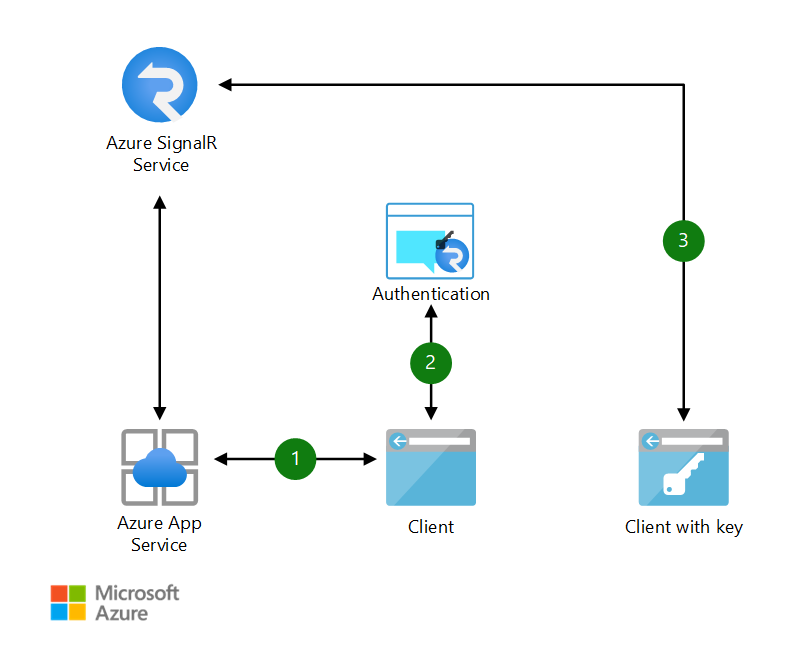

[!INCLUDE [header_file](../../../includes/sol-idea-header.md)]

This document describes the architecture and design considerations for reliable, high-performing chat applications.
It uses the SignalR Service to implement multi-factor authentication working with Azure App Service.

## Architecture

*Download an [SVG](../media/cross-platform-chat.svg) of this architecture.*

### Data flow

1. Web chat app connects to SignalR Service and receives token
1. User logs into app with multi-factor authentication; if passed, SignalR endpoint and bearer token returned
1. User connects to the SignalR Service with endpoint and token

### Components

## Next steps

Product documentation:

- [App Service overview](/azure/app-service/overview)
- [What is Azure SignalR Service?](/azure/azure-signalr/signalr-overview)

Microsoft Learn modules:

- [Replace client-side polling with ASP.NET Core SignalR](/learn/modules/aspnet-core-signalr-polling-fix)
- [Configure Azure App Services](/learn/modules/configure-azure-app-services)
- [Explore Azure App Service](/learn/modules/introduction-to-azure-app-service)

## Related resources

- [Hybrid architecture design](../../hybrid/hybrid-start-here.md)
- [Enhanced-security hybrid messaging infrastructure — desktop-client access](../../example-scenario/hybrid/secure-hybrid-messaging-client.yml)
- [Enhanced-security hybrid messaging infrastructure — web access](../../example-scenario/hybrid/secure-hybrid-messaging-web.yml)
