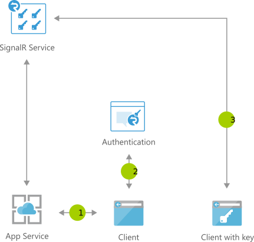

[!INCLUDE [header_file](../../../includes/sol-idea-header.md)]

This architecture uses Azure App Service to accelerate development of reliable, high-performing chat applications.

## Architecture

*Download a [Visio file](https://arch-center.azureedge.net/cross-platform-chat.vsdx) of this architecture.*

### Dataflow

1. Web chat app connects to [SignalR Service](/aspnet/core/signalr/introduction) and receives token
1. User logs into app with multi-factor authentication; if passed, SignalR endpoint and bearer token returned
1. User connects to the SignalR Service with endpoint and token

### Components

Key technology used to implement this architecture:

- [Azure SignalR Service](https://azure.microsoft.com/services/signalr-service)
- [Azure App Service](https://azure.microsoft.com/services/app-service)

## Scenario details

This document describes the architecture and design considerations for reliable, high-performing chat applications. It uses the SignalR Service to implement multi-factor authentication working with Azure App Service.

### Potential use cases

- Ease of use
- Accessibility
- Scalability
- Multi-factor authentication

## Next steps

Product documentation:

- [Azure App Service overview](/azure/app-service/overview)
- [What is Azure SignalR Service?](/azure/azure-signalr/signalr-overview)

Microsoft Learn modules:

- [Replace client-side polling with ASP.NET Core SignalR](/training/modules/aspnet-core-signalr-polling-fix)
- [Configure Azure App Services](/training/modules/configure-azure-app-services)
- [Explore Azure App Service](/training/modules/introduction-to-azure-app-service)

## Related resources

- [Hybrid architecture design](../../hybrid/hybrid-start-here.md)
- [Enhanced-security hybrid messaging infrastructure — desktop client access](../../example-scenario/hybrid/secure-hybrid-messaging-client.yml)
- [Enhanced-security hybrid messaging infrastructure — web access](../../example-scenario/hybrid/secure-hybrid-messaging-web.yml)
