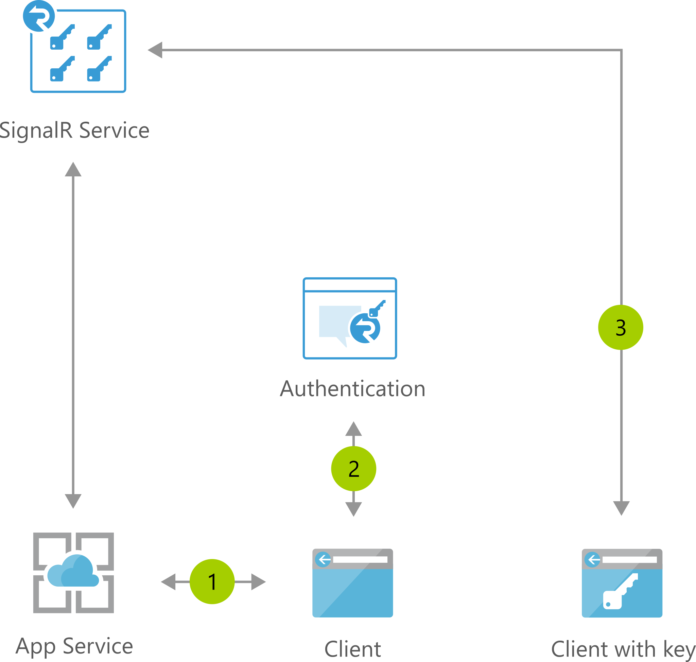

# Cross-platform Chat

[!INCLUDE [header_file](../../../includes/sol-idea-header.md)]

Accelerate development of reliable, high-performing chat applications.

## Architecture

*Download an [SVG](../media/cross-platform-chat.svg) of this architecture.*

## Data Flow

1. Web chat app connects to SignalR Service and receives token
1. User logs into app with multi-factor authentication; if passed, SignalR endpoint and bearer token returned
1. User connects to the SignalR Service with endpoint and token
