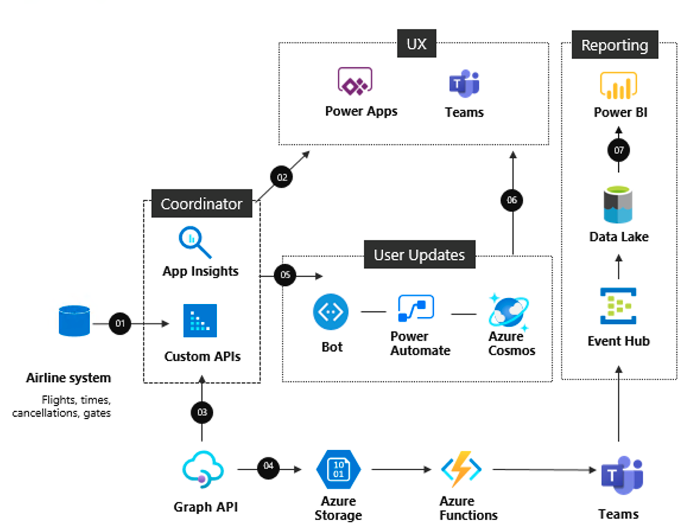

[!INCLUDE [header_file](../../../includes/sol-idea-header.md)]

This example demonstrates how you can deploy portals that automate manual or paper-based processes and surface rich user experience. Leverage Azure API management and Azure Functions to connect custom APIs which tap into your legacy systems. Using Azure managed databases and low-code approach to automate tasks, you can lower the overall solution costs while easily building apps that are real-time, resilient, and scalable by default.

## Architecture

### Data flow

The data flows through the solution as follows:

1. The airline system assigns flights to Teams channel which are also displayed in Power Apps.
2. Custom API Coordinator hosted in Azure API Management receives notifications and handles incoming messages from the airline system.
3. When a user selects a flight to monitor or the system assigns the user to a flight, Graph API call is queued for coordinator to process.
4. Azure Functions run the Graph API calls which are processed in Azure Storage.
5. Notifications from airline system are managed by a custom bot messaging service leveraging Azure Bot Service.
6. Custom bots sends flight updates to users in Teams.
7. Power BI generates reports from the Azure Data Lake, based on Teams activity.

### Components

Data is loaded from these different data sources using several Azure components:

- [Power Apps](https://powerapps.microsoft.com/): Increase agility across your organization by rapidly building low-code apps that modernize processes and solve tough challenges.
- [Azure Functions](https://azure.microsoft.com/services/functions/): Accelerate and simplify application development with serverless compute
- [Azure API management](https://azure.microsoft.com/services/api-management/): Hybrid, multi-cloud management platform for APIs across all environments
- [Azure SQL Database](https://azure.microsoft.com//services/sql-database/): Build apps that scale with the pace of your business with managed and intelligent SQL in the cloud
- [Azure Cosmos DB](https://azure.microsoft.com/services/cosmos-db/): Fast NoSQL database with open APIs for any scale
- [Azure Storage](https://azure.microsoft.com/product-categories/storage/): Massively scalable, secure cloud storage for your data, apps, and workloads
- [Azure Event Hubs](https://azure.microsoft.com/services/event-hubs/): Simple, secure, and scalable real-time data ingestion
- [Azure Data Lake Storage](https://azure.microsoft.com/services/storage/data-lake-storage/): Massively scalable and secure data lake for your high-performance analytics workloads
- [Azure Bot Service](https://azure.microsoft.com/services/bot-service/): A managed service purpose-built for bot development
- [Azure Data Factory](https://azure.microsoft.com/services/data-factory/): Hybrid data integration service that simplifies ETL at scale
- [Power Automate](https://flow.microsoft.com/): Streamline repetitive tasks and paperless processes
- [Power BI](/power-bi) is a suite of business analytics tools to analyze data and share insights.

## Next steps

- Learn more: [https://aka.ms/learnpowerapps](/learn/browse/?products=power-apps)
