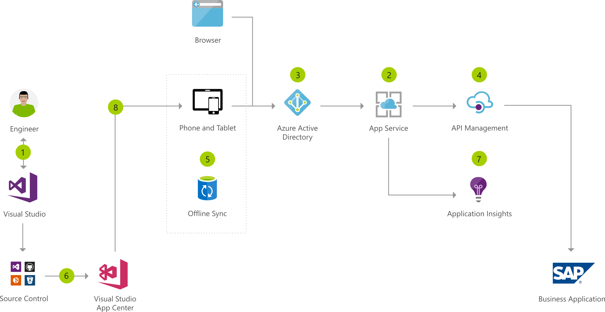

[!INCLUDE [header_file](../../../includes/sol-idea-header.md)]

This mobile workforce app architecture uses Active Directory to secure corporate data from an SAP back end system, delivered to devices via Azure App Service API Management.

A Xamarin.Forms client app, with support for iOS, Android, and Windows, works offline and enables field engineers to view and edit the jobs assigned to them.

The app is built with Visual Studio (PC or Mac) and Xamarin, sharing C# code across Android, iOS, and Windows without compromising user experience. Visual Studio App Center is used to automate builds and tests and distribute to beta testers and app stores, while also providing usage monitoring and analytics in conjunction with App Insights.

## Architecture

*Download an [SVG](../media/custom-mobile-workforce-app.svg) of this architecture.*

### Data flow

1. Create the app using Visual Studio and Xamarin.
1. Add the Azure App Service Mobile Apps back end service to the app solution.
1. Implement authentication through Azure Active Directory.
1. Connect to business data in external systems like SAP using Azure API Management.
1. Implement offline sync to make the mobile app functional without a network connection.
1. Build and test the app through Visual Studio App Center and publish it.
1. Use Application Insights to monitor the App Service.
1. Deploy the app to devices using App Center.

### Components

* Build the web front end, mobile apps, and back end services with C# in [Visual Studio](https://azure.microsoft.com/products/visual-studio) 2017 or [Visual Studio](https://azure.microsoft.com/products/visual-studio) for Mac.
* [Xamarin](https://azure.microsoft.com/features/xamarin): Create mobile apps for iOS and Android using C# and Azure SDKs.
* [Visual Studio App Center](https://azure.microsoft.com/services/app-center): App Center enables a continuous integration and deployment workflow by pulling code from BitBucket, GitHub, and Visual Studio Team Services.
* An [App Service](https://azure.microsoft.com/services/app-service) web app can host a customer-facing web app and a service that is used by both the web and mobile client.
* [Application Insights (via Azure Monitor)](https://azure.microsoft.com/services/application-insights): Detect issues, diagnose crashes, and track usage in your web app with Application Insights. Make informed decisions throughout the development lifecycle.
* [API Management](https://azure.microsoft.com/services/api-management): Publish APIs to external, partner, and employee developers securely and at scale.
* [Azure Active Directory](https://azure.microsoft.com/services/active-directory) is used for secure, enterprise-grade authentication.

## Next steps

* [Visual Studio Documentation](/visualstudio)
* [Xamarin Documentation](/xamarin)
* [Visual Studio App Center](/appcenter)
* [App Service](https://azure.microsoft.com/services/app-service)
* [Application Insights Documentation](/azure/application-insights)
* [API Management documentation](/azure/api-management)
* [Azure Active Directory Documentation](/azure/active-directory)
