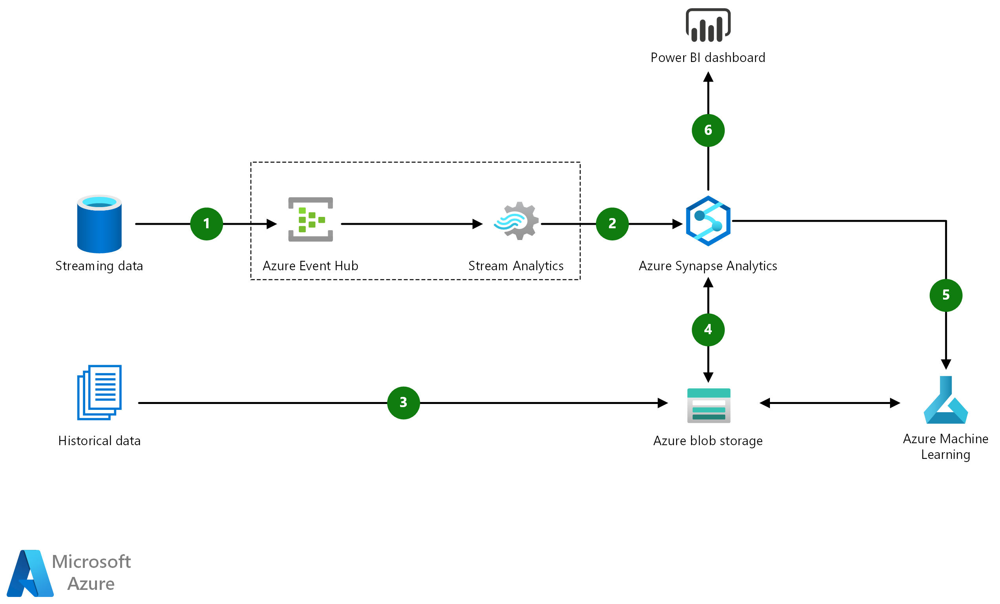

[!INCLUDE [header_file](../../../includes/sol-idea-header.md)]

Customer Churn Prediction uses Azure AI platform to predict churn probability, and it helps find patterns in existing data that are associated with the predicted churn rate.

## Architecture

*Download a [Visio file](https://arch-center.azureedge.net/customer-churn-prediction.vsdx) of this architecture.*

### Dataflow

1. Use [Azure Event Hubs](https://azure.microsoft.com/services/event-hubs) to stream all live data into Azure.

1. Process real-time data using [Azure Stream Analytics](https://azure.microsoft.com/services/stream-analytics). Stream Analytics can output processed data into [Azure Synapse](https://azure.microsoft.com/services/synapse-analytics) . This allows customers to combine existing and historical data to create dashboards and reports in Power BI.

1. Ingest historical data at scale into [Azure Blob Storage](https://azure.microsoft.com/services/storage/blobs) using [Azure Synapse](https://azure.microsoft.com/services/synapse-analytics) or another ETL tool.

1. Use [Azure Synapse](https://azure.microsoft.com/services/synapse-analytics) to combine streaming data with historical data for reporting or experimentation in [Azure Machine Learning](https://azure.microsoft.com/free/machine-learning).

1. Use [Azure Machine Learning](https://azure.microsoft.com/free/machine-learning) to build models for predicting churn probability and identify data patterns to deliver intelligent insights.

1. Use [Power BI](https://powerbi.microsoft.com) to build operational reports and dashboards on top of Azure Synapse. Azure Machine Learning models can be used to further enhance reporting and to assist businesses in decision making processes.

### Components

* [Azure Event Hubs](https://azure.microsoft.com/services/event-hubs) is an event ingestion service that can process millions of events per second. Data sent to event hub can be transformed and stored using any real-time analytics provider.
* [Azure Stream Analytics](https://azure.microsoft.com/services/stream-analytics) is a real-time analytics engine designed to analyze and process high volume of fast streaming data. Relationships and patterns identified in the data can be used to trigger actions and initiate workflows such as creating alerts, feeding information to a reporting tool, or storing transformed data for later use.
* [Azure Blob Storage](https://azure.microsoft.com/services/storage/blobs) is a cloud service for storing large amounts of unstructured data such as text, binary data, audio, and documents more-easily and cost-effectively. Azure Blob Storage allows data scientists quick access to data for experimentation and AI model building.
* [Azure Synapse Analytics](https://azure.microsoft.com/services/synapse-analytics) is a fast and reliable data warehouse with limitless analytics that brings together data integration, enterprise data warehousing, and big data analytics. It gives you the freedom to query data on your terms, using either serverless or dedicated resources and serve data for immediate BI and machine learning needs.
* [Azure Machine Learning](https://azure.microsoft.com/free/machine-learning) can be used for any supervised and unsupervised machine learning, whether you prefer to write Python of R code. You can build, train, and track machine learning models in an Azure Machine Leaning workspace.
* [Power BI](https://powerbi.microsoft.com) is a suite of tools that delivers powerful insights to organizations. Power BI connects to various data sources, simplify data prep and model creation from disparate sources. Enhance team collaboration across the organization to produce analytical reports and dashboard to support the business decisions and publish them to the web and mobile devices for users to consume.

## Scenario details

Keeping existing customers is five times cheaper than the cost of getting new customers. For this reason, marketing executives often find themselves trying to estimate the likelihood of customer churn and finding the necessary actions to minimize the churn rate.

### Potential use cases

This solution uses [Azure Machine Learning](/azure/machine-learning) to predict churn probability and helps find patterns in existing data associated with the predicted churn rate. By using both historical and near real-time data, users are able to create predictive models to analyze characteristics and identify predictors of the existing audience. This information provides businesses with actionable intelligence to improve customer retention and profit margins.

This solution is optimized for the retail industry.

## Deploy this scenario

For more details on how to build and deploy this solution, visit the [solution guide in GitHub](https://github.com/Azure/cortana-intelligence-churn-prediction-solution).

The objective of this guide is to demonstrate predictive data pipelines for retailers to predict customer churn. Retailers can use these predictions to prevent customer churn by using their domain knowledge and proper marketing strategies to address at-risk customers. The guide also shows how customer churn models can be retrained to use more data as it becomes available.

### What's under the hood

The end-to-end solution is implemented in the cloud, using Microsoft Azure. The solution is composed of several Azure components, including data ingest, data storage, data movement, advanced analytics, and visualization. The advanced analytics are implemented in Azure Machine Learning, where you can use Python or R language to build data science models. Or you can reuse existing in-house or third-party libraries. With data ingest, the solution can make predictions based on data transferred to Azure from an on-premises environment.

### Solution dashboard

The snapshot below shows an example Power BI dashboard that gives insights into the predicted churn rates across a customer base.

## Next steps

* [About Azure Event Hubs](/azure/event-hubs/event-hubs-about)
* [Welcome to Azure Stream Analytics](/azure/stream-analytics/stream-analytics-introduction)
* [What is Azure Synapse Analytics?](/azure/synapse-analytics/overview-what-is)
* [Introduction to Azure Blob Storage](/azure/storage/blobs/storage-blobs-introduction)
* [What is Azure Machine Learning?](/azure/machine-learning/overview-what-is-azure-machine-learning)
* [What is Power BI?](/power-bi/fundamentals/power-bi-overview)

## Related resources

Architecture guides:

* [Artificial intelligence (AI)](../../data-guide/big-data/ai-overview.md)
* [Compare the machine learning products and technologies from Microsoft](../../data-guide/technology-choices/data-science-and-machine-learning.md)
* [Machine learning at scale](../../data-guide/big-data/machine-learning-at-scale.md)
* [Machine learning operations (MLOps) framework](../../example-scenario/mlops/mlops-technical-paper.yml)

Reference architectures:

* [Batch scoring for deep learning models](../../reference-architectures/ai/batch-scoring-deep-learning.yml)
* [Batch scoring of Python models on Azure](../../reference-architectures/ai/batch-scoring-python.yml)
* [Build a speech-to-text transcription pipeline](/azure/architecture/example-scenario/ai/speech-to-text-transcription-analytics)
* [Movie recommendations on Azure](../../example-scenario/ai/movie-recommendations-with-machine-learning.yml)
