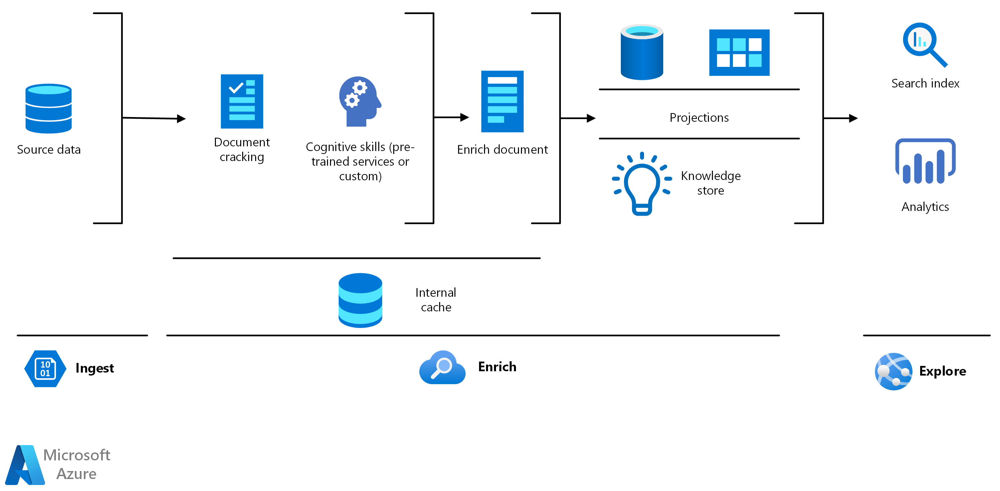

<!-- cSpell:ignore pracjain keyphrase -->

[!INCLUDE [header_file](../../../includes/sol-idea-header.md)]

For many companies, customer support is costly and doesn't always operate efficiently. [Knowledge mining](https://azure.microsoft.com/solutions/knowledge-mining/) can help customer support teams quickly find the best answers to customer questions or assess customer sentiment at scale.

## Potential use cases

This solution is optimized for the retail industry.

[Azure Cognitive Search](/azure/search/search-what-is-azure-search) is a key part of knowledge mining solutions. Cognitive Search creates a search index over aggregated and analyzed content.

With queries using the search index, companies can discover trends about what customers are saying and use that information to improve products and services.

## Architecture

There are three steps in knowledge mining: ingest, enrich, and explore.

### Dataflow

- **Ingest**

The ingest step aggregates content from a range of sources, including structured and unstructured data. For customer support and feedback analysis, you can ingest different types of content like customer support tickets, chat logs, call transcriptions, customer emails, customer payment history, product reviews, social media feeds, online comments, feedback forms, and surveys.

- **Enrich**

The enrich step uses AI capabilities to extract information, find patterns, and deepen understanding. You can enrich content by using key phrase extraction, sentiment analysis, language translation, bot services, custom models to focus on specific products or company policies.

- **Explore**

The explore step is explorer data via search, existing business applications, or analytics solutions. For example, you can compile enriched documents in the knowledge store and project them into tabular or object stores. The stores can be used to surface trends in an analytics dashboard identifying frequent issues or popular products. Or, you can integrate the search index into customer service support applications.

### Components

Key technologies used to implement tools for technical content review and research

- [Azure Cognitive Search](/azure/search)
- [Microsoft Text Analytics API](https://azure.microsoft.com/services/cognitive-services/text-analytics)
- [Microsoft Translator Text API](https://azure.microsoft.com/services/cognitive-services/translator-text-api)
- [Web API custom skill interface](/azure/search/cognitive-search-custom-skill-interface)

## Next steps

- Use the [knowledge mining solution accelerator](/samples/azure-samples/azure-search-knowledge-mining/azure-search-knowledge-mining) to build an initial knowledge mining prototype with Azure Cognitive Search.

- Build an Azure Cognitive Search [custom skill](/azure/search/cognitive-search-custom-skill-interface).

- Explore the Microsoft Learning Path [knowledge mining with Azure Cognitive Search](/learn/paths/implement-knowledge-mining-azure-cognitive-search).
