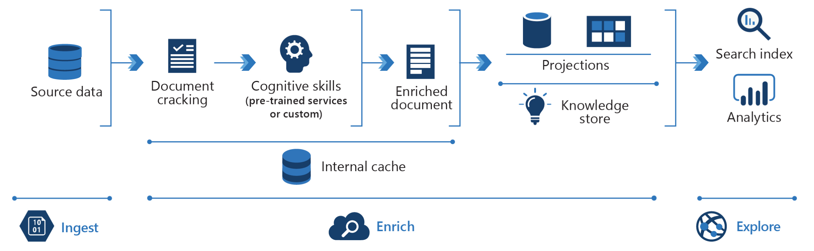

<!-- cSpell:ignore pracjain keyphrase -->

For many companies, customer support is costly and inefficient. Knowledge mining can help customer support teams quickly find the right answer for a customer inquiry or assess customer sentiment at scale.

Every company is looking to enhance the customer experience. Knowledge mining can aggregate and analyze data to discover trends about what customers are saying and use that information to improve products and services

## Data Flow

There are three steps: Ingest, Enrich and Exploration.

First, the unstructured and structured data is ingested then enrichment of this data with AI to extract information and find and finally explore the newly structured data via search, existing business applications or analytics solutions.

1. The user can ingest different types of content like customer support tickets, chat logs, call transcriptions, customer emails, customer payment history, product reviews, social media feeds, online comments, feedback forms, and surveys
2. This content is enriched by using keyphrase extraction, sentiment analysis, language translation, bot services, custom models to focus on specific products or company policies
3. And finally, the user compile enriched documents in the knowledge store and project them into tabular or object stores, then surface trends in an analytics dashboard, such as frequent issues, popular products or integrate the search index in to customer service support application

## Components

Key technologies used to implement tools for technical content review and research

- [Azure Cognitive Search](/azure/search/)
- [Microsoft Text Analytics API](https://azure.microsoft.com/services/cognitive-services/text-analytics/)
- [Microsoft Translator Text API](https://azure.microsoft.com/services/cognitive-services/translator-text-api/)
- [Web API custom skill interface](/azure/search/cognitive-search-custom-skill-interface)

## Next steps

Using the [knowledge mining solution accelerator](/samples/azure-samples/azure-search-knowledge-mining/azure-search-knowledge-mining/) to build an initial knowledge mining prototype with Azure Cognitive Search.

Building custom skills with Microsoft's [Custom Web API](/azure/search/cognitive-search-custom-skill-interface)