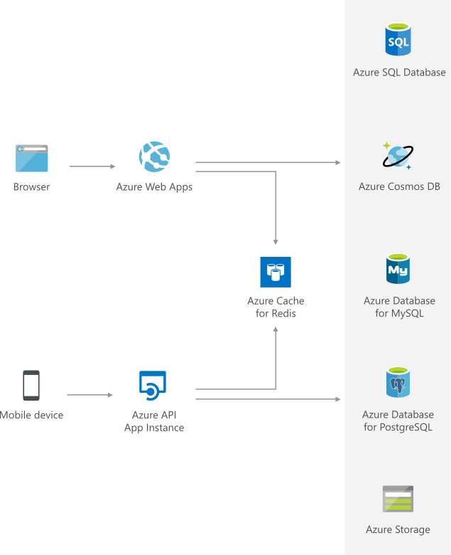

[!INCLUDE [header_file](../../../includes/sol-idea-header.md)]

Azure Cache for Redis perfectly complements Azure database services such as Azure Cosmos DB. It provides a cost-effective solution to scale read and write throughput of your data tier. Store and share database query results, session states, static contents, and more using a common cache-aside pattern.

## Architecture

*Download a [Visio file](https://arch-center.azureedge.net/data-cache-with-redis-cache.vsdx) of this architecture.*

### Dataflow

1. When an application needs to retrieve data, it will first search to see if it exists in Azure Cache for Redis.
1. If the data is found in Azure Cache for Redis (cache hit), the application will use this data.
1. If the data is not found in Azure Cache for Redis (cache miss), then the application will need to retrieve the data from the appropriate Azure database service.
1. For cache miss scenarios, the requesting application should add the data retrieved from the Azure Database service to Azure Cache for Redis.

### Components

Key technologies used to implement this architecture:

* [Azure Cache for Redis](https://azure.microsoft.com/services/cache) complements database services, such as Azure SQL Database and Azure Cosmos DB, by enabling your data tier to scale throughput, at a lower cost than through expanded database instances. Store and share database query results, session states, and static content, by using a common cache-aside pattern. Make your application nimbler and more scalable.
* [Azure App Service](https://azure.microsoft.com/services/app-service) is an HTTP-based service for hosting web applications, REST APIs, and mobile back ends. You can develop in your favorite language, including .NET, .NET Core, Java, Ruby, Node.js, PHP, and Python. Applications run and scale with ease on both Windows and Linux-based environments.
* [Azure Cosmos DB](https://azure.microsoft.com/services/cosmos-db) is a fully managed NoSQL database service for modern app development.
* [Azure SQL Database](https://azure.microsoft.com/products/azure-sql/database) is part of the Azure SQL family. Azure SQL Database is an intelligent, scalable, and relational database service built for the cloud. 
* [Azure Database for PostgreSQL](https://azure.microsoft.com/en-gb/services/postgresql) is also part of the Azure SQL family.

## Scenario details

### Potential use cases

- Airlines (aircraft and aerospace)
- Online vehicle dealers (automotive)
- Restaurants (travel and hospitality)

## Contributors

*This article is maintained by Microsoft. It was originally written by the following contributors.*

Principal author:

* [Sarah Parkes](https://www.linkedin.com/in/sarah-p-a06370) | Cloud Solution Architect

## Next steps

* [About Azure Cache for Redis](/azure/azure-cache-for-redis/cache-overview)
* [App Service overview](/azure/app-service/overview)
* [Welcome to Azure Cosmos DB](/azure/cosmos-db/introduction)
* [What is Azure SQL Database?](/azure/azure-sql/database/sql-database-paas-overview)

## Related resources

* [Cache-Aside Pattern](../../patterns/cache-aside.yml)
* [Caching Best Practice](../../best-practices/caching.yml)
* [Data streaming with AKS](/azure/architecture/solution-ideas/articles/data-streaming-scenario)
* [Messaging](/azure/architecture/solution-ideas/articles/messaging)
