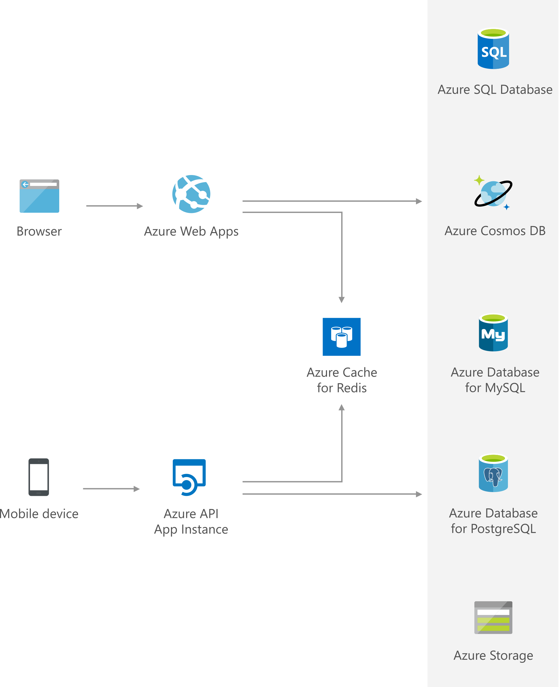

# Data cache

[!INCLUDE [header_file](../../../includes/sol-idea-header.md)]

Azure Cache for Redis perfectly complements Azure database services such as Cosmos DB. It provides a cost-effective solution to scale read and write throughput of your data tier. Store and share database query results, session states, static contents, and more using a common cache-aside pattern.

## Architecture

*Download an [SVG](../media/data-cache-with-redis-cache.svg) of this architecture.*
