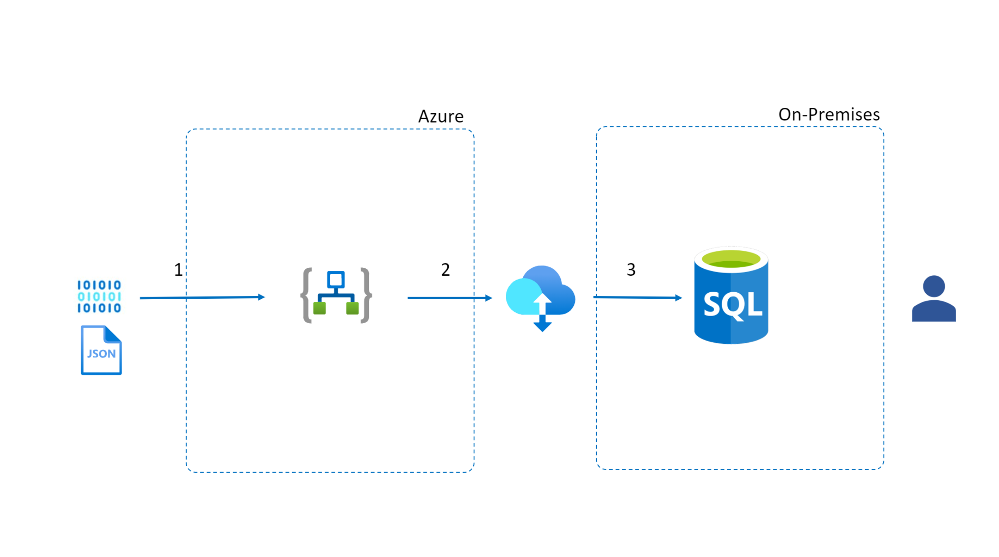

# Data Integration with Logic Apps and SQL Server  

[!INCLUDE [header_file](../../../includes/sol-idea-header.md)]
 
With Azure Logic Apps it is possible to integrate data from an HTTP request and store it in an on-premises database using Microsoft SQL Server. This gives us the benefits of using a Logic App, such as being able to securely acess it as an endpoint using [Azure API Management](https://azure.microsoft.com/en-us/services/api-management/), or allowing you to automate tasks related to the data, such as sending a Teams message or an Email. 

## Architecture

## Data Flow

1. Data is consumed in Azure Logic Apps through an HTTP request.
2. A connection with an on-premises data gateway is established (which is configured on both Azure and the local machine).
3. Data is stored in a SQL database through Microsoft SQL Server.

## Components

The architecture has the following components: 

- [Azure Logic Apps](https://docs.microsoft.com/en-us/azure/logic-apps/quickstart-create-first-logic-app-workflow)
- [On-premises data gateway](https://docs.microsoft.com/en-us/power-bi/connect-data/service-gateway-onprem)
- [SQL Server](https://docs.microsoft.com/en-us/sql/?view=sql-server-ver15)

## Next Steps
- [Import a Logic App as an API](https://docs.microsoft.com/en-us/azure/api-management/import-logic-app-as-api)
- [On-premises data gateways documentation](https://docs.microsoft.com/en-us/data-integration/gateway/)
- [Install on-premises data gateway for Azure Logic Apps](https://docs.microsoft.com/en-us/azure/logic-apps/logic-apps-gateway-install)

