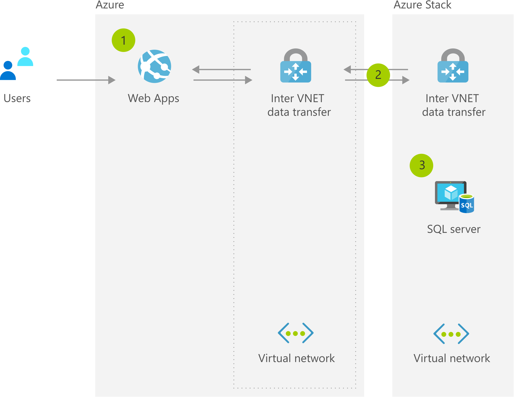

# Custom Data Sovereignty & Data Gravity Requirements

[!INCLUDE [header_file](../../../includes/sol-idea-header.md)]

Azure with Azure Stack enables organizations to make technology placement decisions based on business needs-simplifying meeting custom compliance, sovereignty, and data gravity requirements.

## Architecture

*Download an [SVG](../media/data-sovereignty-and-gravity.svg) of this architecture.*

## Data Flow

1. User enters data into Azure-based web app.
1. Application commits data to database over virtual network-to virtual network VPN connection to Azure Stack.
1. Data is stored in SQL database on virtual machine (VM).

## Components

* [Virtual Network](https://azure.microsoft.com/services/virtual-network): Provision private networks, optionally connect to on-premises datacenters
* [VPN Gateway](https://azure.microsoft.com/services/vpn-gateway): Establish secure, cross-premises connectivity
* [Azure SQL Database](https://azure.microsoft.com/services/sql-database): Managed, intelligent SQL in the cloud
* [Azure Functions](https://azure.microsoft.com/services/functions): Process events with serverless code
* [Azure Stack](https://azure.microsoft.com/overview/azure-stack): Build and run innovative hybrid applications across cloud boundaries

## Next steps

* [Virtual Network documentation](/azure/virtual-network)
* [VPN Gateway documentation](/azure/vpn-gateway)
* [Azure SQL Database documentation](/azure/sql-database)
* [Azure Functions documentation](/azure/azure-functions)
* [Azure Stack documentation](/azure/azure-stack/user/azure-stack-solution-staged-data-analytics)