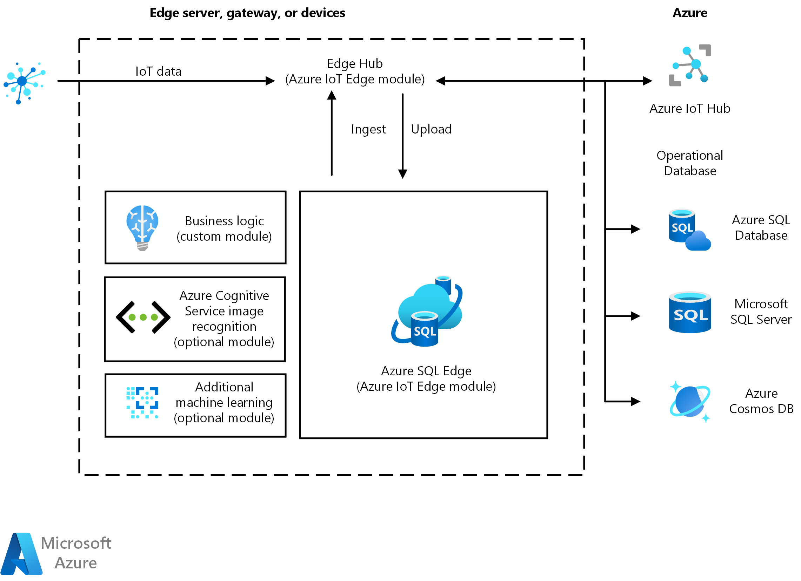

[!INCLUDE [header_file](../../../includes/sol-idea-header.md)]

This Internet of Things (IoT) solution demonstrates an on-premises edge network for computing and data collecting.

## Architecture

*Download a [Visio file](https://arch-center.azureedge.net/data-storage-edge.vsdx)* of this architecture.

This implementation uses Azure SQL Edge on an edge processor. Communications to and from devices is done using Edge Hub. Communications between IoT devices and cloud applications is done using Azure IoT Hub.

### Components

The architecture uses the following Azure services:

- [Azure IoT Edge](https://azure.microsoft.com/services/iot-edge) is a fully managed service built on Azure IoT Hub. It can run your cloud workloads—whether artificial intelligence, Azure and third-party services, or your own business logic—on edge devices via standard containers.
- [Azure IoT Hub](https://azure.microsoft.com/services/iot-hub) provides highly secure and reliable communication between your IoT application and the devices it manages. It can extend your solution from the cloud to the edge with per-device authentication, built-in device management, and scaled provisioning.
- [Azure SQL Edge](https://azure.microsoft.com/services/sql-edge) is a small-footprint, edge-optimized SQL database engine with built-in AI.
- [Azure Cognitive Services](https://azure.microsoft.com/services/cognitive-services) is a comprehensive family of AI services and cognitive APIs that your intelligent apps can use. The services can run on IoT Edge devices via containers.
- [Azure SQL Database](https://azure.microsoft.com/services/sql-database) is a fully managed relational database with built-in intelligence.
- [SQL Server on Virtual Machines](https://azure.microsoft.com/services/virtual-machines/sql-server) can run your SQL Server workloads on the cloud at the lowest total cost of ownership.
- [Azure Cosmos DB](https://azure.microsoft.com/services/cosmos-db) is a fast NoSQL database with open APIs for any scale.

## Scenario details

An Internet of Things (IoT) solution might require that an on-premises edge network provide computing and data collecting, rather than the cloud. Edge devices often meet the following needs better than the cloud:

- Quick analysis of real-time data
- High availability
- High bandwidth

### Potential use cases

Here are examples of how you can use edge networks in Azure solutions.

#### Manufacturing

- **Predict machine failure on the plant floor:** Use sensor data to monitor machines and predict failures. Send failure alerts to the cloud. For example, see how [ZEISS sharpens its focus on optical excellence with Microsoft Azure SQL Edge.](https://customers.microsoft.com/story/764241-zeiss-manufacturing-sql-db-edge).
- **Provide real-time data on the plant floor for immediate decision making:** Capture production data on an Azure SQL Edge database. Use the data to monitor production processes, empower front-line employees, and provide real-time insights. For example, see how [Achilles uses Microsoft Azure SQL Edge to keep front-line workers connected and employees empowered](https://customers.microsoft.com/story/823356-achilles-manufacturing-azure-sql-edge).

#### Healthcare

- **Obtain a complete view of patients:** Consolidate and analyze data from medical and patient devices to provide a unified and complete picture of each patient's condition.
- **Monitor surgeries and procedures:** Consolidate and analyze data from surgeries and other procedures to gain insight and improve outcomes.

#### Energy

- **Monitor offshore oil rigs:** Monitor rig conditions and save the data in an edge database for high availability. Use the data to predict failures, monitor efficiency, and reduce risk.
- **Monitor ships at sea:** Apply machine learning and real-time analysis of ship data on-premises without having to transmit data via satellite. For example, see how [Geotechnical company Fugro generates environmental insights faster and more reliably with edge computing](https://customers.microsoft.com/story/772599-fugro-professional-services-azure-sql-database-edge).

## Contributors

*This article is maintained by Microsoft. It was originally written by the following contributors.*

Principal author:

- [Ansley Yeo](https://www.linkedin.com/in/ansleyyeo) | Technology Leader / IoT

## Next steps

For more information, see the following articles:

- [What is Azure IoT Edge?](/azure/iot-edge/about-iot-edge)
- [What is Azure SQL Edge?](/azure/azure-sql-edge/overview)
- [Create a solution by using Azure SQL Edge - part one](/azure/azure-sql-edge/tutorial-deploy-azure-resources)

## Related resources

The related resources provide further information on edge solutions, including information on relevant Azure components, and on specific architectures.

### Guidance

- [Vision with Azure IoT Edge](../../guide/iot-edge-vision/index.md)
- [Azure Industrial IoT Analytics Guidance](../../guide/iiot-guidance/iiot-architecture.yml)
- [Architectural Considerations in an IIoT Analytics Solution](../../guide/iiot-guidance/iiot-considerations.md)
- [Field and cloud edge gateways](../../example-scenario/iot/field-cloud-edge-gateways.yml)

### Architectures

- [IoT using Azure Cosmos DB](iot-using-cosmos-db.yml)
- [Retail - Buy online, pickup in store (BOPIS)](../../example-scenario/iot/vertical-buy-online-pickup-in-store.yml)
- [Predictive maintenance with the intelligent IoT Edge](../../example-scenario/predictive-maintenance/iot-predictive-maintenance.yml)
