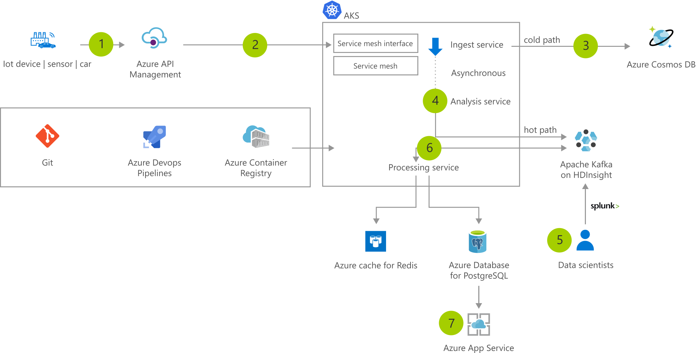

[!INCLUDE [header_file](../../../includes/sol-idea-header.md)]

Use AKS to easily ingest & process a real-time data stream with millions of data points collected via sensors. Perform fast analysis and computations to develop insights into complex scenarios quickly.

## Architecture

*Download an [SVG](../media/data-streaming-scenario.svg) of this architecture.*

### Data flow

1. Sensor data is generated and streamed to Azure API Management.
1. AKS cluster runs microservice that are deployed as containers behind a service mesh. Containers are built using a DevOps process and stored in Azure Container Registry.
1. Ingest service stores data in a Azure Cosmos DB
1. Asynchronously, the Analysis service receives the data and streams it to Apache Kafka and Azure HDInsight.
1. Data scientists can analyze the large big data for use in machine learning models using Splunk.
1. Data is processed by the processing service which stores the result in Azure Database for PostgreSQL and caches the data in an Azure Cache for Redis.
1. A web app running in Azure App Service is used to visualize the results.

### Components

Key technologies used to implement this architecture:

- [API Management](https://azure.microsoft.com/services/api-management)
- [App Service](https://azure.microsoft.com/services/app-service)
- [Azure Cache for Redis](https://azure.microsoft.com/services/cache)
- [Azure Container Registry](https://azure.microsoft.com/services/container-registry)
- [Azure Cosmos DB](https://azure.microsoft.com/services/cosmos-db)
- [Azure Database for PostgreSQL](https://azure.microsoft.com/services/postgresql)
- [Azure HDInsight](https://azure.microsoft.com/services/hdinsight)
- [Azure Kubernetes Service (AKS)](https://azure.microsoft.com/services/kubernetes-service)
- [Azure Pipelines](https://azure.microsoft.com/services/devops/pipelines)

## Next steps

Product documentation:

- [About Azure Cache for Redis](/azure/azure-cache-for-redis/cache-overview)
- [About API Management](/azure/api-management/api-management-key-concepts)
- [App Service overview](/azure/app-service/overview)
- [Azure Kubernetes Service](/azure/aks/intro-kubernetes)
- [Introduction to private Docker container registries in Azure](/azure/container-registry/container-registry-intro)
- [Welcome to Azure Cosmos DB](/azure/cosmos-db/introduction)
- [What is Azure Database for PostgreSQL?](/azure/postgresql/overview)
- [What is Azure HDInsight?](/azure/hdinsight/hdinsight-overview)
- [What is Azure Pipelines?](/azure/devops/pipelines/get-started/what-is-azure-pipelines)

Microsoft Learn modules:

- [Build and store container images with Azure Container Registry](/learn/modules/build-and-store-container-images)
- [Configure app service plans](/learn/modules/configure-app-service-plans)
- [Create an Azure Cosmos DB database built to scale](/learn/modules/create-cosmos-db-for-scale)
- [Create and connect to an Azure Database for PostgreSQL](/learn/modules/create-connect-to-postgres)
- [Develop for Azure Cache for Redis](/learn/modules/develop-for-azure-cache-for-redis)
- [Explore API Management](/learn/modules/explore-api-management)
- [Implement Azure Kubernetes Service (AKS)](/learn/modules/implement-azure-kubernetes-service)
- [Introduction to Azure HDInsight](/learn/modules/intro-to-azure-hdinsight)

## Related resources

- [Azure Kubernetes Service (AKS) architecture design](../../reference-architectures/containers/aks-start-here.md)
- [Azure Kubernetes in event stream processing](serverless-event-processing-aks.yml)
- [Instant IoT data streaming with AKS](aks-iot-data-streaming.yml)
