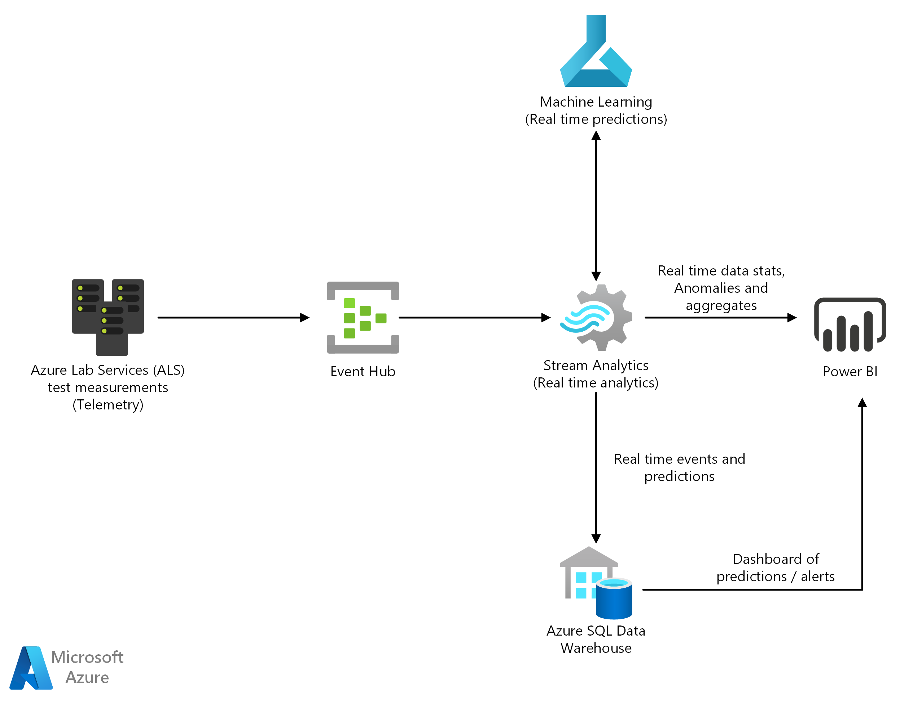

[!INCLUDE [header_file](../../../includes/sol-idea-header.md)]

Learn how to use Azure Machine Learning to predict failures before they happen with real-time assembly line data.

This solution is built on Azure-managed services: [Azure Stream Analytics](https://azure.microsoft.com/services/stream-analytics), [Event Hubs](https://azure.microsoft.com/services/event-hubs), [Azure Machine Learning](https://azure.microsoft.com/services/machine-learning), [Azure Synapse Analytics](https://azure.microsoft.com/services/synapse-analytics), and [Power BI](https://powerbi.microsoft.com). These services run in a high-availability environment, patched and supported, allowing you to focus on your solution instead of the environment they run in.

## Architecture

*Download an [SVG](../media/defect-prevention-with-predictive-maintenance.svg) of this architecture.*

### Components

* [Event Hubs](https://azure.microsoft.com/services/event-hubs) ingests raw assembly-line data and passes it on to Azure Stream Analytics.
* [Azure Stream Analytics](https://azure.microsoft.com/services/stream-analytics) provides near real-time analytics on the input stream from Event Hubs. Input data is filtered and passed to an Azure Machine Learning endpoint. Results of machine learning are sent to a Power BI dashboard.
* [Azure Machine Learning](https://azure.microsoft.com/services/machine-learning) predicts potential failures based on real-time assembly-line data from Stream Analytics.
* [Azure Synapse Analytics](https://azure.microsoft.com/services/synapse-analytics) stores assembly-line data along with failure predictions.
* [Power BI](https://powerbi.microsoft.com) enables visualization of real-time assembly-line data from Stream Analytics, and the predicted failures and alerts from Data Warehouse.

## Next steps

See the product documentation:

* [Stream Analytics](/azure/stream-analytics/stream-analytics-introduction)
* [Event Hubs](/azure/event-hubs/event-hubs-what-is-event-hubs)
* [Azure Machine Learning](/azure/machine-learning/overview-what-is-azure-ml)
* [Synapse Analytics](/azure/sql-data-warehouse/sql-data-warehouse-overview-what-is)
* [Power BI](https://powerbi.microsoft.com/documentation/powerbi-landing-page)

## Related resources

See the following related Azure Architecture Center articles:

* [Artificial intelligence (AI) Overview](../../data-guide/big-data/ai-overview.md)
* [Predictive maintenance](./predictive-maintenance.yml)
* [Predictive marketing with machine learning](./predictive-marketing-campaigns-with-machine-learning-and-spark.yml)
* [Predictive maintenance for industrial IoT](./iot-predictive-maintenance.yml)
